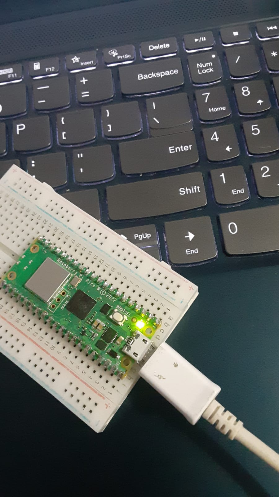

# Práctica 2 Blink LED Micropython

## 2 Parpadeo del led integrado en Raspberry Pico W
_En este apartado se presenta el código .py para **parpadear el led**_
```python
from machine import Pin
from utime import sleep

led = machine.Pin("LED", machine.Pin.OUT)

while True:
    led.toggle()
    sleep(0.5)
```

### Resultado
_Despliege de resultados, parpadeo constante del led_ 

