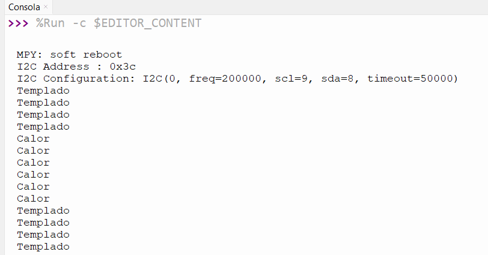

# 2.2 Desplegar ANIMACIÓN de la temperatura en OLED Display con bitArray imagen y animación

>Autor: Guipzot Garibay Denisse Abigail 20211788 SC7C
 
### Código Micropython
_En este apartado se presenta el código .py para desplegar **animación de temperatura**_
```python
#librerías
from machine import ADC
import utime
#importación de elementos de biblioteca
from machine import Pin, I2C #configuración de pines para su comunicación
from ssd1306 import SSD1306_I2C #comunicación con la pantalla OLED
import framebuf, sys

#Verificación de dispositivo
def init_i2c(scl_pin, sda_pin):
    i2c_dev = I2C(0, scl=Pin(scl_pin), sda=Pin(sda_pin), freq=200000)
    i2c_addr = [hex(ii) for ii in i2c_dev.scan()]
    
    if not i2c_addr:
        print('Pantalla I2C no encontrada')
        sys.exit()
    else:
        print("I2C Address : {}".format(i2c_addr[0]))
        print("I2C Configuration: {}".format(i2c_dev))
        
    return i2c_dev

#configuración de pines para el despliegue en pantalla oled
i2c_dev = init_i2c(scl_pin=9, sda_pin=8)
oled = SSD1306_I2C(128,64, i2c_dev)

#indicar el pin a donde esta conectado el ADC
sensor = ADC(4)

#BitArray de las imágenes elegidas
def animacion(oled):
    frio1= bytearray([0x00, 0x00, 0x00, 0x00, 0x00, 0x00, 0x00, 0x00, 0x00, 0x00, 0x00, 0x00, 0x00, 0x00, 0x00, 0x00, 
0x00, 0x00, 0x00, 0x00, 0x00, 0x00, 0x00, 0x00, 0x00, 0x00, 0x00, 0x00, 0x00, 0x00, 0x00, 0x00, 
0x00, 0x00, 0x00, 0x00, 0x00, 0x00, 0x00, 0x00, 0x00, 0x00, 0x00, 0x00, 0x00, 0x00, 0x00, 0x00, 
0x00, 0x00, 0x00, 0x00, 0x00, 0x00, 0x00, 0x00, 0x00, 0x00, 0x00, 0x00, 0x00, 0x00, 0x00, 0x00, 
0x00, 0x00, 0x00, 0x00, 0x00, 0x00, 0x00, 0x00, 0x00, 0x00, 0x00, 0x00, 0x00, 0x00, 0x00, 0x00, 
0x00, 0x00, 0x00, 0x00, 0x00, 0x00, 0x00, 0x00, 0x00, 0x00, 0x00, 0x00, 0x00, 0x00, 0x00, 0x00, 
0x00, 0x00, 0x00, 0x00, 0x00, 0x00, 0x00, 0x00, 0x00, 0x00, 0x00, 0x00, 0x00, 0x00, 0x00, 0x00, 
0x00, 0x00, 0x00, 0x00, 0x00, 0x00, 0x00, 0x00, 0x00, 0x00, 0x00, 0x00, 0x00, 0x00, 0x00, 0x00, 
0x00, 0x00, 0x00, 0x00, 0x00, 0x00, 0x00, 0x03, 0xe0, 0x00, 0x00, 0x00, 0x00, 0x00, 0x00, 0x00, 
0x00, 0x00, 0x00, 0x00, 0x00, 0x00, 0x00, 0x63, 0xe3, 0x00, 0x00, 0x00, 0x00, 0x00, 0x00, 0x00, 
0x00, 0x00, 0x00, 0x00, 0x00, 0x00, 0x00, 0xff, 0xff, 0x80, 0x00, 0x00, 0x00, 0x00, 0x00, 0x00, 
0x00, 0x00, 0x00, 0x00, 0x00, 0x00, 0x00, 0xff, 0xff, 0x80, 0x00, 0x00, 0x00, 0x00, 0x00, 0x00, 
0x00, 0x00, 0x00, 0x00, 0x00, 0x00, 0x00, 0x0f, 0xf8, 0x00, 0x00, 0x00, 0x00, 0x00, 0x00, 0x00, 
0x00, 0x00, 0x00, 0x00, 0x00, 0x00, 0x00, 0x03, 0xe0, 0x00, 0x00, 0x00, 0x00, 0x00, 0x00, 0x00, 
0x00, 0x00, 0x00, 0x00, 0x00, 0x00, 0x00, 0x83, 0xe0, 0x40, 0x00, 0x00, 0x00, 0x00, 0x00, 0x00, 
0x00, 0x00, 0x00, 0x00, 0x00, 0x00, 0x03, 0xf3, 0xe3, 0xe0, 0x00, 0x00, 0x00, 0x00, 0x00, 0x00, 
0x00, 0x00, 0x00, 0x00, 0x00, 0x00, 0x03, 0xff, 0xff, 0xf0, 0x00, 0x00, 0x00, 0x00, 0x00, 0x00, 
0x00, 0x00, 0x00, 0x00, 0x00, 0x00, 0x00, 0x7f, 0xff, 0x80, 0x00, 0x00, 0x00, 0x00, 0x00, 0x00, 
0x00, 0x00, 0x00, 0x00, 0x00, 0x00, 0x00, 0x07, 0xf8, 0x00, 0x00, 0x00, 0x00, 0x00, 0x00, 0x00, 
0x00, 0x00, 0x00, 0x00, 0x00, 0x00, 0x00, 0x03, 0xe0, 0x00, 0x00, 0x00, 0x00, 0x00, 0x00, 0x00, 
0x00, 0x00, 0x00, 0x00, 0x00, 0x00, 0x00, 0x03, 0xe0, 0x00, 0x00, 0x00, 0x00, 0x00, 0x00, 0x00, 
0x00, 0x00, 0x01, 0x80, 0x00, 0x00, 0x00, 0x03, 0xe0, 0x00, 0x00, 0x00, 0x00, 0xf8, 0x00, 0x00, 
0x00, 0x00, 0x07, 0xc0, 0x70, 0x00, 0x00, 0x03, 0xe0, 0x00, 0x00, 0x03, 0x81, 0xf8, 0x00, 0x00, 
0x00, 0x00, 0x47, 0xc1, 0xf0, 0x00, 0x00, 0x07, 0xf0, 0x00, 0x00, 0x07, 0xe1, 0xf3, 0x00, 0x00, 
0x00, 0x00, 0xff, 0xc1, 0xf8, 0x00, 0x00, 0x0f, 0xf8, 0x00, 0x00, 0x07, 0xc1, 0xff, 0x80, 0x00, 
0x00, 0x00, 0xff, 0xf0, 0xf8, 0x00, 0x00, 0x1f, 0xfc, 0x00, 0x00, 0x07, 0xc7, 0xff, 0x80, 0x00, 
0x00, 0x00, 0x3f, 0xff, 0xf8, 0x00, 0x00, 0x3f, 0x3e, 0x00, 0x00, 0x0f, 0xff, 0xfe, 0x00, 0x00, 
0x00, 0x00, 0xff, 0xff, 0xfc, 0x00, 0x00, 0x7e, 0x1f, 0x00, 0x00, 0x1f, 0xff, 0x7f, 0x80, 0x00, 
0x00, 0x00, 0xf8, 0x07, 0xff, 0xc0, 0x0f, 0xfc, 0x0f, 0xf8, 0x01, 0xff, 0xf0, 0x0f, 0x80, 0x00, 
0x00, 0x00, 0x40, 0x1f, 0xff, 0xff, 0xff, 0xf8, 0x07, 0xff, 0xff, 0xff, 0xf8, 0x02, 0x00, 0x00, 
0x00, 0x00, 0x00, 0xff, 0x01, 0xff, 0xff, 0x80, 0x00, 0x7f, 0xff, 0xc0, 0xff, 0x00, 0x00, 0x00, 
0x00, 0x00, 0x00, 0x7c, 0x00, 0x0f, 0xc0, 0x00, 0x00, 0x01, 0xfc, 0x00, 0x1f, 0x00, 0x00, 0x00, 
0x00, 0x00, 0x00, 0x00, 0x00, 0x03, 0xf0, 0x00, 0x00, 0x07, 0xf0, 0x00, 0x04, 0x00, 0x00, 0x00, 
0x00, 0x00, 0x00, 0x00, 0x00, 0x00, 0xfc, 0x00, 0x00, 0x1f, 0xc0, 0x00, 0x00, 0x00, 0x00, 0x00, 
0x00, 0x00, 0x00, 0x00, 0x00, 0x00, 0x3f, 0x00, 0x00, 0x7f, 0x00, 0x00, 0x00, 0x00, 0x00, 0x00, 
0x00, 0x00, 0x00, 0x00, 0x00, 0x00, 0x1f, 0x80, 0x00, 0x7c, 0x00, 0x00, 0x00, 0x00, 0x00, 0x00, 
0x00, 0x00, 0x00, 0x00, 0x00, 0x00, 0x0f, 0x00, 0x00, 0x7c, 0x00, 0x00, 0x00, 0x00, 0x00, 0x00, 
0x00, 0x00, 0x00, 0x00, 0x00, 0x00, 0x1f, 0x00, 0x00, 0x7c, 0x00, 0x00, 0x00, 0x00, 0x00, 0x00, 
0x00, 0x00, 0x00, 0x00, 0x00, 0x00, 0x1f, 0x07, 0xf0, 0x3e, 0x00, 0x00, 0x00, 0x00, 0x00, 0x00, 
0x00, 0x00, 0x00, 0x00, 0x00, 0x00, 0x1f, 0x3f, 0xff, 0x3e, 0x00, 0x00, 0x00, 0x00, 0x00, 0x00, 
0x00, 0x00, 0x00, 0x00, 0x00, 0x00, 0x3f, 0xff, 0x3f, 0xfe, 0x00, 0x00, 0x00, 0x00, 0x00, 0x00, 
0x00, 0x00, 0x00, 0x00, 0x00, 0x00, 0x3f, 0xf0, 0x03, 0xff, 0x00, 0x00, 0x00, 0x00, 0x00, 0x00, 
0x00, 0x00, 0x00, 0x00, 0x18, 0x00, 0xff, 0x00, 0x00, 0x3f, 0x80, 0x00, 0x00, 0x00, 0x00, 0x00, 
0x00, 0x00, 0x00, 0x00, 0x3f, 0xe3, 0xf8, 0x00, 0x00, 0x0f, 0xc0, 0x00, 0x00, 0x00, 0x00, 0x00, 
0x00, 0x00, 0x00, 0x00, 0x3f, 0xff, 0xe0, 0x00, 0x00, 0x07, 0xf0, 0x00, 0x00, 0x00, 0x00, 0x00, 
0x00, 0x00, 0x00, 0x00, 0x00, 0xff, 0x80, 0x00, 0x00, 0x01, 0xff, 0xfe, 0x00, 0x00, 0x00, 0x00, 
0x00, 0x00, 0x00, 0x00, 0x01, 0xff, 0x80, 0x00, 0x00, 0x00, 0xff, 0xfe, 0x00, 0x00, 0x00, 0x00, 
0x00, 0x00, 0x00, 0x0f, 0xc7, 0xff, 0x80, 0x00, 0x00, 0x01, 0xff, 0xfe, 0x00, 0x00, 0x00, 0x00, 
0x00, 0x00, 0x00, 0x0f, 0xff, 0xcf, 0x80, 0x00, 0x00, 0x03, 0xff, 0x80, 0x00, 0x00, 0x00, 0x00, 
0x00, 0x00, 0x00, 0x01, 0xff, 0x0f, 0xc0, 0x00, 0x00, 0x07, 0xef, 0xe0, 0x00, 0x00, 0x00, 0x00, 
0x00, 0x00, 0x00, 0x03, 0xff, 0x07, 0xc0, 0x00, 0x00, 0x0f, 0xc3, 0xff, 0xf0, 0x00, 0x00, 0x00, 
0x00, 0x00, 0x00, 0x03, 0xff, 0x00, 0x00, 0x00, 0x00, 0x07, 0x81, 0xff, 0xf0, 0x00, 0x00, 0x00, 
0x00, 0x00, 0x00, 0x00, 0x8f, 0x80, 0x00, 0x00, 0x00, 0x00, 0x03, 0xff, 0x00, 0x00, 0x00, 0x00, 
0x00, 0x00, 0x00, 0x00, 0x0f, 0x80, 0x00, 0x00, 0x00, 0x00, 0x07, 0xff, 0x00, 0x00, 0x00, 0x00, 
0x00, 0x00, 0x00, 0x00, 0x00, 0x00, 0x00, 0x00, 0x00, 0x00, 0x0f, 0xde, 0x00, 0x00, 0x00, 0x00, 
0x00, 0x00, 0x00, 0x00, 0x00, 0x00, 0x00, 0x00, 0x00, 0x00, 0x01, 0x80, 0x00, 0x00, 0x00, 0x00, 
0x00, 0x00, 0x00, 0x00, 0x00, 0x00, 0x00, 0x00, 0x00, 0x00, 0x00, 0x00, 0x00, 0x00, 0x00, 0x00, 
0x00, 0x00, 0x00, 0x00, 0x00, 0x00, 0x00, 0x00, 0x00, 0x00, 0x00, 0x00, 0x00, 0x00, 0x00, 0x00, 
0x00, 0x00, 0x00, 0x00, 0x00, 0x00, 0x00, 0x00, 0x00, 0x00, 0x00, 0x00, 0x00, 0x00, 0x00, 0x00, 
0x00, 0x00, 0x00, 0x00, 0x00, 0x00, 0x00, 0x00, 0x00, 0x00, 0x00, 0x00, 0x00, 0x00, 0x00, 0x00, 
0x00, 0x00, 0x00, 0x00, 0x00, 0x00, 0x00, 0x00, 0x00, 0x00, 0x00, 0x00, 0x00, 0x00, 0x00, 0x00, 
0x00, 0x00, 0x00, 0x00, 0x00, 0x00, 0x00, 0x00, 0x00, 0x00, 0x00, 0x00, 0x00, 0x00, 0x00, 0x00, 
0x00, 0x00, 0x00, 0x00, 0x00, 0x00, 0x00, 0x00, 0x00, 0x00, 0x00, 0x00, 0x00, 0x00, 0x00, 0x00, 
0x00, 0x00, 0x00, 0x00, 0x00, 0x00, 0x00, 0x00, 0x00, 0x00, 0x00, 0x00, 0x00, 0x00, 0x00, 0x00
])
    
    frio2= bytearray([0x00, 0x00, 0x00, 0x00, 0x00, 0x00, 0x00, 0x00, 0x00, 0x00, 0x00, 0x00, 0x00, 0x00, 0x00, 0x00, 
0x00, 0x00, 0x00, 0x00, 0x00, 0x00, 0x00, 0x00, 0x00, 0x00, 0x00, 0x00, 0x00, 0x00, 0x00, 0x00, 
0x00, 0x00, 0x00, 0x00, 0x00, 0x00, 0x00, 0x00, 0x00, 0x00, 0x00, 0x00, 0x00, 0x00, 0x00, 0x00, 
0x00, 0x00, 0x00, 0x00, 0x00, 0x00, 0x00, 0x00, 0x00, 0x00, 0x00, 0x00, 0x00, 0x00, 0x00, 0x00, 
0x00, 0x00, 0x00, 0x00, 0x00, 0x00, 0x00, 0x00, 0x00, 0x00, 0x00, 0x00, 0x00, 0x00, 0x00, 0x00, 
0x00, 0x00, 0x00, 0x00, 0x00, 0x00, 0x00, 0x00, 0x00, 0x00, 0x00, 0x00, 0x00, 0x00, 0x00, 0x00, 
0x00, 0x00, 0x00, 0x00, 0x00, 0x00, 0x00, 0x00, 0x00, 0x00, 0x00, 0x00, 0x00, 0x00, 0x00, 0x00, 
0x00, 0x00, 0x00, 0x00, 0x00, 0x00, 0x00, 0x00, 0x00, 0x00, 0x00, 0x00, 0x00, 0x00, 0x00, 0x00, 
0x00, 0x00, 0x00, 0x00, 0x00, 0x00, 0x00, 0x00, 0x00, 0x00, 0x00, 0x00, 0x00, 0x00, 0x00, 0x00, 
0x00, 0x00, 0x00, 0x00, 0x00, 0x00, 0x00, 0x00, 0x00, 0x00, 0x00, 0x00, 0x00, 0x00, 0x00, 0x00, 
0x00, 0x00, 0x00, 0x00, 0x00, 0x00, 0x00, 0x00, 0x00, 0x00, 0x00, 0x00, 0x00, 0x00, 0x00, 0x00, 
0x00, 0x00, 0x00, 0x00, 0x1c, 0x78, 0x00, 0x00, 0x00, 0x00, 0x00, 0x00, 0x00, 0x00, 0x00, 0x00, 
0x00, 0x00, 0x00, 0x00, 0x3f, 0xfc, 0x00, 0x00, 0x00, 0x00, 0x1f, 0x00, 0x00, 0x00, 0x00, 0x00, 
0x00, 0x00, 0x00, 0x00, 0x3f, 0xf0, 0x00, 0x00, 0x00, 0x00, 0x1f, 0x3c, 0x00, 0x00, 0x00, 0x00, 
0x00, 0x00, 0x00, 0x03, 0xff, 0xe0, 0x00, 0x00, 0x00, 0x00, 0x0f, 0xfc, 0x00, 0x00, 0x00, 0x00, 
0x00, 0x00, 0x00, 0x03, 0xff, 0xe0, 0xf8, 0x00, 0x00, 0x01, 0x0f, 0xfc, 0x00, 0x00, 0x00, 0x00, 
0x00, 0x00, 0x00, 0x00, 0x03, 0xf1, 0xf8, 0x00, 0x00, 0x1f, 0x07, 0xff, 0x80, 0x00, 0x00, 0x00, 
0x00, 0x00, 0x00, 0x00, 0x01, 0xff, 0xf0, 0x00, 0x00, 0x0f, 0x8f, 0xff, 0x80, 0x00, 0x00, 0x00, 
0x00, 0x00, 0x00, 0x00, 0x00, 0xff, 0xc0, 0x00, 0x00, 0x0f, 0xff, 0x00, 0x00, 0x00, 0x00, 0x00, 
0x00, 0x00, 0x00, 0x00, 0x3f, 0xff, 0x80, 0x00, 0x00, 0x07, 0xfe, 0x00, 0x00, 0x00, 0x00, 0x00, 
0x00, 0x00, 0x00, 0x00, 0x3f, 0xff, 0x80, 0x00, 0x00, 0x03, 0xff, 0x00, 0x00, 0x00, 0x00, 0x00, 
0x00, 0x00, 0x00, 0x00, 0x00, 0x0f, 0xc0, 0x00, 0x00, 0x03, 0xff, 0xf8, 0x00, 0x00, 0x00, 0x00, 
0x00, 0x00, 0x00, 0x00, 0x00, 0x07, 0xe0, 0x00, 0x00, 0x0f, 0xff, 0xf8, 0x00, 0x00, 0x00, 0x00, 
0x00, 0x00, 0x00, 0x00, 0x00, 0x01, 0xf0, 0x00, 0x00, 0x1f, 0x80, 0x00, 0x00, 0x00, 0x00, 0x00, 
0x00, 0x00, 0x00, 0x00, 0x00, 0x00, 0xfe, 0x00, 0x00, 0xfe, 0x00, 0x00, 0x00, 0x00, 0x00, 0x00, 
0x00, 0x00, 0x00, 0x00, 0x00, 0x00, 0x7f, 0xe0, 0x0f, 0xfc, 0x00, 0x00, 0x00, 0x00, 0x00, 0x00, 
0x00, 0x00, 0x00, 0x00, 0x00, 0x00, 0x7f, 0xfc, 0xff, 0xfc, 0x00, 0x00, 0x00, 0x00, 0x00, 0x00, 
0x00, 0x00, 0x00, 0x00, 0x00, 0x00, 0x7c, 0x7f, 0xfc, 0xf8, 0x00, 0x00, 0x00, 0x00, 0x00, 0x00, 
0x00, 0x00, 0x00, 0x00, 0x00, 0x00, 0x7c, 0x0f, 0xc0, 0xf8, 0x00, 0x00, 0x00, 0x00, 0x00, 0x00, 
0x00, 0x00, 0x00, 0x00, 0x00, 0x00, 0x3e, 0x00, 0x00, 0xf8, 0x00, 0x00, 0x00, 0x00, 0x00, 0x00, 
0x00, 0x00, 0x00, 0x00, 0x00, 0x00, 0x3e, 0x00, 0x01, 0xf0, 0x00, 0x00, 0x00, 0x00, 0x00, 0x00, 
0x00, 0x00, 0x00, 0x00, 0x00, 0x00, 0x3e, 0x00, 0x01, 0xf0, 0x00, 0x00, 0x00, 0x00, 0x00, 0x00, 
0x00, 0x00, 0x00, 0x3e, 0x00, 0x00, 0xfc, 0x00, 0x00, 0xfc, 0x00, 0x00, 0x00, 0x00, 0x00, 0x00, 
0x00, 0x00, 0x30, 0x3f, 0x00, 0x07, 0xf0, 0x00, 0x00, 0x7f, 0x00, 0x00, 0x10, 0x00, 0x00, 0x00, 
0x00, 0x01, 0xf8, 0x1f, 0x80, 0x1f, 0xc0, 0x00, 0x00, 0x1f, 0xc0, 0x00, 0x7c, 0x00, 0x00, 0x00, 
0x00, 0x00, 0xfc, 0x0f, 0xe1, 0xff, 0x80, 0x00, 0x00, 0x07, 0xf0, 0x01, 0xfc, 0x04, 0x00, 0x00, 
0x00, 0x01, 0xff, 0xff, 0xff, 0xff, 0xff, 0x00, 0x00, 0xff, 0xff, 0xe7, 0xf0, 0x1f, 0x00, 0x00, 
0x00, 0x07, 0xff, 0xff, 0xff, 0xff, 0xff, 0xe0, 0x1f, 0xff, 0xff, 0xff, 0xe0, 0x7f, 0x00, 0x00, 
0x00, 0x03, 0xff, 0xcf, 0xe0, 0x00, 0x07, 0xf0, 0x3f, 0xf0, 0x03, 0xff, 0xff, 0xfc, 0x00, 0x00, 
0x00, 0x00, 0x7e, 0x0f, 0xc0, 0x00, 0x00, 0xf8, 0x7c, 0x00, 0x00, 0x1f, 0xff, 0xff, 0x80, 0x00, 
0x00, 0x00, 0xfc, 0x1f, 0x80, 0x00, 0x00, 0xfc, 0xf8, 0x00, 0x00, 0x0f, 0x83, 0xff, 0x00, 0x00, 
0x00, 0x00, 0x78, 0x3f, 0x00, 0x00, 0x00, 0x7f, 0xf0, 0x00, 0x00, 0x0f, 0x81, 0xf1, 0x00, 0x00, 
0x00, 0x00, 0x00, 0x00, 0x00, 0x00, 0x00, 0x3f, 0xe0, 0x00, 0x00, 0x07, 0xc1, 0xf8, 0x00, 0x00, 
0x00, 0x00, 0x00, 0x00, 0x00, 0x00, 0x00, 0x1f, 0xc0, 0x00, 0x00, 0x07, 0xc0, 0xf8, 0x00, 0x00, 
0x00, 0x00, 0x00, 0x00, 0x00, 0x00, 0x00, 0x0f, 0x80, 0x00, 0x00, 0x00, 0x00, 0x00, 0x00, 0x00, 
0x00, 0x00, 0x00, 0x00, 0x00, 0x00, 0x00, 0x0f, 0x80, 0x00, 0x00, 0x00, 0x00, 0x00, 0x00, 0x00, 
0x00, 0x00, 0x00, 0x00, 0x00, 0x00, 0x00, 0x0f, 0x80, 0x00, 0x00, 0x00, 0x00, 0x00, 0x00, 0x00, 
0x00, 0x00, 0x00, 0x00, 0x00, 0x00, 0x00, 0x0f, 0x80, 0x00, 0x00, 0x00, 0x00, 0x00, 0x00, 0x00, 
0x00, 0x00, 0x00, 0x00, 0x00, 0x00, 0x00, 0x1f, 0x80, 0x00, 0x00, 0x00, 0x00, 0x00, 0x00, 0x00, 
0x00, 0x00, 0x00, 0x00, 0x00, 0x00, 0x00, 0xff, 0xe0, 0x00, 0x00, 0x00, 0x00, 0x00, 0x00, 0x00, 
0x00, 0x00, 0x00, 0x00, 0x00, 0x00, 0x0f, 0xff, 0xfc, 0x00, 0x00, 0x00, 0x00, 0x00, 0x00, 0x00, 
0x00, 0x00, 0x00, 0x00, 0x00, 0x00, 0x1f, 0xff, 0xff, 0x00, 0x00, 0x00, 0x00, 0x00, 0x00, 0x00, 
0x00, 0x00, 0x00, 0x00, 0x00, 0x00, 0x0e, 0x1f, 0x1f, 0x00, 0x00, 0x00, 0x00, 0x00, 0x00, 0x00, 
0x00, 0x00, 0x00, 0x00, 0x00, 0x00, 0x00, 0x1f, 0x02, 0x00, 0x00, 0x00, 0x00, 0x00, 0x00, 0x00, 
0x00, 0x00, 0x00, 0x00, 0x00, 0x00, 0x00, 0x1f, 0x80, 0x00, 0x00, 0x00, 0x00, 0x00, 0x00, 0x00, 
0x00, 0x00, 0x00, 0x00, 0x00, 0x00, 0x01, 0xff, 0xe0, 0x00, 0x00, 0x00, 0x00, 0x00, 0x00, 0x00, 
0x00, 0x00, 0x00, 0x00, 0x00, 0x00, 0x07, 0xff, 0xfc, 0x00, 0x00, 0x00, 0x00, 0x00, 0x00, 0x00, 
0x00, 0x00, 0x00, 0x00, 0x00, 0x00, 0x03, 0xdf, 0xfc, 0x00, 0x00, 0x00, 0x00, 0x00, 0x00, 0x00, 
0x00, 0x00, 0x00, 0x00, 0x00, 0x00, 0x00, 0x1f, 0x08, 0x00, 0x00, 0x00, 0x00, 0x00, 0x00, 0x00, 
0x00, 0x00, 0x00, 0x00, 0x00, 0x00, 0x00, 0x00, 0x00, 0x00, 0x00, 0x00, 0x00, 0x00, 0x00, 0x00, 
0x00, 0x00, 0x00, 0x00, 0x00, 0x00, 0x00, 0x00, 0x00, 0x00, 0x00, 0x00, 0x00, 0x00, 0x00, 0x00, 
0x00, 0x00, 0x00, 0x00, 0x00, 0x00, 0x00, 0x00, 0x00, 0x00, 0x00, 0x00, 0x00, 0x00, 0x00, 0x00, 
0x00, 0x00, 0x00, 0x00, 0x00, 0x00, 0x00, 0x00, 0x00, 0x00, 0x00, 0x00, 0x00, 0x00, 0x00, 0x00, 
0x00, 0x00, 0x00, 0x00, 0x00, 0x00, 0x00, 0x00, 0x00, 0x00, 0x00, 0x00, 0x00, 0x00, 0x00, 0x00
])
    
   
    calor1= bytearray([0xff, 0xff, 0xff, 0xff, 0xff, 0xff, 0xff, 0xff, 0xff, 0xff, 0xff, 0xff, 0xff, 0xff, 0xff, 0xff, 
0xff, 0xff, 0xff, 0xff, 0xff, 0xff, 0xff, 0xff, 0xff, 0xff, 0xff, 0xff, 0xff, 0xff, 0xff, 0xff, 
0xff, 0xff, 0xff, 0xff, 0xff, 0xff, 0xff, 0xff, 0xff, 0xff, 0xff, 0xff, 0xff, 0xff, 0xff, 0xff, 
0xff, 0xff, 0xff, 0xff, 0xff, 0xff, 0xff, 0xff, 0xff, 0xff, 0xff, 0xff, 0xff, 0xff, 0xff, 0xff, 
0xff, 0xff, 0xff, 0xff, 0xff, 0xff, 0xff, 0xff, 0xff, 0xff, 0xff, 0xff, 0xff, 0xff, 0xff, 0xff, 
0xff, 0xff, 0xff, 0xff, 0xff, 0xff, 0xff, 0xff, 0xff, 0xff, 0xff, 0xff, 0xff, 0xff, 0xff, 0xff, 
0xff, 0xff, 0xff, 0xff, 0xff, 0xff, 0xff, 0xff, 0xff, 0xff, 0xff, 0xff, 0xff, 0xff, 0xff, 0xff, 
0xff, 0xff, 0xff, 0xff, 0xff, 0xff, 0xff, 0xff, 0xff, 0xff, 0xff, 0xff, 0xff, 0xff, 0xff, 0xff, 
0xff, 0xff, 0xff, 0xff, 0xff, 0xff, 0xff, 0xff, 0xff, 0xff, 0xff, 0xff, 0xff, 0xff, 0xff, 0xff, 
0xff, 0xff, 0xff, 0xff, 0xff, 0xff, 0xff, 0xff, 0xff, 0xff, 0xff, 0xff, 0xff, 0xff, 0xff, 0xff, 
0xff, 0xff, 0xff, 0xff, 0xff, 0xff, 0xff, 0xff, 0xff, 0xff, 0xff, 0xff, 0xff, 0xff, 0xff, 0xff, 
0xff, 0xff, 0xff, 0xff, 0xff, 0xff, 0xff, 0xff, 0xff, 0xff, 0xff, 0xff, 0xff, 0xff, 0xff, 0xff, 
0xff, 0xff, 0xff, 0xff, 0xff, 0xff, 0xff, 0xff, 0xff, 0xff, 0xff, 0xff, 0xff, 0xff, 0xff, 0xff, 
0xff, 0xff, 0xff, 0xff, 0xfb, 0xdf, 0xff, 0xff, 0xff, 0xff, 0xff, 0xff, 0xff, 0xff, 0xff, 0xff, 
0xff, 0xff, 0xff, 0xff, 0xe7, 0xef, 0xff, 0xff, 0xff, 0xff, 0xff, 0xff, 0xff, 0xff, 0xff, 0xff, 
0xff, 0xff, 0xff, 0xff, 0xef, 0xf7, 0xff, 0xff, 0xff, 0xff, 0xff, 0xff, 0xff, 0xff, 0xff, 0xff, 
0xff, 0xff, 0xff, 0xff, 0xef, 0xf7, 0xff, 0xff, 0xff, 0xff, 0xff, 0xff, 0xff, 0xff, 0xff, 0xff, 
0xff, 0xff, 0xff, 0xff, 0xef, 0xf7, 0xff, 0xff, 0xff, 0xff, 0xff, 0xff, 0xff, 0xff, 0xff, 0xff, 
0xff, 0xff, 0xff, 0xff, 0xef, 0xf7, 0xff, 0xff, 0xff, 0xff, 0xff, 0xff, 0xff, 0xff, 0xff, 0xff, 
0xff, 0xff, 0xff, 0xff, 0xef, 0xf7, 0xff, 0xff, 0xff, 0xff, 0xff, 0xff, 0xff, 0xff, 0xff, 0xff, 
0xff, 0xff, 0xff, 0xff, 0xef, 0xf7, 0xff, 0xff, 0xff, 0xff, 0xff, 0xff, 0xff, 0xff, 0xff, 0xff, 
0xff, 0xff, 0xff, 0xff, 0xef, 0xf7, 0xff, 0xff, 0xf8, 0xff, 0xff, 0xff, 0xff, 0xff, 0xff, 0xff, 
0xff, 0xff, 0xff, 0xff, 0xef, 0xf7, 0xff, 0xff, 0xf4, 0x7f, 0xff, 0xff, 0xff, 0xff, 0xff, 0xff, 
0xff, 0xff, 0xff, 0xff, 0xef, 0xf7, 0xfe, 0x1f, 0xc0, 0x00, 0xff, 0xff, 0xff, 0xff, 0xff, 0xff, 
0xff, 0xff, 0xff, 0xff, 0xef, 0xf7, 0xfe, 0x12, 0x0c, 0x61, 0xff, 0xff, 0xff, 0xff, 0xff, 0xff, 
0xff, 0xff, 0xff, 0xff, 0xef, 0xf7, 0xfe, 0x1a, 0x7f, 0x82, 0x7f, 0xff, 0xff, 0xff, 0xff, 0xff, 
0xff, 0xff, 0xff, 0xff, 0xef, 0xf7, 0xfe, 0x1a, 0x7c, 0xf8, 0x7f, 0xff, 0xff, 0xff, 0xff, 0xff, 
0xff, 0xff, 0xff, 0xff, 0xef, 0xf7, 0xfe, 0x18, 0x7f, 0x00, 0xff, 0xff, 0xff, 0xff, 0xff, 0xff, 
0xff, 0xff, 0xff, 0xff, 0xef, 0xf7, 0xff, 0xbf, 0xff, 0xff, 0xff, 0xff, 0xff, 0xff, 0xff, 0xff, 
0xff, 0xff, 0xff, 0xff, 0xef, 0xf7, 0xff, 0xff, 0xff, 0xff, 0xff, 0xff, 0xff, 0xff, 0xff, 0xff, 
0xff, 0xff, 0xff, 0xff, 0xef, 0xf7, 0xff, 0xff, 0xff, 0xff, 0xff, 0xff, 0xff, 0xff, 0xff, 0xff, 
0xff, 0xff, 0xff, 0xff, 0xef, 0xf7, 0xff, 0xff, 0xff, 0xff, 0xff, 0xff, 0xff, 0xff, 0xff, 0xff, 
0xff, 0xff, 0xff, 0xff, 0xef, 0xf7, 0xff, 0xff, 0xff, 0xff, 0xff, 0xff, 0xff, 0xff, 0xff, 0xff, 
0xff, 0xff, 0xff, 0xff, 0xef, 0xf7, 0xff, 0xff, 0xff, 0xff, 0xff, 0xff, 0xff, 0xff, 0xff, 0xff, 
0xff, 0xff, 0xff, 0xff, 0xef, 0xf7, 0xff, 0xff, 0xff, 0xff, 0xff, 0xff, 0xff, 0xff, 0xff, 0xff, 
0xff, 0xff, 0xff, 0xff, 0xef, 0xf7, 0xff, 0xff, 0xff, 0xff, 0xff, 0xff, 0xff, 0xff, 0xff, 0xff, 
0xff, 0xff, 0xff, 0xff, 0xef, 0xf7, 0xff, 0xff, 0xff, 0xff, 0xff, 0xff, 0xff, 0xff, 0xff, 0xff, 
0xff, 0xff, 0xff, 0xff, 0xef, 0xf7, 0xff, 0xff, 0xff, 0xff, 0xff, 0xff, 0xff, 0xff, 0xff, 0xff, 
0xff, 0xff, 0xff, 0xff, 0xec, 0x17, 0xff, 0xff, 0xff, 0xff, 0xff, 0xff, 0xff, 0xff, 0xff, 0xff, 
0xff, 0xff, 0xff, 0xff, 0xec, 0x17, 0xff, 0xff, 0xff, 0xff, 0xff, 0xff, 0xff, 0xff, 0xff, 0xff, 
0xff, 0xff, 0xff, 0xff, 0xed, 0xf7, 0xff, 0xff, 0xff, 0xff, 0xff, 0xff, 0xff, 0xff, 0xff, 0xff, 
0xff, 0xff, 0xff, 0xff, 0xec, 0x17, 0xff, 0xff, 0xff, 0xff, 0xff, 0xff, 0xff, 0xff, 0xff, 0xff, 
0xff, 0xff, 0xff, 0xff, 0xec, 0x17, 0xff, 0xff, 0xff, 0xff, 0xff, 0xff, 0xff, 0xff, 0xff, 0xff, 
0xff, 0xff, 0xff, 0xff, 0xec, 0x17, 0xff, 0xff, 0xff, 0xff, 0xff, 0xff, 0xff, 0xff, 0xff, 0xff, 
0xff, 0xff, 0xff, 0xff, 0xed, 0xf7, 0xff, 0xff, 0xff, 0xff, 0xff, 0xff, 0xff, 0xff, 0xff, 0xff, 
0xff, 0xff, 0xff, 0xff, 0xec, 0x17, 0xff, 0xff, 0xff, 0xff, 0xff, 0xff, 0xff, 0xff, 0xff, 0xff, 
0xff, 0xff, 0xff, 0xff, 0xec, 0x17, 0xff, 0xff, 0xff, 0xff, 0xff, 0xff, 0xff, 0xff, 0xff, 0xff, 
0xff, 0xff, 0xff, 0xff, 0xec, 0x17, 0xff, 0xff, 0xff, 0xff, 0xff, 0xff, 0xff, 0xff, 0xff, 0xff, 
0xff, 0xff, 0xff, 0xff, 0xed, 0xf7, 0xff, 0xff, 0xff, 0xff, 0xff, 0xff, 0xff, 0xff, 0xff, 0xff, 
0xff, 0xff, 0xff, 0xff, 0xe4, 0x17, 0xff, 0xff, 0xff, 0xff, 0xff, 0xff, 0xff, 0xff, 0xff, 0xff, 
0xff, 0xff, 0xff, 0xff, 0xe4, 0x13, 0xff, 0xff, 0xff, 0xff, 0xff, 0xff, 0xff, 0xff, 0xff, 0xff, 
0xff, 0xff, 0xff, 0xff, 0xcc, 0x1c, 0xff, 0xff, 0xff, 0xff, 0xff, 0xff, 0xff, 0xff, 0xff, 0xff, 
0xff, 0xff, 0xff, 0xff, 0x38, 0x03, 0x3f, 0xff, 0xff, 0xff, 0xff, 0xff, 0xff, 0xff, 0xff, 0xff, 
0xff, 0xff, 0xff, 0xfe, 0xe0, 0x3c, 0xdf, 0xff, 0xff, 0xff, 0xff, 0xff, 0xff, 0xff, 0xff, 0xff, 
0xff, 0xff, 0xff, 0xfd, 0xc0, 0x18, 0x4f, 0xff, 0xff, 0xff, 0xff, 0xff, 0xff, 0xff, 0xff, 0xff, 
0xff, 0xff, 0xff, 0xfd, 0xc0, 0x00, 0x6f, 0xff, 0xff, 0xff, 0xff, 0xff, 0xff, 0xff, 0xff, 0xff, 
0xff, 0xff, 0xff, 0xfd, 0x80, 0x00, 0x6f, 0xff, 0xff, 0xff, 0xff, 0xff, 0xff, 0xff, 0xff, 0xff, 
0xff, 0xff, 0xff, 0xfd, 0xc0, 0x1e, 0xef, 0xff, 0xff, 0xff, 0xff, 0xff, 0xff, 0xff, 0xff, 0xff, 
0xff, 0xff, 0xff, 0xfc, 0xc0, 0xf9, 0xdf, 0xff, 0xff, 0xff, 0xff, 0xff, 0xff, 0xff, 0xff, 0xff, 
0xff, 0xff, 0xff, 0xfe, 0x70, 0x07, 0x3f, 0xff, 0xff, 0xff, 0xff, 0xff, 0xff, 0xff, 0xff, 0xff, 
0xff, 0xff, 0xff, 0xff, 0x9f, 0xfc, 0xff, 0xff, 0xff, 0xff, 0xff, 0xff, 0xff, 0xff, 0xff, 0xff, 
0xff, 0xff, 0xff, 0xff, 0xf0, 0x0f, 0xff, 0xff, 0xff, 0xff, 0xff, 0xff, 0xff, 0xff, 0xff, 0xff, 
0xff, 0xff, 0xff, 0xff, 0xff, 0xff, 0xff, 0xff, 0xff, 0xff, 0xff, 0xff, 0xff, 0xff, 0xff, 0xff, 
0xff, 0xff, 0xff, 0xff, 0xff, 0xff, 0xff, 0xff, 0xff, 0xff, 0xff, 0xff, 0xff, 0xff, 0xff, 0xff
])
    
    calor2= bytearray([0xff, 0xff, 0xff, 0xff, 0xff, 0xff, 0xff, 0xff, 0xff, 0xff, 0xff, 0xff, 0xff, 0xff, 0xff, 0xff, 
0xff, 0xff, 0xff, 0xff, 0xff, 0xff, 0xff, 0xff, 0xff, 0xff, 0xff, 0xff, 0xff, 0xff, 0xff, 0xff, 
0xff, 0xff, 0xff, 0xff, 0xff, 0xff, 0xff, 0xff, 0xff, 0xff, 0xff, 0xff, 0xff, 0xff, 0xff, 0xff, 
0xff, 0xff, 0xff, 0xff, 0xff, 0xff, 0xff, 0xff, 0xff, 0xff, 0xff, 0xff, 0xff, 0xff, 0xff, 0xff, 
0xff, 0xff, 0xff, 0xff, 0xff, 0xff, 0xff, 0xff, 0xff, 0xff, 0xff, 0xff, 0xff, 0xff, 0xff, 0xff, 
0xff, 0xff, 0xff, 0xff, 0xff, 0xff, 0xff, 0xff, 0xff, 0xff, 0xff, 0xff, 0xff, 0xff, 0xff, 0xff, 
0xff, 0xff, 0xff, 0xff, 0xff, 0xff, 0xff, 0xff, 0xff, 0xff, 0xff, 0xff, 0xff, 0xff, 0xff, 0xff, 
0xff, 0xff, 0xff, 0xff, 0xff, 0xff, 0xff, 0xff, 0xff, 0xff, 0xff, 0xff, 0xff, 0xff, 0xff, 0xff, 
0xff, 0xff, 0xff, 0xff, 0xff, 0xff, 0xff, 0xff, 0xff, 0xff, 0xff, 0xff, 0xff, 0xff, 0xff, 0xff, 
0xff, 0xff, 0xff, 0xff, 0xff, 0xff, 0xff, 0xff, 0xff, 0xff, 0xff, 0xff, 0xff, 0xff, 0xff, 0xff, 
0xff, 0xff, 0xff, 0xff, 0xff, 0xff, 0xff, 0xff, 0xff, 0xff, 0xff, 0xff, 0xff, 0xff, 0xff, 0xff, 
0xff, 0xff, 0xff, 0xff, 0xff, 0xff, 0xff, 0xff, 0xff, 0xff, 0xff, 0xff, 0xff, 0xff, 0xff, 0xff, 
0xff, 0xff, 0xff, 0xff, 0xff, 0xff, 0xff, 0xff, 0xff, 0xff, 0xff, 0xff, 0xff, 0xff, 0xff, 0xff, 
0xff, 0xff, 0xff, 0xff, 0xf9, 0xdf, 0xff, 0xff, 0xff, 0xff, 0xff, 0xff, 0xff, 0xff, 0xff, 0xff, 
0xff, 0xff, 0xff, 0xff, 0xf7, 0xef, 0xff, 0xff, 0xff, 0xff, 0xff, 0xff, 0xff, 0xff, 0xff, 0xff, 
0xff, 0xff, 0xff, 0xff, 0xef, 0xf7, 0xff, 0xff, 0xff, 0xff, 0xff, 0xff, 0xff, 0xff, 0xff, 0xff, 
0xff, 0xff, 0xff, 0xff, 0xef, 0xf7, 0xff, 0xff, 0xff, 0xff, 0xff, 0xff, 0xff, 0xff, 0xff, 0xff, 
0xff, 0xff, 0xff, 0xff, 0xef, 0xf7, 0xff, 0xff, 0xff, 0xff, 0xff, 0xff, 0xff, 0xff, 0xff, 0xff, 
0xff, 0xff, 0xff, 0xff, 0xef, 0xf7, 0xff, 0xff, 0xff, 0xff, 0xff, 0xff, 0xff, 0xff, 0xff, 0xff, 
0xff, 0xff, 0xff, 0xff, 0xef, 0xf7, 0xff, 0xff, 0xff, 0xff, 0xff, 0xff, 0xff, 0xff, 0xff, 0xff, 
0xff, 0xff, 0xff, 0xff, 0xef, 0xf7, 0xff, 0xff, 0xff, 0xff, 0xff, 0xff, 0xff, 0xff, 0xff, 0xff, 
0xff, 0xff, 0xff, 0xff, 0xef, 0xf7, 0xff, 0xff, 0xff, 0xff, 0xff, 0xff, 0xff, 0xff, 0xff, 0xff, 
0xff, 0xff, 0xff, 0xff, 0xef, 0xf7, 0xff, 0xff, 0xfa, 0x3f, 0xff, 0xff, 0xff, 0xff, 0xff, 0xff, 
0xff, 0xff, 0xff, 0xff, 0xef, 0xf7, 0xff, 0x0f, 0xe8, 0x00, 0x7f, 0xff, 0xff, 0xff, 0xff, 0xff, 
0xff, 0xff, 0xff, 0xff, 0xef, 0xf7, 0xff, 0x00, 0x06, 0xe0, 0xff, 0xff, 0xff, 0xff, 0xff, 0xff, 
0xff, 0xff, 0xff, 0xff, 0xef, 0xf7, 0xff, 0x0c, 0x3f, 0x83, 0x3f, 0xff, 0xff, 0xff, 0xff, 0xff, 
0xff, 0xff, 0xff, 0xff, 0xef, 0xf7, 0xff, 0x0e, 0x3e, 0xfe, 0x3f, 0xff, 0xff, 0xff, 0xff, 0xff, 
0xff, 0xff, 0xff, 0xff, 0xef, 0xf7, 0xff, 0x0c, 0x3f, 0x00, 0x7f, 0xff, 0xff, 0xff, 0xff, 0xff, 
0xff, 0xff, 0xff, 0xff, 0xef, 0xf7, 0xff, 0x9e, 0x3f, 0xff, 0xff, 0xff, 0xff, 0xff, 0xff, 0xff, 
0xff, 0xff, 0xff, 0xff, 0xec, 0xb7, 0xff, 0xff, 0xff, 0xff, 0xff, 0xff, 0xff, 0xff, 0xff, 0xff, 
0xff, 0xff, 0xff, 0xff, 0xec, 0x17, 0xff, 0xff, 0xff, 0xff, 0xff, 0xff, 0xff, 0xff, 0xff, 0xff, 
0xff, 0xff, 0xff, 0xff, 0xec, 0x17, 0xff, 0xff, 0xff, 0xff, 0xff, 0xff, 0xff, 0xff, 0xff, 0xff, 
0xff, 0xff, 0xff, 0xff, 0xec, 0x17, 0xff, 0xff, 0xff, 0xff, 0xff, 0xff, 0xff, 0xff, 0xff, 0xff, 
0xff, 0xff, 0xff, 0xff, 0xec, 0xf7, 0xff, 0xff, 0xff, 0xff, 0xff, 0xff, 0xff, 0xff, 0xff, 0xff, 
0xff, 0xff, 0xff, 0xff, 0xec, 0x17, 0xff, 0xff, 0xff, 0xff, 0xff, 0xff, 0xff, 0xff, 0xff, 0xff, 
0xff, 0xff, 0xff, 0xff, 0xec, 0x17, 0xff, 0xff, 0xff, 0xff, 0xff, 0xff, 0xff, 0xff, 0xff, 0xff, 
0xff, 0xff, 0xff, 0xff, 0xec, 0x17, 0xff, 0xff, 0xff, 0xff, 0xff, 0xff, 0xff, 0xff, 0xff, 0xff, 
0xff, 0xff, 0xff, 0xff, 0xec, 0xf7, 0xff, 0xff, 0xff, 0xff, 0xff, 0xff, 0xff, 0xff, 0xff, 0xff, 
0xff, 0xff, 0xff, 0xff, 0xec, 0x17, 0xff, 0xff, 0xff, 0xff, 0xff, 0xff, 0xff, 0xff, 0xff, 0xff, 
0xff, 0xff, 0xff, 0xff, 0xec, 0x17, 0xff, 0xff, 0xff, 0xff, 0xff, 0xff, 0xff, 0xff, 0xff, 0xff, 
0xff, 0xff, 0xff, 0xff, 0xed, 0xf7, 0xff, 0xff, 0xff, 0xff, 0xff, 0xff, 0xff, 0xff, 0xff, 0xff, 
0xff, 0xff, 0xff, 0xff, 0xec, 0x17, 0xff, 0xff, 0xff, 0xff, 0xff, 0xff, 0xff, 0xff, 0xff, 0xff, 
0xff, 0xff, 0xff, 0xff, 0xec, 0x17, 0xff, 0xff, 0xff, 0xff, 0xff, 0xff, 0xff, 0xff, 0xff, 0xff, 
0xff, 0xff, 0xff, 0xff, 0xec, 0x17, 0xff, 0xff, 0xff, 0xff, 0xff, 0xff, 0xff, 0xff, 0xff, 0xff, 
0xff, 0xff, 0xff, 0xff, 0xed, 0xf7, 0xff, 0xff, 0xff, 0xff, 0xff, 0xff, 0xff, 0xff, 0xff, 0xff, 
0xff, 0xff, 0xff, 0xff, 0xe4, 0x13, 0xff, 0xff, 0xff, 0xff, 0xff, 0xff, 0xff, 0xff, 0xff, 0xff, 
0xff, 0xff, 0xff, 0xff, 0xe4, 0x13, 0xff, 0xff, 0xff, 0xff, 0xff, 0xff, 0xff, 0xff, 0xff, 0xff, 
0xff, 0xff, 0xff, 0xff, 0xe4, 0x13, 0xff, 0xff, 0xff, 0xff, 0xff, 0xff, 0xff, 0xff, 0xff, 0xff, 
0xff, 0xff, 0xff, 0xff, 0xe5, 0xf3, 0xff, 0xff, 0xff, 0xff, 0xff, 0xff, 0xff, 0xff, 0xff, 0xff, 
0xff, 0xff, 0xff, 0xff, 0xe4, 0x13, 0xff, 0xff, 0xff, 0xff, 0xff, 0xff, 0xff, 0xff, 0xff, 0xff, 
0xff, 0xff, 0xff, 0xff, 0xe4, 0x13, 0xff, 0xff, 0xff, 0xff, 0xff, 0xff, 0xff, 0xff, 0xff, 0xff, 
0xff, 0xff, 0xff, 0xff, 0xcc, 0x1c, 0xff, 0xff, 0xff, 0xff, 0xff, 0xff, 0xff, 0xff, 0xff, 0xff, 
0xff, 0xff, 0xff, 0xff, 0x38, 0x03, 0x3f, 0xff, 0xff, 0xff, 0xff, 0xff, 0xff, 0xff, 0xff, 0xff, 
0xff, 0xff, 0xff, 0xfe, 0xe0, 0x3c, 0xdf, 0xff, 0xff, 0xff, 0xff, 0xff, 0xff, 0xff, 0xff, 0xff, 
0xff, 0xff, 0xff, 0xfd, 0xc0, 0x18, 0x4f, 0xff, 0xff, 0xff, 0xff, 0xff, 0xff, 0xff, 0xff, 0xff, 
0xff, 0xff, 0xff, 0xfd, 0xc0, 0x00, 0x6f, 0xff, 0xff, 0xff, 0xff, 0xff, 0xff, 0xff, 0xff, 0xff, 
0xff, 0xff, 0xff, 0xfd, 0x80, 0x00, 0x6f, 0xff, 0xff, 0xff, 0xff, 0xff, 0xff, 0xff, 0xff, 0xff, 
0xff, 0xff, 0xff, 0xfd, 0xc0, 0x1e, 0xef, 0xff, 0xff, 0xff, 0xff, 0xff, 0xff, 0xff, 0xff, 0xff, 
0xff, 0xff, 0xff, 0xfc, 0xc0, 0xfd, 0xdf, 0xff, 0xff, 0xff, 0xff, 0xff, 0xff, 0xff, 0xff, 0xff, 
0xff, 0xff, 0xff, 0xfe, 0x70, 0x07, 0x3f, 0xff, 0xff, 0xff, 0xff, 0xff, 0xff, 0xff, 0xff, 0xff, 
0xff, 0xff, 0xff, 0xff, 0x9f, 0xfc, 0xff, 0xff, 0xff, 0xff, 0xff, 0xff, 0xff, 0xff, 0xff, 0xff, 
0xff, 0xff, 0xff, 0xff, 0xf0, 0x0f, 0xff, 0xff, 0xff, 0xff, 0xff, 0xff, 0xff, 0xff, 0xff, 0xff, 
0xff, 0xff, 0xff, 0xff, 0xff, 0xff, 0xff, 0xff, 0xff, 0xff, 0xff, 0xff, 0xff, 0xff, 0xff, 0xff, 
0xff, 0xff, 0xff, 0xff, 0xff, 0xff, 0xff, 0xff, 0xff, 0xff, 0xff, 0xff, 0xff, 0xff, 0xff, 0xff
])
    
    calor3= bytearray([0xff, 0xff, 0xff, 0xff, 0xff, 0xff, 0xff, 0xff, 0xff, 0xff, 0xff, 0xff, 0xff, 0xff, 0xff, 0xff, 
0xff, 0xff, 0xff, 0xff, 0xff, 0xff, 0xff, 0xff, 0xff, 0xff, 0xff, 0xff, 0xff, 0xff, 0xff, 0xff, 
0xff, 0xff, 0xff, 0xff, 0xff, 0xff, 0xff, 0xff, 0xff, 0xff, 0xff, 0xff, 0xff, 0xff, 0xff, 0xff, 
0xff, 0xff, 0xff, 0xff, 0xff, 0xff, 0xff, 0xff, 0xff, 0xff, 0xff, 0xff, 0xff, 0xff, 0xff, 0xff, 
0xff, 0xff, 0xff, 0xff, 0xff, 0xff, 0xff, 0xff, 0xff, 0xff, 0xff, 0xff, 0xff, 0xff, 0xff, 0xff, 
0xff, 0xff, 0xff, 0xff, 0xff, 0xff, 0xff, 0xff, 0xff, 0xff, 0xff, 0xff, 0xff, 0xff, 0xff, 0xff, 
0xff, 0xff, 0xff, 0xff, 0xff, 0xff, 0xff, 0xff, 0xff, 0xff, 0xff, 0xff, 0xff, 0xff, 0xff, 0xff, 
0xff, 0xff, 0xff, 0xff, 0xff, 0xff, 0xff, 0xff, 0xff, 0xff, 0xff, 0xff, 0xff, 0xff, 0xff, 0xff, 
0xff, 0xff, 0xff, 0xff, 0xff, 0xff, 0xff, 0xff, 0xff, 0xff, 0xff, 0xff, 0xff, 0xff, 0xff, 0xff, 
0xff, 0xff, 0xff, 0xff, 0xff, 0xff, 0xff, 0xff, 0xff, 0xff, 0xff, 0xff, 0xff, 0xff, 0xff, 0xff, 
0xff, 0xff, 0xff, 0xff, 0xff, 0xff, 0xff, 0xff, 0xff, 0xff, 0xff, 0xff, 0xff, 0xff, 0xff, 0xff, 
0xff, 0xff, 0xff, 0xff, 0xff, 0xff, 0xff, 0xff, 0xff, 0xff, 0xff, 0xff, 0xff, 0xff, 0xff, 0xff, 
0xff, 0xff, 0xff, 0xff, 0xff, 0xff, 0xff, 0xff, 0xff, 0xff, 0xff, 0xff, 0xff, 0xff, 0xff, 0xff, 
0xff, 0xff, 0xff, 0xff, 0xfc, 0xef, 0xff, 0xff, 0xff, 0xff, 0xff, 0xff, 0xff, 0xff, 0xff, 0xff, 
0xff, 0xff, 0xff, 0xff, 0xfb, 0xf7, 0xff, 0xff, 0xff, 0xff, 0xff, 0xff, 0xff, 0xff, 0xff, 0xff, 
0xff, 0xff, 0xff, 0xff, 0xf7, 0xfb, 0xff, 0xff, 0xff, 0xff, 0xff, 0xff, 0xff, 0xff, 0xff, 0xff, 
0xff, 0xff, 0xff, 0xff, 0xf7, 0xfb, 0xff, 0xff, 0xff, 0xff, 0xff, 0xff, 0xff, 0xff, 0xff, 0xff, 
0xff, 0xff, 0xff, 0xff, 0xf7, 0xfb, 0xff, 0xff, 0xff, 0xff, 0xff, 0xff, 0xff, 0xff, 0xff, 0xff, 
0xff, 0xff, 0xff, 0xff, 0xf7, 0xfb, 0xff, 0xff, 0xff, 0xff, 0xff, 0xff, 0xff, 0xff, 0xff, 0xff, 
0xff, 0xff, 0xff, 0xff, 0xf7, 0xfb, 0xff, 0xff, 0xff, 0xff, 0xff, 0xff, 0xff, 0xff, 0xff, 0xff, 
0xff, 0xff, 0xff, 0xff, 0xf7, 0xfb, 0xff, 0xff, 0xff, 0xff, 0xff, 0xff, 0xff, 0xff, 0xff, 0xff, 
0xff, 0xff, 0xff, 0xff, 0xf4, 0x1b, 0xff, 0xff, 0xff, 0xff, 0xff, 0xff, 0xff, 0xff, 0xff, 0xff, 
0xff, 0xff, 0xff, 0xff, 0xf4, 0x1b, 0xff, 0xff, 0xfa, 0x3f, 0xff, 0xff, 0xff, 0xff, 0xff, 0xff, 
0xff, 0xff, 0xff, 0xff, 0xf4, 0x7b, 0xfe, 0x5f, 0xc0, 0x20, 0xff, 0xff, 0xff, 0xff, 0xff, 0xff, 
0xff, 0xff, 0xff, 0xff, 0xf4, 0x1b, 0xfe, 0x02, 0x05, 0xc1, 0xff, 0xff, 0xff, 0xff, 0xff, 0xff, 
0xff, 0xff, 0xff, 0xff, 0xf4, 0x1b, 0xfe, 0x1a, 0x7f, 0x02, 0x7f, 0xff, 0xff, 0xff, 0xff, 0xff, 
0xff, 0xff, 0xff, 0xff, 0xf4, 0x7b, 0xfe, 0x1a, 0x7e, 0xfc, 0x7f, 0xff, 0xff, 0xff, 0xff, 0xff, 
0xff, 0xff, 0xff, 0xff, 0xf4, 0x1b, 0xfe, 0x1a, 0x7e, 0x00, 0x7f, 0xff, 0xff, 0xff, 0xff, 0xff, 
0xff, 0xff, 0xff, 0xff, 0xf4, 0x1b, 0xff, 0x9e, 0x7f, 0xff, 0xff, 0xff, 0xff, 0xff, 0xff, 0xff, 
0xff, 0xff, 0xff, 0xff, 0xf4, 0x1b, 0xff, 0xff, 0xfe, 0x30, 0x07, 0xff, 0x78, 0x7f, 0xff, 0xff, 
0xff, 0xff, 0xff, 0xff, 0xf4, 0x1b, 0xfe, 0x88, 0xf0, 0xc0, 0x81, 0x26, 0x88, 0x1f, 0xff, 0xff, 
0xff, 0xff, 0xff, 0xff, 0xf4, 0x1b, 0xfe, 0x88, 0x80, 0x27, 0x8d, 0x30, 0x80, 0x3f, 0xff, 0xff, 
0xff, 0xff, 0xff, 0xff, 0xf4, 0x1b, 0xfe, 0x88, 0xcd, 0x03, 0x8c, 0x20, 0x82, 0x8f, 0xff, 0xff, 
0xff, 0xff, 0xff, 0xff, 0xf4, 0xfb, 0xfe, 0x8c, 0x80, 0x13, 0x8c, 0x21, 0x83, 0x0f, 0xff, 0xff, 
0xff, 0xff, 0xff, 0xff, 0xf4, 0x1b, 0xfe, 0x8c, 0xf0, 0x00, 0x1c, 0x21, 0x8f, 0x8f, 0xff, 0xff, 
0xff, 0xff, 0xff, 0xff, 0xf4, 0x1b, 0xff, 0x88, 0x80, 0x7b, 0x9f, 0x06, 0x18, 0x0f, 0xff, 0xff, 
0xff, 0xff, 0xff, 0xff, 0xf4, 0x1b, 0xff, 0xff, 0xff, 0xff, 0xff, 0xff, 0xff, 0xff, 0xff, 0xff, 
0xff, 0xff, 0xff, 0xff, 0xf4, 0xfb, 0xff, 0xff, 0xff, 0xff, 0xff, 0xff, 0xff, 0xff, 0xff, 0xff, 
0xff, 0xff, 0xff, 0xff, 0xf4, 0x1b, 0xff, 0xff, 0xff, 0xff, 0xff, 0xff, 0xff, 0xff, 0xff, 0xff, 
0xff, 0xff, 0xff, 0xff, 0xf4, 0x1b, 0xff, 0xff, 0xff, 0xff, 0xff, 0xff, 0xff, 0xff, 0xff, 0xff, 
0xff, 0xff, 0xff, 0xff, 0xf4, 0xfb, 0xff, 0xff, 0xff, 0xff, 0xff, 0xff, 0xff, 0xff, 0xff, 0xff, 
0xff, 0xff, 0xff, 0xff, 0xf4, 0x1b, 0xff, 0xff, 0xff, 0xff, 0xff, 0xff, 0xff, 0xff, 0xff, 0xff, 
0xff, 0xff, 0xff, 0xff, 0xf4, 0x1b, 0xff, 0xff, 0xff, 0xff, 0xff, 0xff, 0xff, 0xff, 0xff, 0xff, 
0xff, 0xff, 0xff, 0xff, 0xf4, 0x1b, 0xff, 0xff, 0xff, 0xff, 0xff, 0xff, 0xff, 0xff, 0xff, 0xff, 
0xff, 0xff, 0xff, 0xff, 0xf5, 0xfb, 0xff, 0xff, 0xff, 0xff, 0xff, 0xff, 0xff, 0xff, 0xff, 0xff, 
0xff, 0xff, 0xff, 0xff, 0xf4, 0x1b, 0xff, 0xff, 0xff, 0xff, 0xff, 0xff, 0xff, 0xff, 0xff, 0xff, 
0xff, 0xff, 0xff, 0xff, 0xf4, 0x1b, 0xff, 0xff, 0xff, 0xff, 0xff, 0xff, 0xff, 0xff, 0xff, 0xff, 
0xff, 0xff, 0xff, 0xff, 0xf4, 0x1b, 0xff, 0xff, 0xff, 0xff, 0xff, 0xff, 0xff, 0xff, 0xff, 0xff, 
0xff, 0xff, 0xff, 0xff, 0xf5, 0xfb, 0xff, 0xff, 0xff, 0xff, 0xff, 0xff, 0xff, 0xff, 0xff, 0xff, 
0xff, 0xff, 0xff, 0xff, 0xf4, 0x1b, 0xff, 0xff, 0xff, 0xff, 0xff, 0xff, 0xff, 0xff, 0xff, 0xff, 
0xff, 0xff, 0xff, 0xff, 0xf4, 0x1b, 0xff, 0xff, 0xff, 0xff, 0xff, 0xff, 0xff, 0xff, 0xff, 0xff, 
0xff, 0xff, 0xff, 0xff, 0xcc, 0x1c, 0xff, 0xff, 0xff, 0xff, 0xff, 0xff, 0xff, 0xff, 0xff, 0xff, 
0xff, 0xff, 0xff, 0xff, 0x38, 0x03, 0x3f, 0xff, 0xff, 0xff, 0xff, 0xff, 0xff, 0xff, 0xff, 0xff, 
0xff, 0xff, 0xff, 0xfe, 0xe0, 0x1c, 0xdf, 0xff, 0xff, 0xff, 0xff, 0xff, 0xff, 0xff, 0xff, 0xff, 
0xff, 0xff, 0xff, 0xfd, 0xc0, 0x18, 0x6f, 0xff, 0xff, 0xff, 0xff, 0xff, 0xff, 0xff, 0xff, 0xff, 
0xff, 0xff, 0xff, 0xfd, 0xc0, 0x00, 0x6f, 0xff, 0xff, 0xff, 0xff, 0xff, 0xff, 0xff, 0xff, 0xff, 
0xff, 0xff, 0xff, 0xfd, 0x80, 0x00, 0x6f, 0xff, 0xff, 0xff, 0xff, 0xff, 0xff, 0xff, 0xff, 0xff, 
0xff, 0xff, 0xff, 0xfd, 0xc0, 0x1e, 0x6f, 0xff, 0xff, 0xff, 0xff, 0xff, 0xff, 0xff, 0xff, 0xff, 
0xff, 0xff, 0xff, 0xfe, 0xc0, 0xfd, 0xdf, 0xff, 0xff, 0xff, 0xff, 0xff, 0xff, 0xff, 0xff, 0xff, 
0xff, 0xff, 0xff, 0xff, 0x70, 0x07, 0x3f, 0xff, 0xff, 0xff, 0xff, 0xff, 0xff, 0xff, 0xff, 0xff, 
0xff, 0xff, 0xff, 0xff, 0x9f, 0xfc, 0xff, 0xff, 0xff, 0xff, 0xff, 0xff, 0xff, 0xff, 0xff, 0xff, 
0xff, 0xff, 0xff, 0xff, 0xf0, 0x0f, 0xff, 0xff, 0xff, 0xff, 0xff, 0xff, 0xff, 0xff, 0xff, 0xff, 
0xff, 0xff, 0xff, 0xff, 0xff, 0xff, 0xff, 0xff, 0xff, 0xff, 0xff, 0xff, 0xff, 0xff, 0xff, 0xff, 
0xff, 0xff, 0xff, 0xff, 0xff, 0xff, 0xff, 0xff, 0xff, 0xff, 0xff, 0xff, 0xff, 0xff, 0xff, 0xff
])
    
    calor4= bytearray([0xff, 0xff, 0xff, 0xff, 0xff, 0xff, 0xff, 0xff, 0xff, 0xff, 0xff, 0xff, 0xff, 0xff, 0xff, 0xff, 
0xff, 0xff, 0xff, 0xff, 0xff, 0xff, 0xff, 0xff, 0xff, 0xff, 0xff, 0xff, 0xff, 0xff, 0xff, 0xff, 
0xff, 0xff, 0xff, 0xff, 0xff, 0xff, 0xff, 0xff, 0xff, 0xff, 0xff, 0xff, 0xff, 0xff, 0xff, 0xff, 
0xff, 0xff, 0xff, 0xff, 0xff, 0xff, 0xff, 0xff, 0xff, 0xff, 0xff, 0xff, 0xff, 0xff, 0xff, 0xff, 
0xff, 0xff, 0xff, 0xff, 0xff, 0xff, 0xff, 0xff, 0xff, 0xff, 0xff, 0xff, 0xff, 0xff, 0xff, 0xff, 
0xff, 0xff, 0xff, 0xff, 0xff, 0xff, 0xff, 0xff, 0xff, 0xff, 0xff, 0xff, 0xff, 0xff, 0xff, 0xff, 
0xff, 0xff, 0xff, 0xff, 0xff, 0xff, 0xff, 0xff, 0xff, 0xff, 0xff, 0xff, 0xff, 0xff, 0xff, 0xff, 
0xff, 0xff, 0xff, 0xff, 0xff, 0xff, 0xff, 0xff, 0xff, 0xff, 0xff, 0xff, 0xff, 0xff, 0xff, 0xff, 
0xff, 0xff, 0xff, 0xff, 0xff, 0xff, 0xff, 0xff, 0xff, 0xff, 0xff, 0xff, 0xff, 0xff, 0xff, 0xff, 
0xff, 0xff, 0xff, 0xff, 0xff, 0xff, 0xff, 0xff, 0xff, 0xff, 0xff, 0xff, 0xff, 0xff, 0xff, 0xff, 
0xff, 0xff, 0xff, 0xff, 0xff, 0xff, 0xff, 0xff, 0xff, 0xff, 0xff, 0xff, 0xff, 0xff, 0xff, 0xff, 
0xff, 0xff, 0xff, 0xff, 0xff, 0xff, 0xff, 0xff, 0xff, 0xff, 0xff, 0xff, 0xff, 0xff, 0xff, 0xff, 
0xff, 0xff, 0xff, 0xff, 0xff, 0xff, 0xff, 0xff, 0xff, 0xff, 0xff, 0xff, 0xff, 0xff, 0xff, 0xff, 
0xff, 0xff, 0xff, 0xff, 0xfc, 0xe7, 0xff, 0xff, 0xff, 0xff, 0xff, 0xff, 0xff, 0xff, 0xff, 0xff, 
0xff, 0xff, 0xff, 0xff, 0xfb, 0xfb, 0xff, 0xff, 0xff, 0xff, 0xff, 0xff, 0xff, 0xff, 0xff, 0xff, 
0xff, 0xff, 0xff, 0xff, 0xf3, 0x8b, 0xff, 0xff, 0xff, 0xff, 0xff, 0xff, 0xff, 0xff, 0xff, 0xff, 
0xff, 0xff, 0xff, 0xff, 0xf6, 0x0b, 0xff, 0xff, 0xff, 0xff, 0xff, 0xff, 0xff, 0xff, 0xff, 0xff, 
0xff, 0xff, 0xff, 0xff, 0xf6, 0x0b, 0xff, 0xff, 0xff, 0xff, 0xff, 0xff, 0xff, 0xff, 0xff, 0xff, 
0xff, 0xff, 0xff, 0xff, 0xf6, 0x0b, 0xff, 0xff, 0xff, 0xff, 0xff, 0xff, 0xff, 0xff, 0xff, 0xff, 
0xff, 0xff, 0xff, 0xff, 0xf6, 0x7b, 0xff, 0xff, 0xff, 0xff, 0xff, 0xff, 0xff, 0xff, 0xff, 0xff, 
0xff, 0xff, 0xff, 0xff, 0xf6, 0x0b, 0xff, 0xff, 0xff, 0xff, 0xff, 0xff, 0xff, 0xff, 0xff, 0xff, 
0xff, 0xff, 0xff, 0xff, 0xf6, 0x0b, 0xff, 0xff, 0xff, 0xff, 0xff, 0xff, 0xff, 0xff, 0xff, 0xff, 
0xff, 0xff, 0xff, 0xff, 0xf6, 0x0b, 0xff, 0xff, 0xfa, 0x7f, 0xff, 0xff, 0xff, 0xff, 0xff, 0xff, 
0xff, 0xff, 0xff, 0xff, 0xf6, 0x7b, 0xfe, 0x40, 0x10, 0x09, 0xff, 0xff, 0xff, 0xff, 0xff, 0xff, 
0xff, 0xff, 0xff, 0xff, 0xf6, 0x0b, 0xfe, 0x02, 0x05, 0x80, 0xff, 0xff, 0xff, 0xff, 0xff, 0xff, 
0xff, 0xff, 0xff, 0xff, 0xf6, 0x0b, 0xfe, 0x1a, 0x7f, 0x06, 0x7f, 0xff, 0xff, 0xff, 0xff, 0xff, 
0xff, 0xff, 0xff, 0xff, 0xf6, 0x7b, 0xfe, 0x1a, 0x7e, 0x04, 0x7f, 0xff, 0xff, 0xff, 0xff, 0xff, 
0xff, 0xff, 0xff, 0xff, 0xf6, 0x0b, 0xfe, 0x1a, 0x7c, 0x00, 0x7f, 0xff, 0xff, 0xff, 0xff, 0xff, 
0xff, 0xff, 0xff, 0xff, 0xf6, 0x0b, 0xff, 0x1c, 0x7f, 0xff, 0xff, 0xff, 0xff, 0xff, 0xff, 0xff, 
0xff, 0xff, 0xff, 0xff, 0xf6, 0x1b, 0xff, 0xff, 0xff, 0xff, 0xff, 0xff, 0xfc, 0x7f, 0xff, 0xff, 
0xff, 0xff, 0xff, 0xff, 0xf6, 0x0b, 0xfe, 0x88, 0xf2, 0xc0, 0xc0, 0x26, 0x88, 0x1f, 0xff, 0xff, 
0xff, 0xff, 0xff, 0xff, 0xf6, 0x0b, 0xfe, 0x88, 0x81, 0x06, 0x8c, 0x30, 0x80, 0x3f, 0xff, 0xff, 
0xff, 0xff, 0xff, 0xff, 0xf6, 0x0b, 0xfe, 0x88, 0x8c, 0x26, 0x9c, 0x21, 0x90, 0x8f, 0xff, 0xff, 
0xff, 0xff, 0xff, 0xff, 0xf6, 0x7b, 0xfe, 0xc8, 0x80, 0x22, 0x9c, 0x21, 0x82, 0x0f, 0xff, 0xff, 
0xff, 0xff, 0xff, 0xff, 0xf6, 0x0b, 0xfe, 0x88, 0x80, 0x12, 0x9c, 0x23, 0x8f, 0x8f, 0xff, 0xff, 
0xff, 0xff, 0xff, 0xff, 0xf6, 0x0b, 0xff, 0x00, 0x00, 0x71, 0x9e, 0x06, 0x18, 0x0f, 0xff, 0xff, 
0xff, 0xff, 0xff, 0xff, 0xf6, 0x0b, 0xff, 0xff, 0xff, 0xff, 0xff, 0xff, 0xff, 0xff, 0xff, 0xff, 
0xff, 0xff, 0xff, 0xff, 0xf4, 0xfb, 0xff, 0x09, 0x80, 0x3f, 0xff, 0xff, 0xff, 0xff, 0xff, 0xff, 
0xff, 0xff, 0xff, 0xff, 0xf4, 0x0b, 0xff, 0x08, 0x00, 0x1f, 0xff, 0xff, 0xff, 0xff, 0xff, 0xff, 
0xff, 0xff, 0xff, 0xff, 0xf4, 0x0b, 0xff, 0x08, 0x00, 0x1f, 0xff, 0xff, 0xff, 0xff, 0xff, 0xff, 
0xff, 0xff, 0xff, 0xff, 0xf4, 0xfb, 0xff, 0x08, 0x00, 0x1f, 0xff, 0xff, 0xff, 0xff, 0xff, 0xff, 
0xff, 0xff, 0xff, 0xff, 0xf4, 0x1b, 0xff, 0x00, 0x07, 0xff, 0xff, 0xff, 0xff, 0xff, 0xff, 0xff, 
0xff, 0xff, 0xff, 0xff, 0xf4, 0x1b, 0xff, 0x80, 0x07, 0xff, 0xff, 0xff, 0xff, 0xff, 0xff, 0xff, 
0xff, 0xff, 0xff, 0xff, 0xf4, 0x1b, 0xff, 0xf1, 0xc7, 0xff, 0xff, 0xff, 0xff, 0xff, 0xff, 0xff, 
0xff, 0xff, 0xff, 0xff, 0xf5, 0xfb, 0xff, 0xff, 0xff, 0xff, 0xff, 0xff, 0xff, 0xff, 0xff, 0xff, 
0xff, 0xff, 0xff, 0xff, 0xf4, 0x1b, 0xff, 0xff, 0xff, 0xff, 0xff, 0xff, 0xff, 0xff, 0xff, 0xff, 
0xff, 0xff, 0xff, 0xff, 0xf4, 0x1b, 0xff, 0xff, 0xff, 0xff, 0xff, 0xff, 0xff, 0xff, 0xff, 0xff, 
0xff, 0xff, 0xff, 0xff, 0xf4, 0x1b, 0xff, 0xff, 0xff, 0xff, 0xff, 0xff, 0xff, 0xff, 0xff, 0xff, 
0xff, 0xff, 0xff, 0xff, 0xf4, 0xfb, 0xff, 0xff, 0xff, 0xff, 0xff, 0xff, 0xff, 0xff, 0xff, 0xff, 
0xff, 0xff, 0xff, 0xff, 0xf4, 0x1b, 0xff, 0xff, 0xff, 0xff, 0xff, 0xff, 0xff, 0xff, 0xff, 0xff, 
0xff, 0xff, 0xff, 0xff, 0xf4, 0x1b, 0xff, 0xff, 0xff, 0xff, 0xff, 0xff, 0xff, 0xff, 0xff, 0xff, 
0xff, 0xff, 0xff, 0xff, 0xcc, 0x1c, 0xff, 0xff, 0xff, 0xff, 0xff, 0xff, 0xff, 0xff, 0xff, 0xff, 
0xff, 0xff, 0xff, 0xff, 0x38, 0x03, 0x3f, 0xff, 0xff, 0xff, 0xff, 0xff, 0xff, 0xff, 0xff, 0xff, 
0xff, 0xff, 0xff, 0xfe, 0xe0, 0x1c, 0xdf, 0xff, 0xff, 0xff, 0xff, 0xff, 0xff, 0xff, 0xff, 0xff, 
0xff, 0xff, 0xff, 0xfc, 0xc0, 0x18, 0x6f, 0xff, 0xff, 0xff, 0xff, 0xff, 0xff, 0xff, 0xff, 0xff, 
0xff, 0xff, 0xff, 0xfd, 0xc0, 0x00, 0x6f, 0xff, 0xff, 0xff, 0xff, 0xff, 0xff, 0xff, 0xff, 0xff, 
0xff, 0xff, 0xff, 0xfd, 0x80, 0x00, 0x6f, 0xff, 0xff, 0xff, 0xff, 0xff, 0xff, 0xff, 0xff, 0xff, 
0xff, 0xff, 0xff, 0xfd, 0xc0, 0x1e, 0x6f, 0xff, 0xff, 0xff, 0xff, 0xff, 0xff, 0xff, 0xff, 0xff, 
0xff, 0xff, 0xff, 0xfe, 0xc0, 0xfd, 0xdf, 0xff, 0xff, 0xff, 0xff, 0xff, 0xff, 0xff, 0xff, 0xff, 
0xff, 0xff, 0xff, 0xff, 0x70, 0x07, 0x3f, 0xff, 0xff, 0xff, 0xff, 0xff, 0xff, 0xff, 0xff, 0xff, 
0xff, 0xff, 0xff, 0xff, 0x9f, 0xfc, 0xff, 0xff, 0xff, 0xff, 0xff, 0xff, 0xff, 0xff, 0xff, 0xff, 
0xff, 0xff, 0xff, 0xff, 0xf0, 0x0f, 0xff, 0xff, 0xff, 0xff, 0xff, 0xff, 0xff, 0xff, 0xff, 0xff, 
0xff, 0xff, 0xff, 0xff, 0xff, 0xff, 0xff, 0xff, 0xff, 0xff, 0xff, 0xff, 0xff, 0xff, 0xff, 0xff, 
0xff, 0xff, 0xff, 0xff, 0xff, 0xff, 0xff, 0xff, 0xff, 0xff, 0xff, 0xff, 0xff, 0xff, 0xff, 0xff
])
    
    calor5= bytearray([0xff, 0xff, 0xff, 0xff, 0xff, 0xff, 0xff, 0xff, 0xff, 0xff, 0xff, 0xff, 0xff, 0xff, 0xff, 0xff, 
0xff, 0xff, 0xff, 0xff, 0xff, 0xff, 0xff, 0xff, 0xff, 0xff, 0xff, 0xff, 0xff, 0xff, 0xff, 0xff, 
0xff, 0xff, 0xff, 0xff, 0xff, 0xff, 0xff, 0xff, 0xff, 0xff, 0xff, 0xff, 0xff, 0xff, 0xff, 0xff, 
0xff, 0xff, 0xff, 0xff, 0xff, 0xff, 0xff, 0xff, 0xff, 0xff, 0xff, 0xff, 0xff, 0xff, 0xff, 0xff, 
0xff, 0xff, 0xff, 0xff, 0xd3, 0xfe, 0x7f, 0xff, 0xff, 0xff, 0xff, 0xff, 0xff, 0xff, 0xff, 0xff, 
0xff, 0xff, 0xff, 0xff, 0xe3, 0xfc, 0xff, 0xff, 0xff, 0xff, 0xff, 0xff, 0xff, 0xff, 0xff, 0xff, 
0xff, 0xff, 0xff, 0x03, 0xf3, 0xfd, 0xc3, 0xff, 0xff, 0xff, 0xff, 0xff, 0xff, 0xff, 0xff, 0xff, 
0xff, 0xff, 0xff, 0xb1, 0xff, 0xff, 0x9b, 0xff, 0xff, 0xff, 0xff, 0xff, 0xff, 0xff, 0xff, 0xff, 
0xff, 0xff, 0xff, 0xf8, 0xff, 0x1f, 0x0f, 0xff, 0xff, 0xff, 0xff, 0xff, 0xff, 0xff, 0xff, 0xff, 
0xff, 0xff, 0xff, 0xfe, 0xfb, 0xc2, 0x7f, 0xff, 0xff, 0xff, 0xff, 0xff, 0xff, 0xff, 0xff, 0xff, 
0xff, 0xff, 0xff, 0x1f, 0xd9, 0x05, 0xff, 0xff, 0xff, 0xff, 0xff, 0xff, 0xff, 0xff, 0xff, 0xff, 
0xff, 0xff, 0xff, 0xc7, 0xed, 0x1f, 0xf8, 0x3f, 0xff, 0xff, 0xff, 0xff, 0xff, 0xff, 0xff, 0xff, 
0xff, 0xff, 0xff, 0xff, 0xf8, 0x13, 0xe2, 0x3f, 0xff, 0xff, 0xff, 0xff, 0xff, 0xff, 0xff, 0xff, 
0xff, 0xff, 0xff, 0xff, 0xf8, 0x0f, 0xff, 0xff, 0xff, 0xff, 0xff, 0xff, 0xff, 0xff, 0xff, 0xff, 
0xff, 0xff, 0xff, 0xff, 0xcd, 0x29, 0x80, 0xff, 0xff, 0xff, 0xff, 0xff, 0xff, 0xff, 0xff, 0xff, 
0xff, 0xff, 0xff, 0xff, 0xfe, 0xf2, 0x0e, 0xff, 0xff, 0xff, 0xff, 0xff, 0xff, 0xff, 0xff, 0xff, 
0xff, 0xff, 0xff, 0xff, 0xbe, 0x81, 0x7f, 0xff, 0xff, 0xff, 0xff, 0xff, 0xff, 0xff, 0xff, 0xff, 
0xff, 0xff, 0xff, 0xff, 0x3e, 0x80, 0x7f, 0xff, 0xff, 0xff, 0xff, 0xff, 0xff, 0xff, 0xff, 0xff, 
0xff, 0xff, 0xff, 0x81, 0xfe, 0x80, 0x7f, 0xff, 0xff, 0xff, 0xff, 0xff, 0xff, 0xff, 0xff, 0xff, 
0xff, 0xff, 0xfe, 0x27, 0xfc, 0x9e, 0x7f, 0xff, 0xff, 0xff, 0xff, 0xff, 0xff, 0xff, 0xff, 0xff, 
0xff, 0xff, 0xfe, 0xdf, 0xfc, 0x82, 0x7f, 0xff, 0xff, 0xff, 0xff, 0xff, 0xff, 0xff, 0xff, 0xff, 
0xff, 0xff, 0xff, 0xff, 0xfc, 0x82, 0xff, 0xff, 0xff, 0xff, 0xff, 0xff, 0xff, 0xff, 0xff, 0xff, 
0xff, 0xff, 0xff, 0xff, 0xfd, 0x82, 0xff, 0xff, 0xf4, 0x7f, 0xff, 0xff, 0xff, 0xff, 0xff, 0xff, 
0xff, 0xff, 0xff, 0xff, 0xfd, 0x9e, 0xfc, 0x5f, 0xd0, 0x20, 0xff, 0xff, 0xff, 0xff, 0xff, 0xff, 
0xff, 0xff, 0xff, 0xff, 0xfd, 0x82, 0xfd, 0x04, 0x0d, 0x81, 0xff, 0xff, 0xff, 0xff, 0xff, 0xff, 
0xff, 0xff, 0xff, 0xff, 0xfd, 0x82, 0xfd, 0x3c, 0x7f, 0x04, 0xff, 0xff, 0xff, 0xff, 0xff, 0xff, 
0xff, 0xff, 0xff, 0xff, 0xfd, 0x96, 0xff, 0x3c, 0x7c, 0xfc, 0x7f, 0xff, 0xff, 0xff, 0xff, 0xff, 
0xff, 0xff, 0xff, 0xff, 0xfd, 0x06, 0xfe, 0x1c, 0x7c, 0x00, 0xff, 0xff, 0xff, 0xff, 0xff, 0xff, 
0xff, 0xff, 0xff, 0xff, 0xfd, 0x06, 0xff, 0x3c, 0x7f, 0xff, 0xff, 0xff, 0xff, 0xff, 0xff, 0xff, 
0xff, 0xff, 0xff, 0xff, 0xfd, 0x06, 0xff, 0xff, 0xfe, 0x30, 0x0f, 0xfe, 0x78, 0x7f, 0xff, 0xff, 
0xff, 0xff, 0xff, 0xff, 0xfd, 0x06, 0xfe, 0x08, 0xf1, 0xc0, 0x80, 0x25, 0x80, 0x1f, 0xff, 0xff, 
0xff, 0xff, 0xff, 0xff, 0xfd, 0x06, 0xfe, 0x08, 0x80, 0x06, 0x9c, 0x31, 0x90, 0x3f, 0xff, 0xff, 
0xff, 0xff, 0xff, 0xff, 0xfd, 0x04, 0xfe, 0x08, 0x9c, 0x26, 0x9c, 0x21, 0x80, 0x9f, 0xff, 0xff, 
0xff, 0xff, 0xff, 0xff, 0xf9, 0x3c, 0xfe, 0x88, 0x02, 0x22, 0x9a, 0x05, 0x12, 0x9f, 0xff, 0xff, 
0xff, 0xff, 0xff, 0xff, 0xf9, 0x04, 0xfe, 0x88, 0xf0, 0x42, 0x1a, 0x03, 0x0f, 0x9f, 0xff, 0xff, 
0xff, 0xff, 0xff, 0xff, 0xf9, 0x04, 0xff, 0x18, 0x00, 0x73, 0x9e, 0x06, 0x18, 0x1f, 0xff, 0xff, 
0xff, 0xff, 0xff, 0xff, 0xf9, 0x05, 0xff, 0xff, 0xe1, 0xff, 0xff, 0xff, 0xff, 0xff, 0xff, 0xff, 
0xff, 0xff, 0xff, 0xff, 0xfb, 0x3d, 0xfe, 0x00, 0x00, 0x3f, 0xff, 0xff, 0xff, 0xff, 0xff, 0xff, 
0xff, 0xff, 0xff, 0xff, 0xfb, 0x05, 0xfe, 0x08, 0x00, 0x1f, 0xff, 0xff, 0xff, 0xff, 0xff, 0xff, 
0xff, 0xff, 0xff, 0xff, 0xfb, 0x05, 0xfe, 0x08, 0x00, 0x1f, 0xff, 0xff, 0xff, 0xff, 0xff, 0xff, 
0xff, 0xff, 0xff, 0xff, 0xfb, 0x7d, 0xfe, 0x00, 0x00, 0x1f, 0xff, 0xff, 0xff, 0xff, 0xff, 0xff, 
0xff, 0xff, 0xff, 0xff, 0xfa, 0x0d, 0xff, 0x00, 0x07, 0xff, 0xff, 0xff, 0xff, 0xff, 0xff, 0xff, 
0xff, 0xff, 0xff, 0xff, 0xfa, 0x0d, 0xff, 0x80, 0x07, 0xff, 0xff, 0xff, 0xff, 0xff, 0xff, 0xff, 
0xff, 0xff, 0xff, 0xff, 0xfa, 0x0d, 0xff, 0xff, 0xcf, 0xff, 0xff, 0xff, 0xff, 0xff, 0xff, 0xff, 
0xff, 0xff, 0xff, 0xff, 0xfa, 0xfd, 0xff, 0xff, 0xff, 0xff, 0xff, 0xff, 0xff, 0xff, 0xff, 0xff, 
0xff, 0xff, 0xff, 0xff, 0xfa, 0x0d, 0xff, 0xff, 0xff, 0xff, 0xff, 0xff, 0xff, 0xff, 0xff, 0xff, 
0xff, 0xff, 0xff, 0xff, 0xfa, 0x09, 0xff, 0xff, 0xff, 0xff, 0xff, 0xff, 0xff, 0xff, 0xff, 0xff, 
0xff, 0xff, 0xff, 0xff, 0xf2, 0x09, 0xff, 0xff, 0xff, 0xff, 0xff, 0xff, 0xff, 0xff, 0xff, 0xff, 
0xff, 0xff, 0xff, 0xff, 0xf2, 0xf9, 0xff, 0xff, 0xff, 0xff, 0xff, 0xff, 0xff, 0xff, 0xff, 0xff, 
0xff, 0xff, 0xff, 0xff, 0xf2, 0x09, 0xff, 0xff, 0xff, 0xff, 0xff, 0xff, 0xff, 0xff, 0xff, 0xff, 
0xff, 0xff, 0xff, 0xff, 0xf2, 0x0b, 0xff, 0xff, 0xff, 0xff, 0xff, 0xff, 0xff, 0xff, 0xff, 0xff, 
0xff, 0xff, 0xff, 0xff, 0xee, 0x0e, 0x7f, 0xff, 0xff, 0xff, 0xff, 0xff, 0xff, 0xff, 0xff, 0xff, 
0xff, 0xff, 0xff, 0xff, 0xb8, 0x03, 0xbf, 0xff, 0xff, 0xff, 0xff, 0xff, 0xff, 0xff, 0xff, 0xff, 
0xff, 0xff, 0xff, 0xfe, 0x70, 0x1c, 0xdf, 0xff, 0xff, 0xff, 0xff, 0xff, 0xff, 0xff, 0xff, 0xff, 
0xff, 0xff, 0xff, 0xfe, 0xe0, 0x1c, 0x6f, 0xff, 0xff, 0xff, 0xff, 0xff, 0xff, 0xff, 0xff, 0xff, 
0xff, 0xff, 0xff, 0xfd, 0xc0, 0x00, 0x27, 0xff, 0xff, 0xff, 0xff, 0xff, 0xff, 0xff, 0xff, 0xff, 
0xff, 0xff, 0xff, 0xfd, 0xc0, 0x00, 0x67, 0xff, 0xff, 0xff, 0xff, 0xff, 0xff, 0xff, 0xff, 0xff, 
0xff, 0xff, 0xff, 0xfd, 0xc0, 0x1e, 0x6f, 0xff, 0xff, 0xff, 0xff, 0xff, 0xff, 0xff, 0xff, 0xff, 
0xff, 0xff, 0xff, 0xfe, 0xe0, 0x7c, 0xcf, 0xff, 0xff, 0xff, 0xff, 0xff, 0xff, 0xff, 0xff, 0xff, 
0xff, 0xff, 0xff, 0xff, 0x78, 0x07, 0xbf, 0xff, 0xff, 0xff, 0xff, 0xff, 0xff, 0xff, 0xff, 0xff, 
0xff, 0xff, 0xff, 0xff, 0xdf, 0xfc, 0xff, 0xff, 0xff, 0xff, 0xff, 0xff, 0xff, 0xff, 0xff, 0xff, 
0xff, 0xff, 0xff, 0xff, 0xf8, 0x0f, 0xff, 0xff, 0xff, 0xff, 0xff, 0xff, 0xff, 0xff, 0xff, 0xff, 
0xff, 0xff, 0xff, 0xff, 0xff, 0xff, 0xff, 0xff, 0xff, 0xff, 0xff, 0xff, 0xff, 0xff, 0xff, 0xff, 
0xff, 0xff, 0xff, 0xff, 0xff, 0xff, 0xff, 0xff, 0xff, 0xff, 0xff, 0xff, 0xff, 0xff, 0xff, 0xff
])
    
    calor6= bytearray([0xff, 0xff, 0xff, 0xff, 0xff, 0xff, 0xff, 0xff, 0xff, 0xff, 0xff, 0xff, 0xff, 0xff, 0xff, 0xfe, 
0xff, 0xff, 0xff, 0xff, 0xff, 0xff, 0xff, 0xff, 0xff, 0xff, 0xff, 0xff, 0xff, 0xff, 0xff, 0xfe, 
0xff, 0xff, 0xff, 0xff, 0xff, 0xff, 0xff, 0xff, 0xff, 0xff, 0xff, 0xff, 0xff, 0xff, 0xff, 0xfe, 
0xff, 0xff, 0xff, 0xff, 0xff, 0xff, 0xff, 0xff, 0xff, 0xff, 0xff, 0xff, 0xff, 0xff, 0xff, 0xfe, 
0xff, 0xff, 0xff, 0xff, 0xff, 0xff, 0xff, 0xff, 0xff, 0xff, 0xff, 0xff, 0xff, 0xff, 0xff, 0xfe, 
0xff, 0xff, 0xff, 0xff, 0xff, 0xff, 0xff, 0xff, 0xff, 0xff, 0xff, 0xff, 0xff, 0xff, 0xff, 0xfe, 
0xff, 0xff, 0xff, 0xff, 0xff, 0x7f, 0xff, 0xff, 0xff, 0xff, 0xff, 0xff, 0xff, 0xff, 0xff, 0xfe, 
0xff, 0xff, 0xff, 0xff, 0xfc, 0xff, 0xff, 0xff, 0xff, 0xff, 0xff, 0xff, 0xff, 0xff, 0xff, 0xfe, 
0xff, 0xff, 0xff, 0xff, 0xff, 0xfd, 0xff, 0xff, 0xff, 0xff, 0xff, 0xff, 0xff, 0xff, 0xff, 0xfe, 
0xff, 0xff, 0xff, 0xff, 0xdf, 0xff, 0xff, 0xff, 0xff, 0xff, 0xff, 0xff, 0xff, 0xff, 0xff, 0xfe, 
0xff, 0xff, 0xff, 0xff, 0xff, 0xbf, 0xff, 0xff, 0xff, 0xff, 0xff, 0xff, 0xff, 0xff, 0xff, 0xfe, 
0xff, 0xff, 0xff, 0xff, 0xff, 0xff, 0xff, 0xff, 0xff, 0xff, 0xff, 0xff, 0xff, 0xff, 0xff, 0xfe, 
0xff, 0xff, 0xff, 0xff, 0xff, 0xf3, 0xff, 0xff, 0xff, 0xff, 0xff, 0xff, 0xff, 0xff, 0xff, 0xfe, 
0xff, 0xff, 0xff, 0xff, 0xe7, 0xff, 0xff, 0xff, 0xff, 0xff, 0xff, 0xff, 0xff, 0xff, 0xff, 0xfe, 
0xff, 0xff, 0xff, 0xff, 0xf9, 0x2f, 0xff, 0xff, 0xff, 0xff, 0xff, 0xff, 0xff, 0xff, 0xff, 0xfe, 
0xff, 0xff, 0xff, 0xff, 0xf7, 0x9b, 0xff, 0xff, 0xff, 0xff, 0xff, 0xff, 0xff, 0xff, 0xff, 0xfe, 
0xff, 0xff, 0xff, 0xff, 0xf6, 0x0b, 0xff, 0xff, 0xff, 0xff, 0xff, 0xff, 0xff, 0xff, 0xff, 0xfe, 
0xff, 0xff, 0xff, 0xff, 0xf4, 0x0b, 0xff, 0xff, 0xff, 0xff, 0xff, 0xff, 0xff, 0xff, 0xff, 0xfe, 
0xff, 0xff, 0xff, 0xff, 0xf4, 0x0b, 0xff, 0xff, 0xff, 0xff, 0xff, 0xff, 0xff, 0xff, 0xff, 0xfe, 
0xff, 0xff, 0xff, 0xff, 0xf4, 0x7b, 0xff, 0xff, 0xff, 0xff, 0xff, 0xff, 0xff, 0xff, 0xff, 0xfe, 
0xff, 0xff, 0xff, 0xff, 0xf6, 0x0b, 0xff, 0xff, 0xff, 0xff, 0xff, 0xff, 0xff, 0xff, 0xff, 0xfe, 
0xff, 0xff, 0xff, 0xff, 0xf6, 0x0b, 0xff, 0xff, 0xff, 0xff, 0xff, 0xff, 0xff, 0xff, 0xff, 0xfe, 
0xff, 0xff, 0xff, 0xff, 0xf4, 0x1b, 0xff, 0xff, 0xf4, 0x7f, 0xff, 0xff, 0xff, 0xff, 0xff, 0xfe, 
0xff, 0xff, 0xff, 0xff, 0xf4, 0x7b, 0xfe, 0x5f, 0xd0, 0x01, 0xff, 0xff, 0xff, 0xff, 0xff, 0xfe, 
0xff, 0xff, 0xff, 0xff, 0xf4, 0x0b, 0xff, 0x04, 0x0d, 0x83, 0xff, 0xff, 0xff, 0xff, 0xff, 0xfe, 
0xff, 0xff, 0xff, 0xff, 0xf4, 0x0b, 0xff, 0x3c, 0x7f, 0x04, 0xff, 0xff, 0xff, 0xff, 0xff, 0xfe, 
0xff, 0xff, 0xff, 0xff, 0xf4, 0x7b, 0xff, 0x3c, 0x7c, 0xfc, 0x7f, 0xff, 0xff, 0xff, 0xff, 0xfe, 
0xff, 0xff, 0xff, 0xff, 0xf4, 0x1b, 0xfe, 0x1c, 0x7c, 0x00, 0xff, 0xff, 0xff, 0xff, 0xff, 0xfe, 
0xff, 0xff, 0xff, 0xff, 0xf4, 0x1b, 0xff, 0x3c, 0x7f, 0xff, 0xff, 0xff, 0xff, 0xff, 0xff, 0xfe, 
0xff, 0xff, 0xff, 0xff, 0xf4, 0x1b, 0xff, 0xff, 0xfe, 0x30, 0x0f, 0xfe, 0xf8, 0x7f, 0xff, 0xfe, 
0xff, 0xff, 0xff, 0xff, 0xf4, 0x1b, 0xfe, 0x08, 0xe1, 0xc0, 0x82, 0x25, 0x00, 0x3f, 0xff, 0xfe, 
0xff, 0xff, 0xff, 0xff, 0xf4, 0x1b, 0xfe, 0x08, 0x00, 0x4e, 0x1e, 0x31, 0x00, 0x7f, 0xff, 0xfe, 
0xff, 0xff, 0xff, 0xff, 0xf4, 0x1b, 0xfe, 0x08, 0x9c, 0x26, 0x1a, 0x41, 0x00, 0x9f, 0xff, 0xfe, 
0xff, 0xff, 0xff, 0xff, 0xf4, 0xfb, 0xfe, 0x88, 0x02, 0x26, 0x1a, 0x41, 0x02, 0x9f, 0xff, 0xfe, 
0xff, 0xff, 0xff, 0xff, 0xf4, 0x1b, 0xfe, 0x88, 0xf0, 0x42, 0x1a, 0x43, 0x1f, 0x1f, 0xff, 0xfe, 
0xff, 0xff, 0xff, 0xff, 0xf4, 0x1b, 0xff, 0x19, 0x02, 0xf3, 0x9e, 0x06, 0x30, 0x1f, 0xff, 0xfe, 
0xff, 0xff, 0xff, 0xff, 0xf4, 0x1b, 0xff, 0xff, 0xe1, 0xff, 0xff, 0xff, 0xff, 0xff, 0xff, 0xfe, 
0xff, 0xff, 0xff, 0xff, 0xf4, 0xfb, 0xfe, 0x00, 0x00, 0x3f, 0xff, 0xff, 0xff, 0xff, 0xff, 0xfe, 
0xff, 0xff, 0xff, 0xff, 0xf4, 0x13, 0xfe, 0x08, 0x00, 0x1f, 0xff, 0xff, 0xff, 0xff, 0xff, 0xfe, 
0xff, 0xff, 0xff, 0xff, 0xf4, 0x13, 0xfe, 0x08, 0x00, 0x1f, 0xff, 0xff, 0xff, 0xff, 0xff, 0xfe, 
0xff, 0xff, 0xff, 0xff, 0xf4, 0xf3, 0xfe, 0x00, 0x00, 0x3f, 0xff, 0xff, 0xff, 0xff, 0xff, 0xfe, 
0xff, 0xff, 0xff, 0xff, 0xf4, 0x13, 0xff, 0x00, 0x07, 0xff, 0xff, 0xff, 0xff, 0xff, 0xff, 0xfe, 
0xff, 0xff, 0xff, 0xff, 0xf4, 0x13, 0xff, 0x80, 0x07, 0xff, 0xff, 0xff, 0xff, 0xff, 0xff, 0xfe, 
0xff, 0xff, 0xff, 0xff, 0xf4, 0x13, 0xff, 0xff, 0xcf, 0xff, 0xff, 0xff, 0xff, 0xff, 0xff, 0xfe, 
0xff, 0xff, 0xff, 0xff, 0xf5, 0xf3, 0xff, 0xff, 0xff, 0xff, 0xff, 0xff, 0xff, 0xff, 0xff, 0xfe, 
0xff, 0xff, 0xff, 0xff, 0xf4, 0x13, 0xff, 0xff, 0xff, 0xff, 0xff, 0xff, 0xff, 0xff, 0xff, 0xfe, 
0xff, 0xff, 0xff, 0xff, 0xe4, 0x13, 0xff, 0xff, 0xff, 0xff, 0xff, 0xff, 0xff, 0xff, 0xff, 0xfe, 
0xff, 0xff, 0xff, 0xff, 0xe4, 0x13, 0xff, 0xff, 0xff, 0xff, 0xff, 0xff, 0xff, 0xff, 0xff, 0xfe, 
0xff, 0xff, 0xff, 0xff, 0xe5, 0xf3, 0xff, 0xff, 0xff, 0xff, 0xff, 0xff, 0xff, 0xff, 0xff, 0xfe, 
0xff, 0xff, 0xff, 0xff, 0xe4, 0x13, 0xff, 0xff, 0xff, 0xff, 0xff, 0xff, 0xff, 0xff, 0xff, 0xfe, 
0xff, 0xff, 0xff, 0xff, 0xe4, 0x13, 0xff, 0xff, 0xff, 0xff, 0xff, 0xff, 0xff, 0xff, 0xff, 0xfe, 
0xff, 0xff, 0xff, 0xff, 0xcc, 0x1c, 0xff, 0xff, 0xff, 0xff, 0xff, 0xff, 0xff, 0xff, 0xff, 0xfe, 
0xff, 0xff, 0xff, 0xff, 0x30, 0x03, 0x3f, 0xff, 0xff, 0xff, 0xff, 0xff, 0xff, 0xff, 0xff, 0xfe, 
0xff, 0xff, 0xff, 0xfe, 0xe0, 0x3c, 0x9f, 0xff, 0xff, 0xff, 0xff, 0xff, 0xff, 0xff, 0xff, 0xfe, 
0xff, 0xff, 0xff, 0xfd, 0xc0, 0x18, 0x4f, 0xff, 0xff, 0xff, 0xff, 0xff, 0xff, 0xff, 0xff, 0xfe, 
0xff, 0xff, 0xff, 0xfd, 0x80, 0x00, 0x6f, 0xff, 0xff, 0xff, 0xff, 0xff, 0xff, 0xff, 0xff, 0xfe, 
0xff, 0xff, 0xff, 0xfd, 0x80, 0x00, 0x6f, 0xff, 0xff, 0xff, 0xff, 0xff, 0xff, 0xff, 0xff, 0xfe, 
0xff, 0xff, 0xff, 0xfd, 0x80, 0x3e, 0xcf, 0xff, 0xff, 0xff, 0xff, 0xff, 0xff, 0xff, 0xff, 0xfe, 
0xff, 0xff, 0xff, 0xfc, 0xc0, 0xf9, 0xdf, 0xff, 0xff, 0xff, 0xff, 0xff, 0xff, 0xff, 0xff, 0xfe, 
0xff, 0xff, 0xff, 0xfe, 0x70, 0x07, 0x3f, 0xff, 0xff, 0xff, 0xff, 0xff, 0xff, 0xff, 0xff, 0xfe, 
0xff, 0xff, 0xff, 0xff, 0x9f, 0xfc, 0xff, 0xff, 0xff, 0xff, 0xff, 0xff, 0xff, 0xff, 0xff, 0xfe, 
0xff, 0xff, 0xff, 0xff, 0xf0, 0x0f, 0xff, 0xff, 0xff, 0xff, 0xff, 0xff, 0xff, 0xff, 0xff, 0xfe, 
0xff, 0xff, 0xff, 0xff, 0xff, 0xff, 0xff, 0xff, 0xff, 0xff, 0xff, 0xff, 0xff, 0xff, 0xff, 0xfe, 
0xff, 0xff, 0xff, 0xff, 0xff, 0xff, 0xff, 0xff, 0xff, 0xff, 0xff, 0xff, 0xff, 0xff, 0xff, 0xfe
])
    
    templado1= bytearray([0xe0, 0x00, 0x00, 0x00, 0xff, 0xff, 0xff, 0xff, 0xff, 0xff, 0x80, 0x00, 0x07, 0xff, 0xff, 0xff, 
0xc0, 0x00, 0x00, 0x01, 0xff, 0xff, 0xff, 0xff, 0xff, 0xff, 0xe0, 0x20, 0x07, 0xff, 0xff, 0xff, 
0xc0, 0x00, 0x00, 0x03, 0xff, 0xff, 0xff, 0xff, 0xff, 0xff, 0xff, 0xe0, 0x07, 0xff, 0xff, 0xff, 
0xc0, 0x00, 0x00, 0x03, 0xff, 0xff, 0xff, 0xff, 0xff, 0xff, 0xff, 0xdf, 0x87, 0xff, 0xff, 0xff, 
0xc0, 0x00, 0x00, 0x01, 0xff, 0xff, 0xff, 0xff, 0xff, 0xff, 0xff, 0xff, 0xc3, 0xff, 0xff, 0xff, 
0xe0, 0x00, 0x00, 0x01, 0xff, 0xff, 0xff, 0xff, 0xff, 0xff, 0xfe, 0xff, 0xf3, 0xff, 0xff, 0xff, 
0xe0, 0x00, 0x00, 0x01, 0xff, 0xff, 0xff, 0xff, 0xff, 0xff, 0xff, 0xff, 0xfb, 0xff, 0xff, 0xff, 
0xe0, 0x00, 0x00, 0x01, 0xff, 0xff, 0xff, 0xff, 0xff, 0xff, 0xff, 0xff, 0xfd, 0xff, 0xff, 0xff, 
0xe0, 0x00, 0x00, 0x01, 0xff, 0xff, 0xff, 0xff, 0xff, 0xff, 0xff, 0xff, 0xff, 0xff, 0xff, 0xff, 
0xe0, 0x00, 0x00, 0x03, 0xff, 0xff, 0xff, 0xff, 0xff, 0xff, 0xff, 0xff, 0xff, 0xff, 0xff, 0xff, 
0x00, 0x00, 0x00, 0x03, 0xff, 0xff, 0xff, 0xff, 0xff, 0xff, 0xff, 0xff, 0xff, 0xff, 0xff, 0xff, 
0x00, 0x00, 0x00, 0x07, 0xff, 0xff, 0xff, 0xff, 0xff, 0xff, 0xff, 0x7f, 0xff, 0xff, 0xff, 0xff, 
0x00, 0x00, 0x00, 0x0f, 0xff, 0xff, 0xff, 0xff, 0xff, 0xff, 0xff, 0xdf, 0xff, 0xff, 0xff, 0xff, 
0x00, 0x00, 0x00, 0x3f, 0xff, 0xff, 0xff, 0x3f, 0xff, 0xff, 0xff, 0xfb, 0xff, 0xff, 0xff, 0xff, 
0x00, 0x00, 0x00, 0xff, 0xff, 0xff, 0xff, 0x3f, 0xff, 0xff, 0xff, 0xff, 0xff, 0xff, 0xff, 0xff, 
0x00, 0x00, 0x07, 0xff, 0xff, 0xff, 0xff, 0x1f, 0xff, 0xf7, 0xff, 0xff, 0xff, 0xff, 0xff, 0xff, 
0x00, 0x00, 0x1f, 0xff, 0xff, 0xff, 0xff, 0x1f, 0xff, 0xff, 0xff, 0xff, 0xff, 0xff, 0xff, 0xff, 
0x00, 0x00, 0x0f, 0xff, 0xff, 0xfe, 0xfe, 0x0f, 0xff, 0xff, 0xff, 0xff, 0xff, 0xff, 0xff, 0xff, 
0x00, 0x00, 0x0f, 0xff, 0xff, 0xfe, 0x7e, 0x0f, 0xf9, 0xf7, 0xff, 0xff, 0xff, 0xff, 0xff, 0xff, 
0x00, 0x00, 0x0f, 0xff, 0xff, 0xfe, 0x3e, 0x07, 0xe3, 0xf7, 0xff, 0xff, 0xff, 0xff, 0xff, 0xff, 
0x00, 0x00, 0x0f, 0xff, 0xff, 0xff, 0x1e, 0x07, 0xc3, 0xfb, 0xff, 0xff, 0xff, 0xff, 0xff, 0xff, 
0x00, 0x00, 0x0f, 0xff, 0xff, 0xff, 0x1c, 0x03, 0x07, 0xfd, 0xff, 0xff, 0xff, 0xff, 0xff, 0xff, 
0x00, 0x00, 0x0f, 0xff, 0xff, 0xff, 0x0c, 0x00, 0x07, 0xff, 0xff, 0xff, 0xff, 0xff, 0xff, 0xff, 
0x00, 0x00, 0x0f, 0xff, 0xff, 0xff, 0x04, 0x00, 0x0f, 0xc3, 0xfb, 0xff, 0xff, 0xff, 0xff, 0xff, 
0x00, 0x00, 0x0f, 0xff, 0xff, 0xff, 0x00, 0x00, 0x08, 0x07, 0xff, 0xff, 0xff, 0xff, 0xff, 0xff, 
0x00, 0x00, 0x1f, 0xff, 0xff, 0xff, 0x00, 0xff, 0x80, 0x0f, 0xff, 0xff, 0xff, 0xff, 0xff, 0xff, 
0x80, 0x00, 0x3f, 0xff, 0xff, 0xff, 0x03, 0xff, 0xe0, 0x1f, 0xff, 0xff, 0xff, 0xff, 0xff, 0xff, 
0xe0, 0x00, 0x3f, 0xff, 0xff, 0xff, 0x07, 0xff, 0xf0, 0x3f, 0x7f, 0xff, 0xff, 0xff, 0xff, 0xff, 
0xfc, 0x00, 0x7f, 0xff, 0xf8, 0x03, 0x0f, 0xff, 0xf8, 0x7f, 0xff, 0xff, 0xff, 0xff, 0xff, 0xff, 
0xff, 0x80, 0xff, 0xff, 0xfe, 0x00, 0x1f, 0xff, 0xf8, 0xff, 0xff, 0xff, 0xff, 0xff, 0xff, 0xff, 
0xff, 0xc1, 0xff, 0xff, 0xff, 0x00, 0x3f, 0xff, 0xfc, 0x0f, 0x7f, 0xff, 0xff, 0xff, 0xff, 0xff, 
0xff, 0xc3, 0xff, 0xff, 0xff, 0x80, 0x3f, 0xff, 0xfc, 0x00, 0x3f, 0xff, 0xff, 0xff, 0xff, 0xff, 
0xff, 0xc0, 0xfe, 0xff, 0xff, 0xe0, 0x3f, 0xff, 0xfe, 0x00, 0x3f, 0xff, 0xff, 0xff, 0xff, 0xff, 
0xff, 0xc7, 0xff, 0xff, 0xff, 0xf0, 0x3f, 0xff, 0xfe, 0x07, 0xdf, 0xff, 0xff, 0xff, 0xff, 0xff, 
0xff, 0xdf, 0xff, 0xf7, 0xff, 0xf8, 0x3f, 0xff, 0xfe, 0x3f, 0xef, 0xff, 0xff, 0xff, 0xff, 0xff, 
0xff, 0xff, 0xff, 0xfd, 0xff, 0xf8, 0x3f, 0xff, 0xfe, 0x1f, 0xff, 0xff, 0xff, 0xff, 0xff, 0xff, 
0xff, 0xff, 0xff, 0xff, 0x7f, 0xe0, 0x3f, 0xff, 0xfc, 0x0f, 0xff, 0xff, 0xff, 0xff, 0xff, 0xff, 
0xff, 0xff, 0xff, 0xff, 0xbf, 0x80, 0x1f, 0xff, 0xfc, 0x07, 0xff, 0x7f, 0xff, 0xff, 0xff, 0xff, 
0xff, 0xff, 0xff, 0xff, 0xde, 0x00, 0x1f, 0xff, 0xfc, 0x03, 0xff, 0x8f, 0xfe, 0x3f, 0xff, 0xff, 
0xff, 0xff, 0xff, 0xff, 0xe8, 0x00, 0x0f, 0xff, 0xf8, 0x81, 0xff, 0xc3, 0xf0, 0x3f, 0xff, 0xff, 
0xff, 0xff, 0xff, 0xff, 0xf0, 0xff, 0x87, 0xff, 0xf0, 0xe0, 0xff, 0xe0, 0x00, 0x7f, 0xff, 0xff, 
0xff, 0xff, 0xff, 0xff, 0xf7, 0xff, 0x83, 0xff, 0xe0, 0x78, 0x7f, 0xfc, 0x00, 0x3f, 0xff, 0xf1, 
0xff, 0xff, 0xff, 0xff, 0xf7, 0xff, 0x00, 0xff, 0x80, 0x7e, 0x3f, 0xff, 0xff, 0x1f, 0xff, 0xf0, 
0xf3, 0xff, 0xff, 0xff, 0xf7, 0xfe, 0x00, 0x00, 0x10, 0x3f, 0x9f, 0xff, 0xff, 0x07, 0xff, 0xf0, 
0xfc, 0xff, 0xff, 0xff, 0xf7, 0xfe, 0x00, 0x00, 0x18, 0x3f, 0xef, 0xff, 0xfe, 0x01, 0xff, 0xf0, 
0xff, 0x7f, 0xff, 0xff, 0xef, 0xfc, 0x0e, 0x00, 0x1e, 0x1f, 0xff, 0xff, 0xfe, 0x00, 0x7f, 0xe0, 
0xff, 0xbf, 0xff, 0xff, 0xff, 0xfc, 0xfe, 0x00, 0x1f, 0x9f, 0xff, 0xff, 0xfc, 0x00, 0x0f, 0xc0, 
0xff, 0x9f, 0xff, 0xff, 0xff, 0xff, 0xfe, 0x03, 0x1f, 0xef, 0xff, 0xff, 0xfc, 0x00, 0x00, 0x00, 
0xff, 0xdf, 0xff, 0xff, 0xbf, 0xff, 0xfe, 0x07, 0x8f, 0xff, 0xff, 0xff, 0xfc, 0x00, 0x00, 0x00, 
0xff, 0xdf, 0xff, 0xff, 0xfd, 0xff, 0xfe, 0x0f, 0x8f, 0xff, 0xff, 0xff, 0xfc, 0x00, 0x00, 0x00, 
0xff, 0xdf, 0xff, 0xff, 0xfe, 0xff, 0xfe, 0x1f, 0xcf, 0xff, 0xff, 0xff, 0xf8, 0x00, 0x00, 0x00, 
0xff, 0xdf, 0xff, 0xff, 0xff, 0x7f, 0xfe, 0x1f, 0xef, 0xff, 0xff, 0xff, 0xfc, 0x00, 0x00, 0x03, 
0xff, 0xdf, 0xff, 0xff, 0xff, 0xbf, 0xfc, 0x3f, 0xef, 0xff, 0xff, 0xff, 0xfc, 0x00, 0x00, 0x07, 
0xff, 0x9f, 0xff, 0xff, 0xff, 0xbf, 0xfc, 0x7f, 0xff, 0xff, 0xff, 0xff, 0xfc, 0x00, 0x00, 0x07, 
0xff, 0xbf, 0xff, 0xff, 0xff, 0xbf, 0xfc, 0xff, 0xff, 0xff, 0xff, 0xff, 0xfc, 0x00, 0x00, 0x0f, 
0xff, 0x7f, 0xff, 0xff, 0xff, 0xbf, 0xfc, 0xff, 0xff, 0xff, 0xff, 0xff, 0xfe, 0x00, 0x00, 0x1f, 
0xff, 0xff, 0xff, 0xff, 0xff, 0x7f, 0xfd, 0xff, 0xff, 0xff, 0xff, 0xff, 0xff, 0x00, 0x00, 0xff, 
0xff, 0xff, 0xff, 0xff, 0xff, 0xff, 0xff, 0xff, 0xff, 0xff, 0xff, 0xff, 0xff, 0x00, 0x03, 0xff, 
0xff, 0xff, 0xff, 0x7f, 0xff, 0xff, 0xff, 0xff, 0xff, 0xff, 0xff, 0xff, 0xfe, 0x00, 0x03, 0xff, 
0xff, 0xff, 0xff, 0xe7, 0xff, 0xff, 0xff, 0xff, 0xff, 0xff, 0xff, 0xff, 0xf8, 0x00, 0x07, 0xff, 
0xff, 0xff, 0xff, 0xf9, 0xff, 0xff, 0xff, 0xff, 0xff, 0xff, 0xff, 0xff, 0xf0, 0x00, 0x07, 0xff, 
0xff, 0xff, 0xff, 0xfe, 0xff, 0xff, 0xff, 0xff, 0xff, 0xff, 0xff, 0xff, 0xe0, 0x00, 0x07, 0xff, 
0xff, 0xff, 0xff, 0xff, 0x7f, 0xff, 0xff, 0xff, 0xff, 0xff, 0xff, 0xff, 0xc0, 0x00, 0xff, 0xff, 
0xff, 0xff, 0xff, 0xff, 0x7f, 0xff, 0xff, 0xff, 0xff, 0xff, 0xff, 0xff, 0x80, 0x01, 0xff, 0xff
])
    
    templado2= bytearray([0xff, 0xfc, 0x00, 0x00, 0x00, 0x3f, 0xff, 0xff, 0xfc, 0x00, 0x00, 0x3f, 0xff, 0xff, 0xff, 0xf8, 
0xff, 0xf8, 0x00, 0x00, 0x00, 0x7f, 0xff, 0xff, 0xff, 0x01, 0x00, 0x7f, 0xff, 0xff, 0xff, 0xff, 
0xff, 0xf0, 0x00, 0x00, 0x00, 0x7f, 0xff, 0xff, 0xff, 0xfe, 0x00, 0x3f, 0xff, 0xff, 0xff, 0xff, 
0xff, 0xf8, 0x00, 0x00, 0x00, 0x7f, 0xff, 0xff, 0xff, 0xfd, 0xf8, 0x3f, 0xff, 0xff, 0xff, 0xff, 
0xff, 0xf8, 0x00, 0x00, 0x00, 0x7f, 0xff, 0xff, 0xff, 0xff, 0xfe, 0x3f, 0xff, 0xff, 0xff, 0xff, 
0xff, 0xf8, 0x00, 0x00, 0x00, 0x3f, 0xff, 0xff, 0xff, 0xff, 0xff, 0x3f, 0xff, 0xff, 0xff, 0xff, 
0xff, 0xfc, 0x00, 0x00, 0x00, 0x3f, 0xff, 0xff, 0xff, 0xff, 0xff, 0xbf, 0xff, 0xff, 0xff, 0xff, 
0xff, 0xfc, 0x00, 0x00, 0x00, 0x7f, 0xff, 0xff, 0xff, 0xdf, 0xff, 0xdf, 0xff, 0xff, 0xff, 0xff, 
0xff, 0xfc, 0x00, 0x00, 0x00, 0x7f, 0xff, 0xff, 0xff, 0xff, 0xff, 0xff, 0xff, 0xff, 0xff, 0xff, 
0xff, 0xfc, 0x00, 0x00, 0x00, 0x7f, 0xff, 0xff, 0xff, 0xdf, 0xff, 0xff, 0xff, 0xff, 0xff, 0xff, 
0xff, 0x80, 0x00, 0x00, 0x00, 0xff, 0xff, 0xff, 0xff, 0xff, 0xff, 0xff, 0xff, 0xff, 0xff, 0xff, 
0xff, 0x00, 0x00, 0x00, 0x01, 0xff, 0xff, 0xff, 0xff, 0xf7, 0xff, 0xff, 0xff, 0xff, 0xff, 0xff, 
0xff, 0x00, 0x00, 0x00, 0x03, 0xff, 0xff, 0xff, 0xff, 0xff, 0xff, 0xff, 0xff, 0xff, 0xff, 0xff, 
0xff, 0x00, 0x00, 0x00, 0x07, 0xff, 0xff, 0x3f, 0xff, 0xff, 0xbf, 0xff, 0xff, 0xff, 0xff, 0xff, 
0xff, 0x00, 0x00, 0x00, 0x1f, 0xff, 0xff, 0x3f, 0xff, 0xff, 0xff, 0xff, 0xff, 0xff, 0xff, 0xff, 
0xfe, 0x00, 0x00, 0x01, 0xff, 0xff, 0xff, 0x1f, 0xff, 0xff, 0xff, 0xff, 0xff, 0xff, 0xff, 0xff, 
0xf8, 0x00, 0x00, 0x03, 0xff, 0xff, 0xff, 0x1f, 0xff, 0xff, 0xff, 0xff, 0xff, 0xff, 0xff, 0xff, 
0xe0, 0x00, 0x00, 0x03, 0xff, 0xfe, 0xfe, 0x0f, 0x7f, 0xff, 0xff, 0xff, 0xff, 0xff, 0xff, 0xff, 
0xc0, 0x00, 0x00, 0x01, 0xff, 0xfe, 0x7e, 0x0f, 0x7f, 0xff, 0xff, 0xff, 0xff, 0xff, 0xff, 0xff, 
0x80, 0x00, 0x00, 0x01, 0xff, 0xfe, 0x3e, 0x07, 0xff, 0xff, 0xff, 0xff, 0xff, 0xff, 0xff, 0xff, 
0x00, 0x00, 0x00, 0x01, 0xff, 0xff, 0x1e, 0x07, 0xbf, 0xff, 0xff, 0xff, 0xff, 0xff, 0xff, 0xff, 
0x00, 0x00, 0x00, 0x01, 0xff, 0xff, 0x1c, 0x03, 0x1f, 0xff, 0xff, 0xff, 0xff, 0xff, 0xff, 0xff, 
0x00, 0x00, 0x00, 0x01, 0xff, 0xff, 0x0c, 0x00, 0x07, 0xff, 0xff, 0xff, 0xff, 0xff, 0xff, 0xff, 
0x00, 0x00, 0x00, 0x03, 0xff, 0xff, 0x04, 0x00, 0x0f, 0xbf, 0xff, 0xff, 0xff, 0xff, 0xff, 0xff, 
0x00, 0x00, 0x00, 0x03, 0xff, 0xff, 0x00, 0x00, 0x08, 0x7f, 0xff, 0xff, 0xff, 0xff, 0xff, 0xff, 
0x00, 0x00, 0x00, 0x03, 0xff, 0xff, 0x00, 0xff, 0x81, 0xff, 0xff, 0xff, 0xff, 0xff, 0xff, 0xff, 
0x0f, 0xe0, 0x00, 0x07, 0xff, 0xff, 0x03, 0xff, 0xe3, 0xff, 0xff, 0xff, 0xff, 0xff, 0xff, 0xff, 
0x1f, 0xfc, 0x00, 0x0f, 0xff, 0xff, 0x07, 0xff, 0xf7, 0xff, 0xff, 0xff, 0xff, 0xff, 0xff, 0xff, 
0x3f, 0xff, 0x80, 0x1f, 0xf8, 0x03, 0x0f, 0xff, 0xf7, 0xff, 0xff, 0xff, 0xff, 0xff, 0xff, 0xff, 
0x3f, 0xff, 0xe0, 0x3f, 0xfe, 0x00, 0x1f, 0xff, 0xf7, 0xff, 0xff, 0xff, 0xff, 0xff, 0xff, 0xff, 
0x3f, 0xff, 0xf8, 0x7f, 0xff, 0x00, 0x1f, 0xff, 0xf7, 0xff, 0xff, 0xff, 0xff, 0xff, 0xff, 0xff, 
0x3f, 0xff, 0xf8, 0x7f, 0xff, 0x80, 0x3f, 0xff, 0xff, 0xff, 0xff, 0xff, 0xff, 0xff, 0xff, 0xff, 
0xff, 0xff, 0xf8, 0x3f, 0xdf, 0xe0, 0x3f, 0xff, 0xfb, 0xff, 0xff, 0xff, 0xff, 0xff, 0xff, 0xff, 
0xff, 0xff, 0xf8, 0xff, 0xf7, 0xf0, 0x3f, 0xff, 0xfd, 0xff, 0xff, 0xff, 0xff, 0xff, 0xff, 0xff, 
0xff, 0xff, 0xfb, 0xff, 0xff, 0xf8, 0x3f, 0xff, 0xfe, 0x7f, 0xff, 0xff, 0xff, 0xff, 0xff, 0xff, 
0xff, 0xff, 0xff, 0xff, 0xff, 0xb8, 0x3f, 0xff, 0xfe, 0x3f, 0xff, 0xff, 0xff, 0xff, 0xff, 0xff, 
0xff, 0xff, 0xff, 0xff, 0xff, 0xe0, 0x3f, 0xff, 0xfc, 0x0f, 0xff, 0xff, 0xff, 0xff, 0xff, 0xff, 
0xff, 0xff, 0xff, 0xff, 0xff, 0xf0, 0x1f, 0xff, 0xfc, 0x03, 0xff, 0xfb, 0xff, 0xff, 0xff, 0xff, 
0xff, 0xff, 0xff, 0xff, 0xff, 0xf8, 0x1f, 0xff, 0xfc, 0x00, 0xff, 0xe3, 0xff, 0xff, 0xff, 0xff, 
0xff, 0xff, 0xff, 0xff, 0xff, 0xfc, 0x0f, 0xff, 0xf8, 0x80, 0x3f, 0x83, 0xff, 0xff, 0xff, 0xff, 
0xff, 0xff, 0xff, 0xff, 0xff, 0xff, 0x87, 0xff, 0xf0, 0xe0, 0x00, 0x07, 0xff, 0xff, 0xff, 0xff, 
0xff, 0xff, 0xff, 0xff, 0xff, 0xfe, 0x03, 0xff, 0xe0, 0x78, 0x40, 0x03, 0xff, 0xff, 0x1f, 0xff, 
0xff, 0xff, 0xff, 0xff, 0xff, 0xfe, 0x00, 0xff, 0x80, 0x7e, 0x3f, 0xf9, 0xff, 0xff, 0x07, 0xff, 
0xf9, 0xfe, 0x7f, 0xff, 0xff, 0xfe, 0x00, 0x00, 0x10, 0x3f, 0x9f, 0xf0, 0x7f, 0xff, 0x01, 0xff, 
0xff, 0xff, 0x9f, 0xff, 0xff, 0xfe, 0x00, 0x00, 0x18, 0x3f, 0xef, 0xe0, 0x1f, 0xff, 0x01, 0xff, 
0xff, 0xff, 0xef, 0xff, 0xff, 0xfc, 0x0e, 0x00, 0x1e, 0x1f, 0xff, 0xe0, 0x07, 0xff, 0x00, 0xff, 
0xff, 0xff, 0xf7, 0xff, 0xff, 0xfc, 0xfe, 0x00, 0x1f, 0x9f, 0xff, 0xe0, 0x00, 0xfc, 0x00, 0x7f, 
0xff, 0xff, 0xf7, 0xff, 0xff, 0xff, 0xfe, 0x03, 0x1f, 0xef, 0xff, 0xc0, 0x00, 0x00, 0x00, 0x3f, 
0xff, 0xff, 0xfb, 0xff, 0xff, 0xff, 0xfe, 0x07, 0x0f, 0xff, 0xff, 0xc0, 0x00, 0x00, 0x00, 0x3f, 
0xff, 0xff, 0xfb, 0xff, 0xff, 0xff, 0xbe, 0x0f, 0x8f, 0xff, 0xff, 0xc0, 0x00, 0x00, 0x00, 0xff, 
0xff, 0xff, 0xfb, 0xff, 0xff, 0xff, 0xde, 0x1f, 0xcf, 0xff, 0xff, 0xc0, 0x00, 0x00, 0x0f, 0xff, 
0xff, 0xff, 0xfb, 0xff, 0xff, 0xff, 0xee, 0x1f, 0xef, 0xff, 0xff, 0xc0, 0x00, 0x00, 0x1f, 0xff, 
0xff, 0xff, 0xfb, 0xff, 0xff, 0xff, 0xec, 0x3f, 0xef, 0xff, 0xff, 0xc0, 0x00, 0x00, 0x3f, 0xff, 
0xff, 0xff, 0xf7, 0xff, 0xff, 0xff, 0xf4, 0x7f, 0xff, 0xff, 0xff, 0xc0, 0x00, 0x00, 0x7f, 0xff, 
0xff, 0xff, 0xf7, 0xff, 0xff, 0xff, 0xf4, 0xff, 0xff, 0xff, 0xff, 0xe0, 0x00, 0x00, 0xff, 0xff, 
0xff, 0xff, 0xef, 0xff, 0xff, 0xff, 0xf4, 0xff, 0xff, 0xff, 0xff, 0xe0, 0x00, 0x01, 0xff, 0xff, 
0xff, 0xff, 0xff, 0xff, 0xff, 0xff, 0xed, 0xff, 0xff, 0xff, 0xff, 0xf0, 0x00, 0x0f, 0xff, 0xff, 
0xff, 0xff, 0xff, 0xff, 0xff, 0xff, 0xff, 0xff, 0xff, 0xff, 0xff, 0xf8, 0x00, 0x3f, 0xff, 0xff, 
0xff, 0xff, 0xff, 0xff, 0xef, 0xff, 0xff, 0xff, 0xff, 0xff, 0xff, 0xe0, 0x00, 0x3f, 0xff, 0xff, 
0xff, 0xff, 0xff, 0xff, 0xf9, 0xff, 0xff, 0xff, 0xff, 0xff, 0xff, 0xc0, 0x00, 0x3f, 0xff, 0xff, 
0xff, 0xff, 0xff, 0xff, 0xff, 0x7f, 0xff, 0xff, 0xff, 0xff, 0xff, 0x00, 0x00, 0x7f, 0xff, 0xff, 
0xff, 0xff, 0xff, 0xff, 0xff, 0xdf, 0xff, 0xff, 0xff, 0xff, 0xfe, 0x00, 0x00, 0x7f, 0xff, 0xff, 
0xff, 0xff, 0xff, 0xff, 0xff, 0xdf, 0xff, 0xff, 0xff, 0xff, 0xfc, 0x00, 0x0f, 0xff, 0xff, 0xff, 
0xff, 0xff, 0xff, 0xff, 0xff, 0xdf, 0xff, 0xff, 0xff, 0xff, 0xfc, 0x00, 0x1f, 0xff, 0xff, 0xff
])
    
    templado3= bytearray([0xff, 0xff, 0xff, 0x80, 0x00, 0x00, 0x07, 0xc0, 0x00, 0x03, 0xff, 0xff, 0xff, 0xff, 0x87, 0xff, 
0xff, 0xff, 0xff, 0x00, 0x00, 0x00, 0x0f, 0xf0, 0x10, 0x07, 0xff, 0xff, 0xff, 0xff, 0xff, 0xff, 
0x03, 0xff, 0xfe, 0x00, 0x00, 0x00, 0x1f, 0xff, 0xe0, 0x03, 0xff, 0xff, 0xff, 0xff, 0xff, 0xff, 
0xfb, 0xff, 0xfe, 0x00, 0x00, 0x00, 0x0f, 0xff, 0xff, 0x83, 0xff, 0xff, 0xff, 0xff, 0xff, 0xff, 
0xff, 0xff, 0xff, 0x00, 0x00, 0x00, 0x0f, 0xff, 0xff, 0xe3, 0xff, 0xff, 0xff, 0xff, 0xff, 0xff, 
0xfb, 0xff, 0xff, 0x00, 0x00, 0x00, 0x0f, 0xff, 0xff, 0xf3, 0xff, 0xff, 0xff, 0xff, 0xff, 0xff, 
0xfb, 0xff, 0xff, 0x80, 0x00, 0x00, 0x0f, 0xff, 0xff, 0xfb, 0xff, 0xff, 0xff, 0xff, 0xff, 0xff, 
0xfb, 0xff, 0xff, 0x80, 0x00, 0x00, 0x0f, 0xfd, 0xff, 0xfd, 0xff, 0xff, 0xff, 0xff, 0xff, 0xff, 
0xfb, 0xff, 0xff, 0x80, 0x00, 0x00, 0x0f, 0xff, 0xff, 0xff, 0xff, 0xff, 0xff, 0xff, 0xff, 0xff, 
0xff, 0xff, 0xff, 0x80, 0x00, 0x00, 0x1f, 0xfd, 0xff, 0xff, 0xff, 0xff, 0xff, 0xff, 0xff, 0xff, 
0xff, 0xff, 0xf0, 0x00, 0x00, 0x00, 0x1f, 0xff, 0xff, 0xff, 0xff, 0xff, 0xff, 0xff, 0xff, 0xff, 
0xff, 0xff, 0xe0, 0x00, 0x00, 0x00, 0x3f, 0xff, 0xff, 0xff, 0xff, 0xff, 0xff, 0xff, 0xff, 0xff, 
0xff, 0xff, 0xe0, 0x00, 0x00, 0x00, 0x7f, 0xff, 0xff, 0xff, 0xff, 0xff, 0xff, 0xff, 0xff, 0xff, 
0xff, 0xff, 0xe0, 0x00, 0x00, 0x01, 0xff, 0xff, 0xfb, 0xff, 0xff, 0xff, 0xff, 0xff, 0xff, 0xff, 
0xff, 0xff, 0xe0, 0x00, 0x00, 0x07, 0xff, 0xff, 0xff, 0xff, 0xff, 0xff, 0xff, 0xff, 0xff, 0xff, 
0xff, 0xff, 0xc0, 0x00, 0x00, 0x3f, 0xf7, 0xff, 0xff, 0xff, 0xff, 0xff, 0xff, 0xff, 0xff, 0xff, 
0xff, 0xff, 0x00, 0x00, 0x00, 0x7f, 0xf7, 0xff, 0xff, 0xff, 0xff, 0xff, 0xff, 0xff, 0xff, 0xff, 
0xff, 0xfc, 0x00, 0x00, 0x00, 0x7e, 0xf7, 0xff, 0xff, 0xff, 0xff, 0xff, 0xff, 0xff, 0xff, 0xff, 
0xff, 0xf8, 0x00, 0x00, 0x00, 0x7e, 0x77, 0xff, 0xff, 0xff, 0xff, 0xff, 0xff, 0xff, 0xff, 0xff, 
0xff, 0xf0, 0x00, 0x00, 0x00, 0x7e, 0x3f, 0xff, 0xff, 0xff, 0xff, 0xff, 0xff, 0xff, 0xff, 0xff, 
0xff, 0xe0, 0x00, 0x00, 0x00, 0x7f, 0x1f, 0xff, 0xff, 0xff, 0xff, 0xff, 0xff, 0xff, 0xff, 0xff, 
0xff, 0xc0, 0x00, 0x00, 0x00, 0x7f, 0x1d, 0xff, 0xff, 0xff, 0xff, 0xff, 0xff, 0xff, 0xff, 0xff, 
0xff, 0x80, 0x00, 0x00, 0x00, 0x7f, 0x0c, 0x1f, 0xff, 0xff, 0xff, 0xff, 0xff, 0xff, 0xff, 0xff, 
0xfe, 0x00, 0x00, 0x00, 0x00, 0x7f, 0x04, 0x01, 0xff, 0xff, 0xff, 0xff, 0xff, 0xff, 0xff, 0xff, 
0xe0, 0x00, 0x00, 0x00, 0x00, 0x7f, 0x00, 0x07, 0xff, 0xff, 0xff, 0xff, 0xff, 0xff, 0xff, 0xff, 
0xe0, 0x00, 0x00, 0x00, 0x00, 0xff, 0x00, 0xff, 0xff, 0xff, 0xff, 0xff, 0xff, 0xff, 0xff, 0xff, 
0xe0, 0x01, 0xfc, 0x00, 0x00, 0xff, 0x03, 0xff, 0xff, 0xff, 0xff, 0xff, 0xff, 0xff, 0xff, 0xff, 
0xf0, 0x03, 0xff, 0x80, 0x01, 0xff, 0x07, 0x7f, 0xff, 0xff, 0xff, 0xff, 0xff, 0xff, 0xff, 0xff, 
0xf8, 0x07, 0xff, 0xf0, 0x00, 0x03, 0x0f, 0x7f, 0xff, 0xff, 0xff, 0xff, 0xff, 0xff, 0xff, 0xff, 
0xfc, 0x07, 0xff, 0xfc, 0x06, 0x00, 0x1f, 0x7f, 0xff, 0xff, 0xff, 0xff, 0xff, 0xff, 0xff, 0xff, 
0xff, 0x07, 0xff, 0xff, 0x0f, 0x00, 0x1f, 0x7f, 0xff, 0xff, 0xff, 0xff, 0xff, 0xff, 0xff, 0xff, 
0xff, 0xc7, 0xff, 0xff, 0x1f, 0x80, 0x3f, 0xbf, 0xff, 0xff, 0xff, 0xff, 0xff, 0xff, 0xff, 0xff, 
0xff, 0xf7, 0xff, 0xff, 0x07, 0xf0, 0x3f, 0xbf, 0xff, 0xff, 0xff, 0xff, 0xff, 0xff, 0xff, 0xff, 
0xff, 0xff, 0xff, 0xff, 0x1f, 0xfe, 0x3f, 0xdf, 0xff, 0xff, 0xff, 0xff, 0xff, 0xff, 0xff, 0xff, 
0xff, 0xff, 0xff, 0xff, 0x7f, 0xff, 0x9f, 0xef, 0xff, 0xff, 0xff, 0xff, 0xff, 0xff, 0xff, 0xff, 
0xff, 0xff, 0xff, 0xff, 0xff, 0xff, 0xf7, 0xfb, 0xff, 0xff, 0xff, 0xff, 0xff, 0xff, 0xff, 0xff, 
0xff, 0xff, 0xff, 0xff, 0xff, 0xff, 0xf9, 0xfd, 0xff, 0xff, 0xff, 0xff, 0xff, 0xff, 0xff, 0xff, 
0xff, 0xff, 0xff, 0xff, 0xff, 0xff, 0xfe, 0xff, 0x3f, 0xff, 0xff, 0xff, 0xff, 0xff, 0xff, 0xff, 
0xff, 0xff, 0xff, 0xff, 0xff, 0xff, 0xff, 0x7f, 0x8f, 0xfe, 0x3f, 0xff, 0xff, 0xff, 0xff, 0xff, 
0xff, 0xff, 0xff, 0xff, 0xff, 0xff, 0xff, 0xbf, 0xc3, 0xf8, 0x3f, 0xff, 0xff, 0xff, 0xff, 0xff, 
0xff, 0xff, 0xff, 0xff, 0xff, 0xff, 0xff, 0xbf, 0xf0, 0x00, 0x3f, 0xff, 0xff, 0xff, 0xff, 0xff, 
0xff, 0xff, 0xff, 0xff, 0xff, 0xff, 0xff, 0xdf, 0xe0, 0x00, 0x3f, 0xff, 0xf1, 0xff, 0xff, 0xff, 
0xff, 0xff, 0xff, 0xff, 0xff, 0xff, 0xff, 0xdf, 0x80, 0x7e, 0x1f, 0xff, 0xf0, 0x7f, 0xff, 0xff, 
0xff, 0xff, 0x3f, 0x8f, 0xff, 0xff, 0xff, 0xc0, 0x10, 0x3f, 0x07, 0xff, 0xf0, 0x1f, 0xff, 0xff, 
0xff, 0xff, 0xff, 0xf3, 0xff, 0xff, 0xff, 0x80, 0x18, 0x3f, 0x01, 0xff, 0xf0, 0x1f, 0xff, 0xff, 
0xff, 0xff, 0xff, 0xfd, 0xff, 0xff, 0xff, 0x00, 0x1e, 0x1f, 0x00, 0x7f, 0xf0, 0x0f, 0xff, 0xff, 
0xff, 0xff, 0xff, 0xfc, 0xff, 0xff, 0xfe, 0x00, 0x1f, 0x9e, 0x00, 0x0f, 0xc0, 0x07, 0xff, 0xff, 
0xff, 0xff, 0xff, 0xfe, 0xff, 0xff, 0xfe, 0x03, 0x1f, 0xee, 0x00, 0x00, 0x00, 0x03, 0xff, 0xff, 
0xff, 0xff, 0xff, 0xff, 0x7f, 0xff, 0xfe, 0x07, 0x8f, 0xfc, 0x00, 0x00, 0x00, 0x01, 0xff, 0xff, 
0xff, 0xff, 0xff, 0xff, 0x7f, 0xff, 0xff, 0xe7, 0x8f, 0xfc, 0x00, 0x00, 0x00, 0x0f, 0xff, 0xff, 
0xff, 0xff, 0xff, 0xff, 0x7f, 0xff, 0xff, 0xfb, 0xcf, 0xfc, 0x00, 0x00, 0x00, 0xff, 0xff, 0xff, 
0xff, 0xff, 0xff, 0xff, 0x7f, 0xff, 0xff, 0xff, 0xef, 0xfc, 0x00, 0x00, 0x01, 0xff, 0xff, 0xff, 
0xff, 0xff, 0xff, 0xff, 0x7f, 0xff, 0xff, 0xfd, 0xef, 0xfe, 0x00, 0x00, 0x03, 0xff, 0xff, 0xff, 
0xff, 0xff, 0xff, 0xfe, 0xff, 0xff, 0xff, 0xff, 0xff, 0xfe, 0x00, 0x00, 0x07, 0xff, 0xff, 0xff, 
0xff, 0xff, 0xff, 0xfe, 0xff, 0xff, 0xff, 0xff, 0xff, 0xfe, 0x00, 0x00, 0x0f, 0xff, 0xff, 0xff, 
0xff, 0xff, 0xff, 0xfd, 0xff, 0xff, 0xff, 0xff, 0xff, 0xff, 0x00, 0x00, 0x1f, 0xff, 0xff, 0xff, 
0xff, 0xff, 0xff, 0xff, 0xff, 0xff, 0xff, 0xff, 0xff, 0xff, 0x00, 0x00, 0xff, 0xff, 0xff, 0xff, 
0xff, 0xff, 0xff, 0xff, 0xff, 0xff, 0xff, 0xff, 0xff, 0xff, 0x80, 0x03, 0xff, 0xff, 0xff, 0xff, 
0xff, 0xff, 0xff, 0xff, 0xff, 0xf9, 0xff, 0xff, 0xff, 0xff, 0x00, 0x03, 0xff, 0xff, 0xff, 0xff, 
0xff, 0xff, 0xff, 0xff, 0xff, 0xff, 0x3f, 0xff, 0xff, 0xfc, 0x00, 0x03, 0xff, 0xff, 0xff, 0xff, 
0xff, 0xff, 0xff, 0xff, 0xff, 0xff, 0xef, 0xff, 0xff, 0xf8, 0x00, 0x07, 0xff, 0xff, 0xff, 0xff, 
0xff, 0xff, 0xff, 0xff, 0xff, 0xff, 0xf7, 0xff, 0xff, 0xf0, 0x00, 0x07, 0xff, 0xff, 0xff, 0xff, 
0xff, 0xff, 0xff, 0xff, 0xff, 0xff, 0xfb, 0xff, 0xff, 0xe0, 0x00, 0xff, 0xff, 0xff, 0xff, 0xff, 
0xff, 0xff, 0xff, 0xff, 0xff, 0xff, 0xfb, 0xff, 0xff, 0xc0, 0x00, 0xff, 0xff, 0xff, 0xff, 0xff
])
    
    templado4= bytearray([0xf0, 0x07, 0xff, 0xfe, 0x00, 0x00, 0x00, 0x30, 0x03, 0xff, 0xff, 0xff, 0xff, 0xff, 0xff, 0xff, 
0xbf, 0xf7, 0xff, 0xfe, 0x00, 0x00, 0x00, 0x1f, 0x83, 0xff, 0xff, 0xff, 0xff, 0xff, 0xff, 0xff, 
0xff, 0xfb, 0xff, 0xfe, 0x00, 0x00, 0x00, 0x3f, 0xe3, 0xff, 0xff, 0xff, 0xff, 0xff, 0xff, 0xff, 
0xff, 0xfb, 0xff, 0xfe, 0x00, 0x00, 0x00, 0x7f, 0xf3, 0xff, 0xff, 0xff, 0xff, 0xff, 0xff, 0xff, 
0xff, 0xfb, 0xff, 0xff, 0x00, 0x00, 0x00, 0xff, 0xf9, 0xff, 0xff, 0xff, 0xff, 0xff, 0xff, 0xff, 
0xff, 0xfb, 0xff, 0xff, 0x00, 0x00, 0x01, 0xff, 0xfd, 0xff, 0xff, 0xff, 0xff, 0xff, 0xff, 0xff, 
0xff, 0xf3, 0xff, 0xff, 0x00, 0x00, 0x01, 0xff, 0xff, 0xff, 0xff, 0xff, 0xff, 0xff, 0xff, 0xff, 
0xff, 0xff, 0xff, 0xff, 0x00, 0x00, 0x01, 0xff, 0xff, 0xff, 0xff, 0xff, 0xff, 0xff, 0xff, 0xff, 
0xff, 0xff, 0xff, 0xfe, 0x00, 0x00, 0x00, 0xff, 0xff, 0xff, 0xff, 0xff, 0xff, 0xff, 0xff, 0xff, 
0xff, 0xff, 0xff, 0xe0, 0x00, 0x00, 0x00, 0x7f, 0xff, 0xff, 0xff, 0xff, 0xff, 0xff, 0xff, 0xff, 
0xff, 0xff, 0xff, 0xc0, 0x00, 0x00, 0x00, 0xff, 0xff, 0xff, 0xff, 0xff, 0xff, 0xff, 0xff, 0xff, 
0xff, 0xff, 0xff, 0xc0, 0x00, 0x00, 0x1f, 0xff, 0xff, 0xff, 0xff, 0xff, 0xff, 0xff, 0xff, 0xff, 
0xff, 0xff, 0xff, 0xc0, 0x00, 0x03, 0xff, 0xff, 0xff, 0xff, 0xff, 0xff, 0xff, 0xff, 0xff, 0xff, 
0xff, 0xff, 0xff, 0x80, 0x00, 0x07, 0xff, 0xff, 0xff, 0xff, 0xff, 0xff, 0xff, 0xff, 0xff, 0xff, 
0xff, 0xff, 0xff, 0x00, 0x00, 0x07, 0xff, 0xff, 0xff, 0xff, 0xff, 0xff, 0xff, 0xff, 0xff, 0xff, 
0xff, 0xff, 0xf8, 0x00, 0x00, 0x07, 0xff, 0xff, 0xff, 0xff, 0xff, 0xff, 0xff, 0xff, 0xff, 0xff, 
0xff, 0xff, 0xf0, 0x00, 0x00, 0x07, 0xff, 0xff, 0xff, 0xff, 0xff, 0xff, 0xff, 0xff, 0xff, 0xff, 
0xff, 0xff, 0xe0, 0x00, 0x00, 0x03, 0xff, 0xff, 0xff, 0xff, 0xff, 0xff, 0xff, 0xff, 0xff, 0xff, 
0xff, 0xff, 0xe0, 0x00, 0x00, 0x03, 0xff, 0xff, 0xff, 0xff, 0xff, 0xff, 0xff, 0xff, 0xff, 0xff, 
0xff, 0xff, 0xc0, 0x00, 0x00, 0x01, 0xff, 0xff, 0xff, 0xff, 0xff, 0xff, 0xff, 0xff, 0xff, 0xff, 
0xff, 0xff, 0x80, 0x00, 0x00, 0x00, 0x1f, 0xff, 0xff, 0xff, 0xff, 0xff, 0xff, 0xff, 0xff, 0xff, 
0xff, 0xfe, 0x00, 0x00, 0x00, 0x00, 0x0f, 0xff, 0xff, 0xff, 0xff, 0xff, 0xff, 0xff, 0xff, 0xff, 
0xff, 0xc0, 0x00, 0x00, 0x00, 0x00, 0x0f, 0xff, 0xff, 0xff, 0xff, 0xff, 0xff, 0xff, 0xff, 0xff, 
0xff, 0xc0, 0x00, 0x00, 0x00, 0x01, 0x1f, 0xff, 0xff, 0xff, 0xff, 0xff, 0xff, 0xff, 0xff, 0xff, 
0xff, 0xc0, 0x01, 0xf0, 0x00, 0x01, 0x3f, 0xff, 0xff, 0xff, 0xff, 0xff, 0xff, 0xff, 0xff, 0xff, 
0xff, 0xe0, 0x07, 0xfe, 0x00, 0x03, 0x7f, 0xff, 0xff, 0xff, 0xff, 0xff, 0xff, 0xff, 0xff, 0xff, 
0xff, 0xf0, 0x0f, 0xff, 0xc0, 0x07, 0x7f, 0xff, 0xff, 0xff, 0xff, 0xff, 0xff, 0xff, 0xff, 0xff, 
0xff, 0xf8, 0x0f, 0xff, 0xf8, 0x0f, 0x7f, 0xff, 0xff, 0xff, 0xff, 0xff, 0xff, 0xff, 0xff, 0xff, 
0xff, 0xfc, 0x0f, 0xff, 0xfc, 0x03, 0x7f, 0xff, 0xff, 0xff, 0xff, 0xff, 0xff, 0xff, 0xff, 0xf0, 
0xff, 0xff, 0x8f, 0xff, 0xfe, 0x00, 0x3f, 0xff, 0xff, 0xff, 0xff, 0xff, 0xff, 0xff, 0xff, 0xef, 
0xff, 0xff, 0xef, 0xff, 0xfe, 0x07, 0xff, 0xff, 0xff, 0xff, 0xff, 0xff, 0xff, 0xff, 0xff, 0xdf, 
0xff, 0xff, 0xff, 0xff, 0xfe, 0x1f, 0xff, 0xff, 0xff, 0xff, 0xff, 0xff, 0xff, 0xff, 0xff, 0xdf, 
0xff, 0xff, 0xff, 0xff, 0xfe, 0x7f, 0xff, 0xff, 0xff, 0xff, 0xff, 0xff, 0xff, 0xff, 0xff, 0xdf, 
0xff, 0xff, 0xff, 0xff, 0xff, 0xff, 0xff, 0xff, 0xff, 0xff, 0xff, 0xff, 0xff, 0xff, 0xff, 0xcf, 
0xff, 0xff, 0xff, 0xff, 0xff, 0xff, 0xff, 0xff, 0xff, 0xff, 0xff, 0xff, 0xff, 0xff, 0xff, 0xef, 
0xff, 0xff, 0xff, 0xff, 0xff, 0xff, 0xff, 0xff, 0xff, 0xff, 0xff, 0xff, 0xff, 0xff, 0xff, 0xef, 
0xff, 0xff, 0xff, 0xff, 0xff, 0xff, 0xff, 0xff, 0xff, 0x3f, 0xff, 0xff, 0xff, 0xff, 0xff, 0xff, 
0xff, 0xff, 0xff, 0xff, 0xff, 0xff, 0xff, 0xff, 0xf8, 0x3f, 0xff, 0xff, 0xff, 0xff, 0xff, 0xff, 
0xff, 0xff, 0xff, 0xff, 0xff, 0xff, 0xff, 0xff, 0x00, 0x3f, 0xff, 0xff, 0xff, 0xff, 0xff, 0xff, 
0xff, 0xff, 0xff, 0xff, 0xff, 0xff, 0xff, 0xff, 0x80, 0x3f, 0xff, 0xf1, 0xff, 0xff, 0xff, 0xff, 
0xff, 0xff, 0xff, 0xff, 0xff, 0xff, 0xff, 0xff, 0x80, 0x9f, 0xff, 0xf0, 0xff, 0xff, 0xff, 0xff, 
0xff, 0xff, 0xfe, 0x00, 0x1f, 0xff, 0xff, 0xff, 0xa0, 0x07, 0xff, 0xf0, 0x1f, 0xff, 0xff, 0xff, 
0xff, 0xff, 0xff, 0xff, 0xe7, 0xff, 0xff, 0xff, 0x80, 0x01, 0xff, 0xf0, 0x1f, 0xff, 0xff, 0xff, 
0xff, 0xff, 0xff, 0xff, 0xfb, 0xff, 0xff, 0xff, 0x10, 0x00, 0x7f, 0xf0, 0x0f, 0xff, 0xff, 0xff, 
0xff, 0xff, 0xff, 0xff, 0xfd, 0xff, 0xff, 0xfe, 0x18, 0x00, 0x1f, 0xc0, 0x07, 0xff, 0xff, 0xff, 
0xff, 0xff, 0xff, 0xff, 0xfd, 0xff, 0xff, 0xf8, 0x1e, 0x00, 0x00, 0x00, 0x03, 0xff, 0xff, 0xff, 
0xff, 0xff, 0xff, 0xff, 0xfe, 0xff, 0xff, 0xe0, 0x1e, 0x00, 0x00, 0x00, 0x01, 0xff, 0xff, 0xff, 
0xff, 0xff, 0xff, 0xff, 0xfe, 0xff, 0xff, 0xff, 0xce, 0x00, 0x00, 0x00, 0x0f, 0xff, 0xff, 0xff, 
0xff, 0xff, 0xff, 0xff, 0xfe, 0xff, 0xff, 0xff, 0xf6, 0x00, 0x00, 0x00, 0xff, 0xff, 0xff, 0xff, 
0xff, 0xff, 0xff, 0xff, 0xfe, 0xff, 0xff, 0xff, 0xfe, 0x00, 0x00, 0x01, 0xff, 0xff, 0xff, 0xff, 
0xff, 0xff, 0xff, 0xff, 0xfe, 0xff, 0xff, 0xff, 0xfa, 0x00, 0x00, 0x03, 0xff, 0xff, 0xff, 0xff, 
0xff, 0xff, 0xff, 0xff, 0xff, 0xff, 0xff, 0xff, 0xfc, 0x00, 0x00, 0x07, 0xff, 0xff, 0xff, 0xff, 
0xff, 0xff, 0xff, 0xff, 0xfd, 0xff, 0xff, 0xff, 0xfc, 0x00, 0x00, 0x0f, 0xff, 0xff, 0xff, 0xff, 
0xff, 0xff, 0xff, 0xff, 0xf9, 0xff, 0xff, 0xff, 0xfd, 0x00, 0x00, 0x1f, 0xff, 0xff, 0xff, 0xff, 
0xff, 0xff, 0xff, 0xff, 0xff, 0xff, 0xff, 0xff, 0xff, 0x80, 0x00, 0x7f, 0xff, 0xff, 0xff, 0xff, 
0xff, 0xff, 0xff, 0xff, 0xff, 0xff, 0xff, 0xff, 0xff, 0x80, 0x01, 0xff, 0xff, 0xff, 0xff, 0xff, 
0xff, 0xff, 0xff, 0xff, 0xff, 0xff, 0xff, 0xff, 0xff, 0x00, 0x03, 0xff, 0xff, 0xff, 0xff, 0xff, 
0xff, 0xff, 0xff, 0xff, 0xff, 0xff, 0xfe, 0xff, 0xfe, 0x00, 0x03, 0xff, 0xff, 0xff, 0xff, 0xff, 
0xff, 0xff, 0xff, 0xff, 0xff, 0xff, 0xff, 0xdf, 0xf8, 0x00, 0x07, 0xff, 0xff, 0xff, 0xff, 0xff, 
0xff, 0xff, 0xff, 0xff, 0xff, 0xff, 0xff, 0xef, 0xf0, 0x00, 0x07, 0xff, 0xff, 0xff, 0xff, 0xff, 
0xff, 0xff, 0xff, 0xff, 0xff, 0xff, 0xff, 0xf7, 0xe0, 0x00, 0xff, 0xff, 0xff, 0xff, 0xff, 0xff, 
0xff, 0xff, 0xff, 0xff, 0xff, 0xff, 0xff, 0xf7, 0xc0, 0x00, 0xff, 0xff, 0xff, 0xff, 0xff, 0xff, 
0xff, 0xff, 0xff, 0xff, 0xff, 0xff, 0xff, 0xf7, 0xc0, 0x01, 0xff, 0xff, 0xff, 0xff, 0xff, 0xff, 
0xff, 0xff, 0xff, 0xff, 0xff, 0xf7, 0xff, 0xff, 0x80, 0x00, 0xff, 0xff, 0xff, 0xff, 0xff, 0xff
])

    #arreglos para la animación
    frio = [frio1, frio2]
    calor = [calor1, calor2, calor3, calor4, calor5, calor6]
    templado= [templado1, templado2, templado3, templado4]

    #ciclo verdadero
    while True:
        #conversión para el valor de la temperatura
        valor = sensor.read_u16()*3.3/65535
        temp = 27-(valor-0.706)/0.001721
        utime.sleep(1)
    
        #condicionales para desplegar imagen según el valor de la temperatura 
        if temp > 18 and temp <= 30.0:
            for imagen in templado:
             print("Templado")
             fb = framebuf.FrameBuffer(imagen, 128, 64, framebuf.MONO_HLSB)
             oled.fill(0)
             oled.text("Templado! T:" + str(temp), 0, 0)
             oled.blit(fb, 5, 15)
             oled.show()
             utime.sleep(0.2) 
        else:
            if temp <= 17.0:
                for imagen in frio:
                 print("Frío!")
                 logo = framebuf.FrameBuffer(imagen, 128, 64, framebuf.MONO_HLSB)
                 oled.fill(0)
                 oled.text("Frio! Temp:" + str(temp), 0, 0)
                 oled.blit(logo, 5, 15)
                 oled.show()
                 utime.sleep(0.2)
            else:
                for imagen in calor:
                 print("Calor")
                 logo = framebuf.FrameBuffer(imagen, 128, 64, framebuf.MONO_HLSB)
                 oled.fill(0)
                 oled.text("Calor! Temp:" + str(temp), 0, 0)
                 oled.blit(logo, 5, 10)
                 oled.show()
                 utime.sleep(0.2)

#despliegue del principal
def main():
    animacion(oled) #llamado a la función

if __name__ == '__main__':
    main()
```
### Resultados en consola
_Despliegue de resultados que se muestran en la consola del software de Thonny_



### Conexión física
_Realización del circuito de forma física_ 


