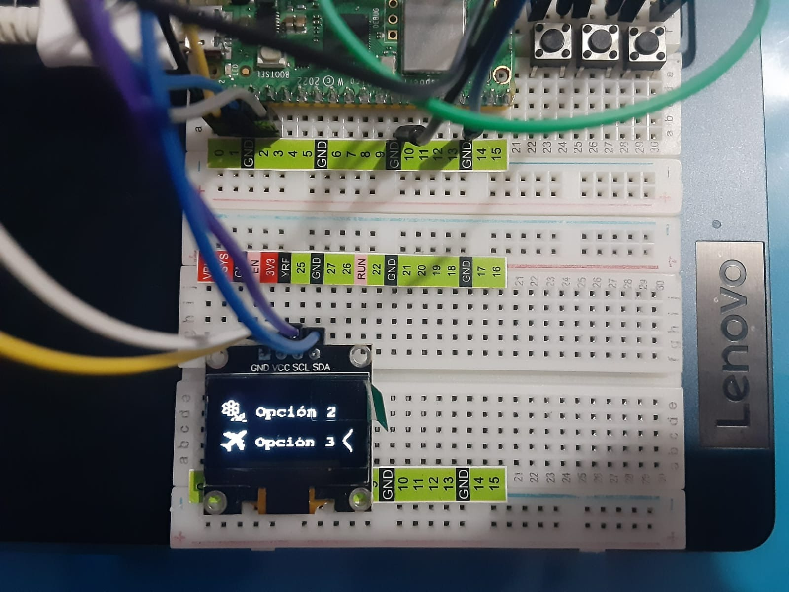

# 2.3 Elabore un menú en OLED Display (MENU DE NAVEGACION) y TIPOS LETRA personalizadas

>Autor: Guipzot Garibay Denisse Abigail 20211788 SC7C
 
### Código Micropython
_En este apartado se presenta el código .py para desplegar un **menú de opciones**_
```python
#Guipzot Garibay Denisse Abigail 20211788
#Sistemas Programables SC7C
#2.3 Menú de opciones

#librerías
import framebuf
from utime import sleep
#importación de elementos de biblioteca
from machine import Pin, I2C 
from ssd1306 import SSD1306_I2C

Menu = True #inicialización del menú
Seleccion = 1 #mostrar flecha en opción 1

#arreglos de bytes para el despliegue de imágenes en la pantalla OLED
flecha = bytearray([0x00, 0x00, 0x00, 0x80, 0x01, 0x80, 0x01, 0x00, 0x03, 0x00, 0x06, 0x00, 0x0c, 0x00, 0x18, 0x00, 
0x30, 0x00, 0x20, 0x00, 0x60, 0x00, 0x20, 0x00, 0x30, 0x00, 0x18, 0x00, 0x0c, 0x00, 0x06, 0x00, 
0x03, 0x00, 0x01, 0x00, 0x00, 0x80, 0x00, 0x80, 0x00, 0x00
])

#imagenes del menú de opciones
OpMariposa = bytearray([0x00, 0x00, 0x00, 0x00, 0x00, 0x00, 0x00, 0x00, 0x00, 0x00, 0x00, 0x00, 0x00, 0x00, 0x00, 0x00, 
0x00, 0x00, 0x00, 0x00, 0x00, 0x00, 0x00, 0x00, 0x00, 0x00, 0x1c, 0x00, 0x01, 0xc0, 0x00, 0x00, 
0x00, 0x00, 0x00, 0x00, 0x00, 0x00, 0x00, 0x3f, 0x80, 0x0f, 0xe0, 0x00, 0x00, 0x00, 0x00, 0x00, 
0x00, 0x00, 0x00, 0x00, 0x3f, 0xc0, 0x1f, 0xe0, 0x00, 0x00, 0x00, 0x00, 0x00, 0x00, 0x00, 0x00, 
0x00, 0x1f, 0xf0, 0x7f, 0xc0, 0x00, 0x00, 0x00, 0x00, 0x00, 0x00, 0x00, 0x00, 0x00, 0x1f, 0xf8, 
0xff, 0xc0, 0x00, 0x00, 0x00, 0x00, 0x00, 0x00, 0x00, 0x00, 0x00, 0x0f, 0xff, 0xff, 0x80, 0x00, 
0x00, 0x00, 0x00, 0x00, 0x00, 0x00, 0x00, 0x00, 0x0f, 0xff, 0xff, 0x80, 0x00, 0x00, 0x00, 0x00, 
0x00, 0x00, 0x00, 0x00, 0x00, 0x01, 0xff, 0xfc, 0x00, 0x01, 0x80, 0x00, 0x00, 0x80, 0x40, 0x00, 
0x00, 0x40, 0x01, 0xff, 0xfe, 0x00, 0x07, 0xc0, 0x00, 0x00, 0x00, 0x00, 0x00, 0x01, 0xe0, 0x03, 
0xff, 0xfe, 0x00, 0x04, 0x20, 0x00, 0x00, 0x00, 0x00, 0x00, 0x00, 0x60, 0x07, 0xff, 0xff, 0x00, 
0x08, 0x3f, 0xe3, 0xf1, 0x83, 0xf3, 0xf0, 0x00, 0x60, 0x07, 0xff, 0xfe, 0x00, 0x08, 0x16, 0x36, 
0x10, 0x82, 0x11, 0x10, 0x00, 0x60, 0x03, 0xfb, 0xfe, 0x00, 0x0c, 0x34, 0x14, 0x00, 0x82, 0x19, 
0x10, 0x00, 0x60, 0x03, 0xfa, 0xfe, 0x00, 0x04, 0x66, 0x36, 0x10, 0xc3, 0x13, 0x10, 0x00, 0x60, 
0x01, 0xfa, 0xfc, 0x00, 0x03, 0xc7, 0xc1, 0xe3, 0xf1, 0xe3, 0x38, 0x01, 0xf8, 0x00, 0xf0, 0xf8, 
0x00, 0x00, 0x04, 0x00, 0x00, 0x00, 0x00, 0x00, 0x00, 0x00, 0x00, 0x30, 0x20, 0x00, 0x00, 0x0f, 
0x00, 0x00, 0x00, 0x00, 0x00, 0x00, 0x00, 0x00, 0x00, 0x00, 0x00, 0x00, 0x00, 0x00, 0x00, 0x00, 
0x00, 0x00, 0x00, 0x00, 0x00, 0x00, 0x00, 0x00, 0x00, 0x00, 0x00, 0x00, 0x00, 0x00, 0x00, 0x00, 
0x00])

OpFlor = bytearray([0x00, 0x00, 0x00, 0x00, 0x00, 0x00, 0x00, 0x00, 0x00, 0x00, 0x00, 0x00, 0x00, 0x00, 0xe0, 0x00, 
0x00, 0x00, 0x00, 0x00, 0x00, 0x00, 0x00, 0x00, 0x00, 0x00, 0x01, 0x10, 0x00, 0x00, 0x00, 0x00, 
0x00, 0x00, 0x00, 0x00, 0x00, 0x00, 0x00, 0x0d, 0x16, 0x00, 0x00, 0x00, 0x00, 0x00, 0x00, 0x00, 
0x00, 0x00, 0x00, 0x00, 0x13, 0x19, 0x00, 0x00, 0x00, 0x00, 0x00, 0x00, 0x00, 0x00, 0x00, 0x00, 
0x00, 0x21, 0xb0, 0x00, 0x00, 0x00, 0x00, 0x00, 0x00, 0x00, 0x00, 0x00, 0x00, 0x00, 0x10, 0xa1, 
0x00, 0x00, 0x00, 0x00, 0x00, 0x02, 0x00, 0x80, 0x00, 0x00, 0x00, 0x0f, 0x1e, 0x00, 0x00, 0x38, 
0x00, 0x00, 0x02, 0x01, 0x00, 0x00, 0x00, 0xd8, 0x19, 0x13, 0x00, 0x00, 0x46, 0x00, 0x00, 0x00, 
0x00, 0x00, 0x00, 0x01, 0x08, 0x10, 0xe1, 0x00, 0x00, 0x83, 0xfe, 0x1f, 0x8e, 0x07, 0xc7, 0xe0, 
0x00, 0x18, 0x21, 0x11, 0x00, 0x00, 0x83, 0x61, 0x30, 0x82, 0x0c, 0x62, 0x20, 0x00, 0x18, 0x1f, 
0x1f, 0x00, 0x00, 0x83, 0x61, 0x20, 0x02, 0x08, 0x22, 0x30, 0x00, 0x60, 0x01, 0x18, 0x08, 0x00, 
0xc2, 0x61, 0x20, 0x02, 0x08, 0x22, 0x30, 0x00, 0xc0, 0x01, 0xa4, 0x28, 0x00, 0x6e, 0x73, 0x18, 
0x87, 0x0e, 0xc6, 0x30, 0x01, 0xc8, 0x00, 0x02, 0x48, 0x00, 0x10, 0x60, 0x06, 0x0f, 0x81, 0x06, 
0x30, 0x01, 0xf8, 0x00, 0x07, 0x58, 0x00, 0x00, 0x60, 0x00, 0x00, 0x00, 0x00, 0x00, 0x00, 0x00, 
0x00, 0x11, 0xe0, 0x00, 0x00, 0xf0, 0x00, 0x00, 0x00, 0x00, 0x00, 0x00, 0x00, 0x00, 0x33, 0x60, 
0x00, 0x00, 0x00, 0x00, 0x00, 0x00, 0x00, 0x00, 0x00, 0x00, 0x00, 0x00, 0x0e, 0x00, 0x00, 0x00, 
0x00, 0x00, 0x00, 0x00, 0x00, 0x00, 0x00, 0x00, 0x00, 0x00, 0x00, 0x00, 0x00, 0x00, 0x00, 0x00, 
0x00, 0x00, 0x00, 0x00, 0x00, 0x00, 0x00, 0x00, 0x00, 0x00, 0x00, 0x00, 0x00, 0x00, 0x00, 0x00, 
0x00])

OpAvion = bytearray([0x00, 0x00, 0x00, 0x00, 0x00, 0x00, 0x00, 0x00, 0x00, 0x00, 0x00, 0x00, 0x00, 0x00, 0x00, 0x00, 
0x00, 0x00, 0x00, 0x00, 0x00, 0x00, 0x00, 0x00, 0x00, 0x00, 0x00, 0x00, 0x0e, 0x00, 0x00, 0x00, 
0x00, 0x00, 0x00, 0x00, 0x00, 0x00, 0x00, 0x01, 0x80, 0x3e, 0x00, 0x00, 0x00, 0x00, 0x00, 0x00, 
0x00, 0x00, 0x00, 0x00, 0x0f, 0xd8, 0x7c, 0x00, 0x00, 0x00, 0x00, 0x00, 0x00, 0x00, 0x00, 0x00, 
0x00, 0x07, 0xfe, 0xf8, 0x00, 0x00, 0x00, 0x00, 0x00, 0x00, 0x00, 0x00, 0x00, 0x00, 0x01, 0xff, 
0xf0, 0x00, 0x00, 0x00, 0x00, 0x00, 0x00, 0x00, 0x00, 0x00, 0x00, 0x00, 0x7f, 0xe0, 0x00, 0x00, 
0x00, 0x00, 0x00, 0x00, 0x00, 0x00, 0x00, 0x00, 0x00, 0x0f, 0xc0, 0x00, 0x18, 0x00, 0x00, 0x06, 
0x02, 0x00, 0x00, 0x01, 0xf0, 0x00, 0x1f, 0xe0, 0x00, 0x66, 0x00, 0x00, 0x00, 0x00, 0x00, 0x00, 
0x00, 0x10, 0x00, 0x3f, 0xf8, 0x00, 0xc3, 0xfe, 0x1f, 0x8e, 0x07, 0x8f, 0xc0, 0x00, 0x10, 0x00, 
0x7d, 0xe0, 0x00, 0xc3, 0x71, 0x30, 0x82, 0x08, 0x46, 0x60, 0x00, 0x70, 0x00, 0xf8, 0xf0, 0x00, 
0xc3, 0x61, 0xa0, 0x02, 0x18, 0x66, 0x20, 0x00, 0x18, 0x3f, 0xf0, 0xf0, 0x00, 0x42, 0x61, 0x30, 
0x02, 0x08, 0x66, 0x20, 0x00, 0x18, 0x0f, 0xc0, 0x7c, 0x00, 0x3c, 0x7f, 0x1f, 0x9f, 0x8f, 0xce, 
0x60, 0x03, 0xf0, 0x03, 0xc0, 0x38, 0x00, 0x00, 0x60, 0x00, 0x00, 0x00, 0x00, 0x00, 0x00, 0x00, 
0x01, 0xc0, 0x38, 0x00, 0x00, 0x60, 0x00, 0x00, 0x00, 0x00, 0x00, 0x00, 0x00, 0x00, 0xc0, 0x18, 
0x00, 0x00, 0x70, 0x00, 0x00, 0x00, 0x00, 0x00, 0x00, 0x00, 0x00, 0xc0, 0x00, 0x00, 0x00, 0x00, 
0x00, 0x00, 0x00, 0x00, 0x00, 0x00, 0x00, 0x00, 0x00, 0x00, 0x00, 0x00, 0x00, 0x00, 0x00, 0x00, 
0x00, 0x00, 0x00, 0x00, 0x00, 0x00, 0x00, 0x00, 0x00, 0x00, 0x00, 0x00, 0x00, 0x00, 0x00, 0x00, 
0x00])

#imagenes de despliegue
Mariposa = bytearray([0x00, 0x00, 0x00, 0x00, 0x00, 0x00, 0x00, 0x00, 0x00, 0x00, 0x00, 0x00, 0x00, 0x00, 0x00, 0x00, 
0x00, 0x00, 0x00, 0x00, 0x00, 0x00, 0x00, 0x00, 0x02, 0x00, 0x00, 0x00, 0x00, 0x00, 0x00, 0x00, 
0x00, 0x00, 0x00, 0x00, 0x00, 0x00, 0x00, 0x00, 0x0f, 0x80, 0x00, 0x00, 0x00, 0x00, 0x00, 0x00, 
0x00, 0x00, 0x00, 0x00, 0x00, 0x00, 0x00, 0x00, 0x1f, 0xc0, 0x00, 0x00, 0x00, 0x00, 0x00, 0x00, 
0x00, 0x00, 0x00, 0x00, 0x00, 0x00, 0x00, 0x00, 0x7f, 0xe0, 0x00, 0x00, 0x00, 0x00, 0x00, 0x00, 
0x00, 0x00, 0x00, 0x00, 0x00, 0x00, 0x00, 0x00, 0xff, 0xf0, 0x00, 0x00, 0x00, 0x00, 0x00, 0x00, 
0x00, 0x00, 0x00, 0x00, 0x00, 0x00, 0x00, 0x00, 0xff, 0xf0, 0x00, 0x00, 0x00, 0x00, 0x00, 0x00, 
0x00, 0x00, 0x00, 0x00, 0x00, 0x00, 0x00, 0x00, 0x7f, 0xf0, 0x00, 0x00, 0x00, 0x00, 0x00, 0x00, 
0x00, 0x00, 0x00, 0x00, 0x00, 0x00, 0x00, 0x1f, 0xff, 0xf0, 0x00, 0x00, 0x00, 0x00, 0x00, 0x00, 
0x00, 0x00, 0x00, 0x00, 0x00, 0x00, 0x00, 0x7f, 0xff, 0xe0, 0x00, 0x00, 0x00, 0x00, 0x00, 0x00, 
0x00, 0x00, 0x00, 0x00, 0x00, 0x00, 0x01, 0xff, 0xff, 0xe0, 0x00, 0x00, 0x00, 0x00, 0x00, 0x00, 
0x00, 0x00, 0x00, 0x00, 0x00, 0x00, 0x01, 0xff, 0xff, 0xf4, 0x00, 0x00, 0x00, 0x00, 0x00, 0x00, 
0x00, 0x00, 0x00, 0x00, 0x00, 0x00, 0x03, 0xff, 0xff, 0xff, 0xfc, 0x00, 0x00, 0x00, 0x00, 0x00, 
0x00, 0x00, 0x00, 0x00, 0x00, 0x00, 0x00, 0xff, 0x8f, 0xff, 0xff, 0xc0, 0x00, 0x00, 0x00, 0x00, 
0x00, 0x00, 0x00, 0x00, 0x00, 0x00, 0x00, 0x00, 0x03, 0xff, 0xff, 0xf8, 0x00, 0x00, 0x00, 0x00, 
0x00, 0x00, 0x00, 0x00, 0x00, 0x00, 0x00, 0x00, 0x07, 0xff, 0xff, 0xfc, 0x00, 0x00, 0x00, 0x00, 
0x00, 0x00, 0x00, 0x00, 0x00, 0x00, 0x00, 0x00, 0x0f, 0xfe, 0xff, 0xfc, 0x00, 0x00, 0x00, 0x00, 
0x00, 0x00, 0x00, 0x00, 0x00, 0x00, 0x00, 0x00, 0x1f, 0xfe, 0x3f, 0x80, 0x00, 0x00, 0x00, 0x00, 
0x00, 0x00, 0x00, 0x00, 0x00, 0x00, 0x00, 0x00, 0x1f, 0xff, 0x00, 0x00, 0x00, 0x00, 0x00, 0x00, 
0x00, 0x00, 0x00, 0x00, 0x00, 0x00, 0x00, 0x00, 0x3f, 0xfe, 0x00, 0x00, 0x00, 0x00, 0x00, 0x00, 
0x00, 0x00, 0x00, 0x00, 0x00, 0x00, 0x00, 0x00, 0x1f, 0xe0, 0x00, 0x00, 0x00, 0x00, 0x00, 0x00, 
0x00, 0x00, 0x00, 0x00, 0x00, 0x00, 0x00, 0x00, 0x00, 0x00, 0x00, 0x00, 0x00, 0x00, 0x00, 0x00, 
0x00, 0x00, 0x00, 0x00, 0x00, 0x00, 0x00, 0x00, 0x00, 0x00, 0x00, 0x00, 0x00, 0x00, 0x00, 0x00, 
0x00, 0x00, 0x00, 0x00, 0x00, 0x00, 0x00, 0x00, 0x00, 0x00, 0x00, 0x00, 0x00, 0x00, 0x00, 0x00, 
0x00, 0x00, 0x00, 0x00, 0x00, 0x00, 0x00, 0x00, 0x00, 0x00, 0x00, 0x00, 0x00, 0x00, 0x00, 0x00, 
0x00, 0x00, 0x00, 0x00, 0x00, 0x00, 0x00, 0x00, 0x00, 0x00, 0x00, 0x00, 0x00, 0x00, 0x00, 0x00, 
0x00, 0x00, 0x00, 0x00, 0x00, 0x00, 0x00, 0x00, 0x00, 0x00, 0x00, 0x00, 0x00, 0x00, 0x00, 0x00, 
0x00, 0x00, 0x00, 0x00, 0x00, 0x00, 0x00, 0x00, 0x00, 0x00, 0x00, 0x00, 0x00, 0x00, 0x00, 0x00, 
0x00, 0x00, 0x00, 0x00, 0x00, 0x00, 0x00, 0x00, 0x00, 0x00, 0x00, 0x00, 0x00, 0x00, 0x00, 0x00, 
0x00, 0x00, 0x00, 0x00, 0x00, 0x00, 0x00, 0x00, 0x00, 0x00, 0x00, 0x00, 0x00, 0x00, 0x00, 0x00, 
0x00, 0x00, 0x00, 0x00, 0x00, 0x00, 0x00, 0x00, 0x00, 0x00, 0x00, 0x00, 0x00, 0x00, 0x00, 0x00, 
0x00, 0x00, 0x00, 0x00, 0x00, 0x00, 0x00, 0x00, 0x00, 0x00, 0x00, 0x00, 0x08, 0x00, 0x00, 0x00, 
0x00, 0x00, 0x00, 0x00, 0x00, 0x00, 0x00, 0x00, 0x00, 0x00, 0x00, 0x00, 0x1f, 0x80, 0x00, 0x00, 
0x00, 0x00, 0x00, 0x00, 0x00, 0x00, 0x00, 0x00, 0x00, 0x00, 0x00, 0x00, 0x1f, 0xe0, 0x00, 0x00, 
0x00, 0x00, 0x00, 0x00, 0x00, 0x00, 0x00, 0x00, 0x00, 0x00, 0x00, 0x00, 0x3f, 0xf0, 0x00, 0x00, 
0x00, 0x00, 0x00, 0x00, 0x00, 0x00, 0x00, 0x00, 0x00, 0x00, 0x00, 0x00, 0x3f, 0xf0, 0x07, 0xfc, 
0x00, 0x00, 0x00, 0x00, 0x00, 0x00, 0x00, 0x00, 0x00, 0x00, 0x00, 0x00, 0x1f, 0xf8, 0x7f, 0xfc, 
0x00, 0x01, 0xf8, 0x00, 0x00, 0x00, 0x00, 0x00, 0x00, 0x00, 0x00, 0x00, 0x07, 0xff, 0xff, 0xf8, 
0x00, 0x01, 0xfe, 0x00, 0x00, 0x00, 0x00, 0x00, 0x00, 0x00, 0x00, 0x00, 0x7f, 0xff, 0xff, 0xe0, 
0x00, 0x03, 0xff, 0x80, 0x00, 0x00, 0x00, 0x00, 0x00, 0x00, 0x00, 0x00, 0x7f, 0xff, 0xff, 0xc0, 
0x00, 0x07, 0xff, 0xc0, 0x00, 0x00, 0x00, 0x00, 0x00, 0x00, 0x00, 0x00, 0xff, 0xd7, 0xf8, 0x00, 
0x00, 0x0f, 0xff, 0xe0, 0x00, 0x00, 0x00, 0x00, 0x00, 0x00, 0x00, 0x00, 0xff, 0x87, 0xfc, 0x00, 
0x00, 0x0f, 0xff, 0xf0, 0x00, 0x00, 0x00, 0x00, 0x00, 0x00, 0x00, 0x00, 0xfe, 0x07, 0xfc, 0x00, 
0x00, 0x07, 0xff, 0xf8, 0x00, 0x00, 0x00, 0x00, 0x00, 0x00, 0x00, 0x00, 0x70, 0x07, 0xf8, 0x00, 
0x00, 0x01, 0xff, 0xf8, 0x00, 0x00, 0x00, 0x00, 0x00, 0x00, 0x00, 0x00, 0x00, 0x07, 0xe0, 0x00, 
0x00, 0xfe, 0x7f, 0xfd, 0x00, 0x00, 0x00, 0x00, 0x00, 0x00, 0x00, 0x00, 0x00, 0x01, 0x80, 0x00, 
0x01, 0xff, 0xff, 0xfc, 0x00, 0x00, 0x00, 0x00, 0x00, 0x00, 0x00, 0x00, 0x00, 0x00, 0x00, 0x00, 
0x03, 0xff, 0xff, 0xf8, 0x00, 0x00, 0x00, 0x00, 0x00, 0x00, 0x00, 0x00, 0x00, 0x00, 0x00, 0x00, 
0x07, 0xff, 0xff, 0xfa, 0x40, 0x00, 0x00, 0x00, 0x00, 0x00, 0x00, 0x00, 0x00, 0x00, 0x00, 0x00, 
0x0f, 0xff, 0xff, 0xff, 0xff, 0xfe, 0x00, 0x00, 0x00, 0x00, 0x00, 0x00, 0x00, 0x00, 0x00, 0x00, 
0x0f, 0xff, 0xff, 0xff, 0xff, 0xff, 0xf8, 0x00, 0x00, 0x00, 0x00, 0x00, 0x00, 0x00, 0x00, 0x00, 
0x07, 0xff, 0xf8, 0xff, 0xff, 0xff, 0xff, 0x80, 0x00, 0x00, 0x00, 0x00, 0x00, 0x00, 0x00, 0x00, 
0x01, 0xfe, 0x01, 0x9f, 0xff, 0xff, 0xff, 0xe0, 0x00, 0x00, 0x00, 0x00, 0x00, 0x00, 0x00, 0x00, 
0x00, 0x00, 0x00, 0x3f, 0xff, 0xff, 0xff, 0xc0, 0x00, 0x00, 0x00, 0x00, 0x00, 0x00, 0x00, 0x00, 
0x00, 0x00, 0x00, 0x7f, 0xff, 0xff, 0xff, 0x80, 0x00, 0x00, 0x00, 0x00, 0x00, 0x00, 0x00, 0x00, 
0x00, 0x00, 0x00, 0x7f, 0xff, 0x3f, 0xf0, 0x00, 0x00, 0x00, 0x00, 0x00, 0x00, 0x00, 0x00, 0x00, 
0x00, 0x00, 0x00, 0x7f, 0xff, 0x82, 0x00, 0x00, 0x00, 0x00, 0x00, 0x00, 0x00, 0x00, 0x00, 0x00, 
0x00, 0x00, 0x00, 0xff, 0xff, 0xc0, 0x00, 0x00, 0x00, 0x00, 0x00, 0x00, 0x00, 0x00, 0x00, 0x00, 
0x00, 0x00, 0x00, 0xff, 0xff, 0x80, 0x00, 0x00, 0x00, 0x00, 0x00, 0x00, 0x00, 0x00, 0x00, 0x00, 
0x00, 0x00, 0x00, 0x7f, 0xfc, 0x00, 0x00, 0x00, 0x00, 0x00, 0x00, 0x00, 0x00, 0x00, 0x00, 0x00, 
0x00, 0x00, 0x00, 0x1f, 0xc0, 0x00, 0x00, 0x00, 0x00, 0x00, 0x00, 0x00, 0x00, 0x00, 0x00, 0x00, 
0x00, 0x00, 0x00, 0x00, 0x00, 0x00, 0x00, 0x00, 0x00, 0x00, 0x00, 0x00, 0x00, 0x00, 0x00, 0x00, 
0x00, 0x00, 0x00, 0x00, 0x00, 0x00, 0x00, 0x00, 0x00, 0x00, 0x00, 0x00, 0x00, 0x00, 0x00, 0x00, 
0x00, 0x00, 0x00, 0x00, 0x00, 0x00, 0x00, 0x00, 0x00, 0x00, 0x00, 0x00, 0x00, 0x00, 0x00, 0x00
])

Flor = bytearray([0x00, 0x00, 0x00, 0x00, 0x00, 0x00, 0x00, 0x7f, 0x00, 0x00, 0x00, 0x00, 0x00, 0x00, 0x00, 0x00, 
0x00, 0x00, 0x00, 0x00, 0x00, 0x00, 0x03, 0xf3, 0xc0, 0x00, 0x00, 0x00, 0x00, 0x00, 0x00, 0x00, 
0x00, 0x00, 0x00, 0x00, 0x00, 0x00, 0x0f, 0x00, 0xc0, 0x00, 0x00, 0x00, 0x00, 0x00, 0x00, 0x00, 
0x00, 0x00, 0x00, 0x00, 0x00, 0x00, 0x1c, 0x00, 0x60, 0x00, 0x00, 0x00, 0x00, 0x00, 0x00, 0x00, 
0x00, 0x00, 0x00, 0x00, 0x00, 0x00, 0x30, 0x00, 0x40, 0x00, 0x00, 0x00, 0x00, 0x00, 0x00, 0x00, 
0x00, 0x00, 0x00, 0x00, 0x00, 0x00, 0x30, 0x00, 0xc0, 0x00, 0x00, 0x00, 0x00, 0x00, 0x00, 0x00, 
0x00, 0x00, 0x00, 0x00, 0x00, 0x00, 0x60, 0x00, 0xc0, 0x00, 0x00, 0x00, 0x00, 0x00, 0x00, 0x00, 
0x00, 0x00, 0x00, 0x00, 0x00, 0x00, 0x60, 0x01, 0x80, 0x00, 0x00, 0x00, 0x00, 0x00, 0x00, 0x00, 
0x00, 0x00, 0x00, 0x00, 0x00, 0x00, 0x60, 0x01, 0x81, 0xf0, 0x00, 0x00, 0x00, 0x00, 0x00, 0x00, 
0x00, 0x00, 0x00, 0x00, 0x07, 0xe0, 0x30, 0x01, 0x8f, 0xfe, 0x00, 0x00, 0x00, 0x00, 0x00, 0x00, 
0x00, 0x00, 0x00, 0x00, 0x0c, 0x3c, 0x38, 0x03, 0x1c, 0x03, 0x80, 0x00, 0x00, 0x00, 0x00, 0x00, 
0x00, 0x00, 0x00, 0x00, 0x18, 0x0f, 0x18, 0x03, 0x70, 0x00, 0xc0, 0x00, 0x00, 0x00, 0x00, 0x00, 
0x00, 0x00, 0x00, 0x00, 0x18, 0x03, 0xcc, 0x03, 0xe0, 0x00, 0x60, 0x00, 0x00, 0x00, 0x00, 0x00, 
0x00, 0x00, 0x00, 0x00, 0x10, 0x00, 0x7e, 0x07, 0xc0, 0x00, 0x30, 0x00, 0x00, 0x00, 0x00, 0x00, 
0x00, 0x00, 0x00, 0x00, 0x10, 0x00, 0x1f, 0xff, 0x80, 0x00, 0x38, 0x00, 0x00, 0x00, 0x00, 0x00, 
0x00, 0x00, 0x00, 0x00, 0x18, 0x00, 0x07, 0xc7, 0x00, 0x00, 0x18, 0x00, 0x00, 0x00, 0x00, 0x00, 
0x00, 0x00, 0x00, 0x00, 0x18, 0x00, 0x03, 0x01, 0x80, 0x00, 0x18, 0x00, 0x00, 0x00, 0x00, 0x00, 
0x00, 0x00, 0x00, 0x00, 0x18, 0x00, 0x03, 0x01, 0x80, 0x00, 0x70, 0x00, 0x00, 0x00, 0x00, 0x00, 
0x00, 0x00, 0x00, 0x00, 0x0c, 0x00, 0x07, 0x01, 0xdf, 0xff, 0xe0, 0x00, 0x00, 0x00, 0x00, 0x00, 
0x00, 0x00, 0x00, 0x00, 0x06, 0x00, 0x0f, 0x01, 0xff, 0xc0, 0x00, 0x00, 0x00, 0x00, 0x00, 0x00, 
0x00, 0x00, 0x00, 0x00, 0x03, 0xc7, 0xff, 0xc7, 0xfc, 0x00, 0x00, 0x00, 0x00, 0x00, 0x00, 0x00, 
0x00, 0x00, 0x00, 0x00, 0x00, 0xff, 0x38, 0xfe, 0x0f, 0x80, 0x00, 0x00, 0x00, 0x00, 0x00, 0x00, 
0x00, 0x00, 0x00, 0x00, 0x00, 0x00, 0x70, 0x38, 0x01, 0xe0, 0x00, 0x00, 0x00, 0x00, 0x00, 0x00, 
0x00, 0x00, 0x00, 0x00, 0x00, 0x01, 0xc0, 0x38, 0x00, 0x30, 0x00, 0x00, 0x00, 0x00, 0x00, 0x00, 
0x00, 0x00, 0x00, 0x00, 0x00, 0x07, 0x00, 0x3c, 0x00, 0x18, 0x00, 0x00, 0x00, 0x00, 0x00, 0x00, 
0x00, 0x00, 0x00, 0x00, 0x00, 0x1e, 0x00, 0x3c, 0x00, 0x18, 0x00, 0x00, 0x00, 0x00, 0x00, 0x00, 
0x00, 0x00, 0x00, 0x00, 0x00, 0x38, 0x00, 0x3e, 0x00, 0x0c, 0x00, 0x00, 0x00, 0x00, 0x00, 0x00, 
0x00, 0x00, 0x00, 0x00, 0x00, 0x60, 0x00, 0x7f, 0x00, 0x0c, 0x00, 0x00, 0x00, 0x00, 0x00, 0x00, 
0x00, 0x00, 0x00, 0x00, 0x00, 0xc0, 0x00, 0x7f, 0x00, 0x08, 0x00, 0x00, 0x00, 0x00, 0x00, 0x00, 
0x00, 0x00, 0x00, 0x00, 0x01, 0x80, 0x00, 0x7f, 0x80, 0x18, 0x00, 0x00, 0x00, 0x00, 0x00, 0x00, 
0x00, 0x00, 0x00, 0x00, 0xff, 0xe0, 0x00, 0xfd, 0x80, 0x18, 0x00, 0x00, 0x00, 0x00, 0x00, 0x00, 
0x00, 0x00, 0x00, 0x00, 0xc0, 0xfc, 0x01, 0xf4, 0xc0, 0x30, 0x00, 0x00, 0x00, 0x00, 0x00, 0x00, 
0x00, 0x00, 0x00, 0x01, 0xc0, 0x3f, 0x87, 0xb6, 0xe0, 0x60, 0x03, 0xfc, 0x00, 0x00, 0x00, 0x00, 
0x00, 0x00, 0x00, 0x00, 0xc0, 0x0f, 0xfe, 0x36, 0x71, 0xc0, 0x3f, 0x8f, 0x00, 0x00, 0x00, 0x00, 
0x00, 0x00, 0x00, 0x00, 0xc0, 0x00, 0x78, 0x36, 0x3f, 0x01, 0xe0, 0x03, 0x00, 0x00, 0x00, 0x00, 
0x00, 0x00, 0x00, 0x00, 0x60, 0x00, 0x1c, 0x36, 0x00, 0x0f, 0x00, 0x01, 0x00, 0x00, 0x00, 0x00, 
0x00, 0x00, 0x00, 0x00, 0x30, 0x00, 0x07, 0x36, 0x00, 0x38, 0x00, 0x03, 0x00, 0x00, 0x00, 0x00, 
0x00, 0x00, 0x00, 0x00, 0x1c, 0x00, 0x03, 0xb3, 0x01, 0xe0, 0x00, 0x06, 0x00, 0x00, 0x00, 0x00, 
0x00, 0x00, 0x00, 0x00, 0x0e, 0x00, 0x00, 0xfb, 0x03, 0x80, 0x00, 0x0c, 0x00, 0x00, 0x00, 0x00, 
0x00, 0x00, 0x00, 0x00, 0x03, 0x80, 0x00, 0x7b, 0x0e, 0x00, 0x00, 0x38, 0x00, 0x00, 0x00, 0x00, 
0x00, 0x00, 0x00, 0x00, 0x01, 0xc0, 0x00, 0x1b, 0x18, 0x00, 0x00, 0x70, 0x00, 0x00, 0x00, 0x00, 
0x00, 0x00, 0x00, 0x00, 0x00, 0x70, 0x00, 0x01, 0xf0, 0x00, 0x01, 0xc0, 0x00, 0x00, 0x00, 0x00, 
0x00, 0x00, 0x00, 0x00, 0x00, 0x1c, 0x00, 0x01, 0xe0, 0x00, 0x07, 0x00, 0x00, 0x00, 0x00, 0x00, 
0x00, 0x00, 0x00, 0x00, 0x00, 0x07, 0x80, 0x01, 0xc0, 0x00, 0x3c, 0x00, 0x00, 0x00, 0x00, 0x00, 
0x00, 0x00, 0x00, 0x00, 0x00, 0x01, 0xe0, 0x00, 0x80, 0x01, 0xf0, 0x00, 0x00, 0x00, 0x00, 0x00, 
0x00, 0x00, 0x00, 0x00, 0x00, 0x00, 0x7e, 0x0e, 0x00, 0x0f, 0x80, 0x00, 0x00, 0x00, 0x00, 0x00, 
0x00, 0x00, 0x00, 0x00, 0x00, 0x00, 0x07, 0xfe, 0x7f, 0xfc, 0x00, 0x00, 0x00, 0x00, 0x00, 0x00, 
0x00, 0x00, 0x00, 0x00, 0x00, 0x00, 0x00, 0x03, 0x7f, 0xc0, 0x00, 0x00, 0x00, 0x00, 0x00, 0x00, 
0x00, 0x00, 0x00, 0x00, 0x00, 0x00, 0x00, 0x03, 0x30, 0x00, 0x00, 0x00, 0x00, 0x00, 0x00, 0x00, 
0x00, 0x00, 0x00, 0x00, 0x00, 0x00, 0x00, 0x01, 0xb0, 0x00, 0x00, 0x00, 0x00, 0x00, 0x00, 0x00, 
0x00, 0x00, 0x00, 0x00, 0x00, 0x00, 0x00, 0x01, 0xd8, 0x00, 0x00, 0x00, 0x00, 0x00, 0x00, 0x00, 
0x00, 0x00, 0x00, 0x00, 0x00, 0x00, 0x00, 0x00, 0xcc, 0x00, 0x00, 0x00, 0x00, 0x00, 0x00, 0x00, 
0x00, 0x00, 0x00, 0x00, 0x00, 0x00, 0x00, 0x00, 0x66, 0x00, 0x00, 0x00, 0x00, 0x00, 0x00, 0x00, 
0x00, 0x00, 0x00, 0x00, 0x00, 0x00, 0x00, 0x00, 0x33, 0x00, 0x00, 0x00, 0x00, 0x00, 0x00, 0x00, 
0x00, 0x00, 0x00, 0x00, 0x00, 0x00, 0x00, 0x00, 0x19, 0xc0, 0x00, 0x00, 0x00, 0x00, 0x00, 0x00, 
0x00, 0x00, 0x00, 0x00, 0x00, 0x00, 0x00, 0x00, 0x0c, 0x70, 0x00, 0x00, 0x00, 0x00, 0x00, 0x00, 
0x00, 0x00, 0x00, 0x00, 0x00, 0x00, 0x00, 0x00, 0x07, 0x3c, 0x00, 0x00, 0x00, 0x00, 0x00, 0x00, 
0x00, 0x00, 0x00, 0x00, 0x00, 0x00, 0x00, 0x00, 0x03, 0xc7, 0xc0, 0x00, 0x00, 0x00, 0x00, 0x00, 
0x00, 0x00, 0x00, 0x00, 0x00, 0x00, 0x00, 0x00, 0x00, 0xf0, 0xff, 0xc0, 0x00, 0x00, 0x00, 0x00, 
0x00, 0x00, 0x00, 0x00, 0x00, 0x00, 0x00, 0x00, 0x00, 0x3c, 0x07, 0xfc, 0x00, 0x00, 0x00, 0x00, 
0x00, 0x00, 0x00, 0x00, 0x00, 0x00, 0x00, 0x00, 0x00, 0x0f, 0x80, 0x0c, 0x00, 0x00, 0x00, 0x00, 
0x00, 0x00, 0x00, 0x00, 0x00, 0x00, 0x00, 0x00, 0x00, 0x00, 0xfc, 0x3c, 0x00, 0x00, 0x00, 0x00, 
0x00, 0x00, 0x00, 0x00, 0x00, 0x00, 0x00, 0x00, 0x00, 0x00, 0x1f, 0xf0, 0x00, 0x00, 0x00, 0x00
])

Avion = bytearray([0x00, 0x00, 0x00, 0x00, 0x00, 0x00, 0x00, 0x00, 0x00, 0x00, 0x00, 0x00, 0x00, 0x00, 0x00, 0x00, 
0x00, 0x00, 0x00, 0x00, 0x00, 0x00, 0x00, 0x00, 0x00, 0x00, 0x00, 0x00, 0x00, 0x00, 0x00, 0x00, 
0x00, 0x00, 0x00, 0x00, 0x00, 0x00, 0x00, 0x00, 0x00, 0x00, 0x00, 0x00, 0x00, 0x00, 0x00, 0x00, 
0x00, 0x00, 0x00, 0x00, 0x00, 0x00, 0x00, 0x00, 0x00, 0x00, 0x00, 0x00, 0x00, 0x00, 0x00, 0x00, 
0x00, 0x00, 0x00, 0x00, 0x00, 0x00, 0x00, 0x00, 0x00, 0x00, 0x00, 0x00, 0x00, 0x00, 0x00, 0x00, 
0x00, 0x00, 0x00, 0x00, 0x00, 0x00, 0x00, 0x00, 0x00, 0x00, 0x00, 0x00, 0x00, 0x00, 0x00, 0x00, 
0x00, 0x00, 0x00, 0x00, 0x00, 0x00, 0x00, 0x00, 0x00, 0x00, 0x00, 0x00, 0x00, 0x00, 0x00, 0x00, 
0x00, 0x00, 0x00, 0x00, 0x00, 0x00, 0x00, 0x00, 0x00, 0x00, 0x00, 0x00, 0x00, 0x00, 0x00, 0x00, 
0x00, 0x00, 0x00, 0x00, 0x00, 0x00, 0x00, 0x00, 0x00, 0x00, 0x00, 0x00, 0x00, 0x00, 0x00, 0x00, 
0x00, 0x00, 0x00, 0x00, 0x00, 0x00, 0x00, 0x00, 0x00, 0x00, 0x00, 0x00, 0x00, 0x00, 0x00, 0x00, 
0x00, 0x00, 0x00, 0x00, 0x00, 0x00, 0x00, 0x00, 0x00, 0x00, 0x00, 0x00, 0x00, 0x00, 0x00, 0x00, 
0x00, 0x00, 0x00, 0x00, 0x00, 0x00, 0x00, 0x00, 0x00, 0x00, 0x00, 0x00, 0x00, 0x00, 0x00, 0x00, 
0x00, 0x00, 0x00, 0x00, 0x00, 0x00, 0x00, 0x00, 0x00, 0x00, 0x00, 0x00, 0x00, 0x00, 0x00, 0x00, 
0x00, 0x00, 0x00, 0x00, 0x00, 0x00, 0x00, 0x00, 0x00, 0x00, 0x00, 0x00, 0x00, 0x00, 0x00, 0x00, 
0x00, 0x00, 0x00, 0x00, 0x00, 0x00, 0x00, 0x00, 0x00, 0x00, 0x00, 0x00, 0x00, 0x00, 0x00, 0x00, 
0x00, 0x00, 0x00, 0x00, 0x00, 0x00, 0x00, 0x00, 0x00, 0x00, 0x00, 0x00, 0x00, 0x00, 0x00, 0x00, 
0x00, 0x00, 0x00, 0x00, 0x00, 0x00, 0x00, 0x00, 0x00, 0x00, 0x00, 0x00, 0x00, 0x00, 0x00, 0x00, 
0x00, 0x00, 0x00, 0x00, 0x00, 0x00, 0x00, 0x00, 0x00, 0x00, 0x00, 0x00, 0x00, 0x00, 0x00, 0x00, 
0x00, 0x00, 0x00, 0x00, 0x00, 0x00, 0x00, 0x00, 0x00, 0x00, 0x00, 0x00, 0x00, 0x00, 0x00, 0x00, 
0x00, 0x00, 0x00, 0x00, 0x00, 0x00, 0x00, 0x00, 0x00, 0x00, 0x00, 0x00, 0x00, 0x00, 0x00, 0x00, 
0x00, 0x00, 0x00, 0x00, 0x00, 0x00, 0x00, 0x00, 0x00, 0x00, 0x00, 0x38, 0x00, 0x00, 0x00, 0x00, 
0x00, 0x00, 0x00, 0x00, 0x00, 0x00, 0x00, 0x00, 0x00, 0x00, 0x01, 0xf8, 0x00, 0x00, 0x00, 0x00, 
0x00, 0x00, 0x00, 0x00, 0x00, 0x00, 0x00, 0x00, 0x00, 0x00, 0x0f, 0xf0, 0x00, 0x00, 0x00, 0x00, 
0x00, 0x00, 0x00, 0x00, 0x00, 0x00, 0x00, 0x00, 0x00, 0x00, 0x3f, 0xe0, 0x00, 0x00, 0x00, 0x00, 
0x00, 0x00, 0x00, 0x00, 0x00, 0x00, 0x00, 0x00, 0x00, 0x00, 0xff, 0xc0, 0x00, 0x00, 0x00, 0x00, 
0x00, 0x00, 0x00, 0x00, 0x00, 0x00, 0x00, 0x00, 0x00, 0x03, 0xff, 0x00, 0x00, 0x00, 0x00, 0x00, 
0x00, 0x00, 0x00, 0x00, 0x03, 0xff, 0xe0, 0x00, 0x00, 0x0f, 0xfe, 0x00, 0x00, 0x00, 0x00, 0x00, 
0x00, 0x00, 0x00, 0x00, 0x0f, 0xff, 0xff, 0xff, 0xff, 0xbf, 0xf8, 0x00, 0x00, 0x00, 0x00, 0x00, 
0x00, 0x00, 0x00, 0x00, 0x07, 0xff, 0xff, 0xff, 0xff, 0xff, 0xe0, 0x00, 0x00, 0x00, 0x00, 0x00, 
0x00, 0x00, 0x00, 0x00, 0x00, 0x01, 0xff, 0xff, 0xff, 0xff, 0xc0, 0x00, 0x00, 0x00, 0x00, 0x00, 
0x00, 0x00, 0x00, 0x00, 0x00, 0x00, 0x03, 0xff, 0xff, 0xff, 0x00, 0x00, 0x00, 0x00, 0x00, 0x00, 
0x00, 0x00, 0x00, 0x00, 0x00, 0x00, 0x00, 0x1f, 0xff, 0xff, 0x80, 0x00, 0x00, 0x00, 0x00, 0x00, 
0x00, 0x00, 0x00, 0x00, 0x00, 0x00, 0x00, 0x03, 0xff, 0xff, 0x80, 0x00, 0x00, 0x00, 0x00, 0x00, 
0x00, 0x00, 0x00, 0x00, 0x00, 0x00, 0x00, 0x01, 0xff, 0xff, 0x80, 0x00, 0x00, 0x00, 0x00, 0x00, 
0x00, 0x00, 0x00, 0x00, 0x00, 0x00, 0x00, 0x03, 0xff, 0xff, 0x80, 0x00, 0x00, 0x00, 0x00, 0x00, 
0x00, 0x00, 0x00, 0x00, 0x00, 0x00, 0x00, 0x0f, 0xff, 0xff, 0xc0, 0x00, 0x00, 0x00, 0x00, 0x00, 
0x00, 0x00, 0x00, 0x00, 0x00, 0x00, 0x00, 0x1f, 0xfb, 0xff, 0xc0, 0x00, 0x00, 0x00, 0x00, 0x00, 
0x00, 0x00, 0x00, 0x00, 0x00, 0x00, 0x00, 0x3f, 0xe0, 0xff, 0xc0, 0x00, 0x00, 0x00, 0x00, 0x00, 
0x00, 0x00, 0x00, 0x00, 0x00, 0x00, 0x00, 0xff, 0x00, 0x7f, 0xe0, 0x00, 0x00, 0x00, 0x00, 0x00, 
0x00, 0x00, 0x00, 0x00, 0x00, 0x7f, 0xc1, 0xfc, 0x00, 0x3f, 0xe0, 0x00, 0x00, 0x00, 0x00, 0x00, 
0x00, 0x00, 0x00, 0x00, 0x00, 0xff, 0xff, 0xe0, 0x00, 0x1f, 0xe0, 0x00, 0x00, 0x00, 0x00, 0x00, 
0x00, 0x00, 0x00, 0x00, 0x00, 0x03, 0xff, 0x80, 0x00, 0x0f, 0xe0, 0x00, 0x00, 0x00, 0x00, 0x00, 
0x00, 0x00, 0x00, 0x00, 0x00, 0x00, 0x3f, 0xc0, 0x00, 0x07, 0xf0, 0x00, 0x00, 0x00, 0x00, 0x00, 
0x00, 0x00, 0x00, 0x00, 0x00, 0x00, 0x7f, 0xe0, 0x00, 0x07, 0xf0, 0x00, 0x00, 0x00, 0x00, 0x00, 
0x00, 0x00, 0x00, 0x00, 0x00, 0x00, 0x03, 0xf0, 0x00, 0x03, 0xf0, 0x00, 0x00, 0x00, 0x00, 0x00, 
0x00, 0x00, 0x00, 0x00, 0x00, 0x00, 0x01, 0xf0, 0x00, 0x01, 0xf0, 0x00, 0x00, 0x00, 0x00, 0x00, 
0x00, 0x00, 0x00, 0x00, 0x00, 0x00, 0x01, 0xf0, 0x00, 0x01, 0xf8, 0x00, 0x00, 0x00, 0x00, 0x00, 
0x00, 0x00, 0x00, 0x00, 0x00, 0x00, 0x00, 0xf0, 0x00, 0x00, 0xf0, 0x00, 0x00, 0x00, 0x00, 0x00, 
0x00, 0x00, 0x00, 0x00, 0x00, 0x00, 0x00, 0x00, 0x00, 0x00, 0xc0, 0x00, 0x00, 0x00, 0x00, 0x00, 
0x00, 0x00, 0x00, 0x00, 0x00, 0x00, 0x00, 0x00, 0x00, 0x00, 0x00, 0x00, 0x00, 0x00, 0x00, 0x00, 
0x00, 0x00, 0x00, 0x00, 0x00, 0x00, 0x00, 0x00, 0x00, 0x00, 0x00, 0x00, 0x00, 0x00, 0x00, 0x00, 
0x00, 0x00, 0x00, 0x00, 0x00, 0x00, 0x00, 0xff, 0xff, 0x80, 0x00, 0x00, 0x00, 0x00, 0x00, 0x00, 
0x00, 0x00, 0x00, 0x00, 0x00, 0x00, 0x00, 0x00, 0x00, 0x00, 0x00, 0x00, 0x00, 0x00, 0x00, 0x00, 
0x00, 0x00, 0x00, 0x00, 0x00, 0x00, 0x00, 0x00, 0x00, 0x00, 0x00, 0x00, 0x00, 0x00, 0x00, 0x00, 
0x00, 0x00, 0x00, 0x00, 0x00, 0x00, 0x00, 0x00, 0x00, 0x00, 0x00, 0x00, 0x00, 0x00, 0x00, 0x00, 
0x00, 0x00, 0x00, 0x00, 0x00, 0x00, 0x00, 0x00, 0x00, 0x00, 0x00, 0x00, 0x00, 0x00, 0x00, 0x00, 
0x00, 0x00, 0x00, 0x00, 0x00, 0x00, 0x00, 0x00, 0x00, 0x00, 0x00, 0x00, 0x00, 0x00, 0x00, 0x00, 
0x00, 0x00, 0x00, 0x00, 0x00, 0x00, 0x00, 0x00, 0x00, 0x00, 0x00, 0x00, 0x00, 0x00, 0x00, 0x00, 
0x00, 0x00, 0x00, 0x00, 0x00, 0x00, 0x00, 0x00, 0x00, 0x00, 0x00, 0x00, 0x00, 0x00, 0x00, 0x00, 
0x00, 0x00, 0x00, 0x00, 0x00, 0x00, 0x00, 0x00, 0x00, 0x00, 0x00, 0x00, 0x00, 0x00, 0x00, 0x00, 
0x00, 0x00, 0x00, 0x00, 0x00, 0x00, 0x00, 0x00, 0x00, 0x00, 0x00, 0x00, 0x00, 0x00, 0x00, 0x00, 
0x00, 0x00, 0x00, 0x00, 0x00, 0x00, 0x00, 0x00, 0x00, 0x00, 0x00, 0x00, 0x00, 0x00, 0x00, 0x00, 
0x00, 0x00, 0x00, 0x00, 0x00, 0x00, 0x00, 0x00, 0x00, 0x00, 0x00, 0x00, 0x00, 0x00, 0x00, 0x00, 
0x00, 0x00, 0x00, 0x00, 0x00, 0x00, 0x00, 0x00, 0x00, 0x00, 0x00, 0x00, 0x00, 0x00, 0x00, 0x00
])

#configuración de pines para el uso y el despligue en pantalla
i2c = I2C(0, scl=Pin(21), sda=Pin(20), freq=200000)
oled = SSD1306_I2C(128, 64, i2c)

#configuración de botones para su uso físico
cmdArriba = Pin(1, Pin.IN, Pin.PULL_UP)
cmdAbajo = Pin(2, Pin.IN, Pin.PULL_UP)
cmdSeleccionar = Pin(3, Pin.IN, Pin.PULL_UP)

#definición de funciones
#función para la configuración de imágenes 
def Desplegar(oled, myBytes, bytesX, bytesY, posX, posY):
    imagen = framebuf.FrameBuffer(myBytes, bytesX, bytesY, framebuf.MONO_HLSB)
    oled.blit(imagen, posX, posY)
    oled.show()

#mostrar la primera parte del menú/ flecha opcion 1
def Opcion1(oled):
    oled.fill(0)
    Desplegar(oled, flecha, 12, 21, 112, 4) #mostrar flecha
    Desplegar(oled, OpMariposa, 104, 21, 4, 4) #mostrar opcion 1 de mariposa
    Desplegar(oled, OpFlor, 104, 21, 4, 29) #mostrar opcion 2 de flor

#mostrar la primera parte del menú/ flecha opcion 2
def Menu2(oled):
    oled.fill(0)
    Desplegar(oled, flecha, 12, 21, 112, 29) 
    Desplegar(oled, OpMariposa, 104, 21, 4, 4) 
    Desplegar(oled, OpFlor, 104, 21, 4, 29) 

#mostrar la segunda parte del menú/ flecha opcion 2
def Opcion2(oled):
    oled.fill(0)
    Desplegar(oled, flecha, 12, 21, 112, 14) #mostrar flecha
    Desplegar(oled, OpFlor, 104, 21, 4, 14) #mostrar opcion 2 de flor
    Desplegar(oled, OpAvion, 104, 21, 4, 39) #mostrar opcion 3 de avion


#mostrar la segunda parte del menú/ flecha opcion 3
def Opcion3(oled):
    oled.fill(0)
    Desplegar(oled, flecha, 12, 21, 112, 39) 
    Desplegar(oled, OpFlor, 104, 21, 4, 14) 
    Desplegar(oled, OpAvion, 104, 21, 4, 39) 

#despliegue de imagen 1
def ImgMariposa(oled):
    oled.fill(0)
    Desplegar(oled, Mariposa, 128, 64, 0, 0) 

#despliegue de imagen 2
def ImgFlor(oled):
    oled.fill(0)
    Desplegar(oled, Flor, 128, 64, 0, 0) 

#despliegue de imagen 3
def ImgAvion(oled):
    oled.fill(0)
    Desplegar(oled, Avion, 128, 64, 0, 0) 

#principal
def main():
    Opcion1(oled)

if __name__ == '__main__':
    main()

#ciclo selectivo
while True:
    #selección y despliegue de opciones
    if Menu == True:
        #movimiento del cursor por medio de los botones
        if cmdArriba.value() == 0:
            print("Botón arriba")
            if Seleccion == 2:
                Opcion1(oled) ##llamar a la función y mostrar 
                Seleccion = 1
            elif Seleccion == 3:
                Opcion2(oled) ##llamar a la función y mostrar 
                Seleccion = 2
        elif cmdAbajo.value() == 0:
            print("Botón abajo")
            if Seleccion == 1:
                Menu2(oled) ##llamar a la función y mostrar 
                Seleccion = 2
            elif Seleccion == 2:
                Opcion3(oled) #llamar a la función y mostrar 
                Seleccion = 3
        elif cmdSeleccionar.value() == 0:
            print("Selección")
            Menu = False
            if Seleccion == 1:
                print("Opción 1: Mariposa")
                ImgMariposa(oled) #despliegue 
            elif Seleccion == 2:
                print("Opción 2: Flor")
                ImgFlor(oled) #despliegue
            elif Seleccion == 3:
                print("Opción 3: Avión")
                ImgAvion(oled) #despliegue
    elif cmdSeleccionar.value() == 0:
        Menu = True
        if Seleccion == 1:
            Opcion1(oled) #llamar a la función y mostrar 
        elif Seleccion == 2:
            Menu2(oled) #llamar a la función y mostrar 
        elif Seleccion == 3:
            Opcion3(oled) #llamar a la función y mostrar 
    sleep(0.1) #tiempo para reflejar cambios
```
### Resultados en consola
_Despliegue de resultados que se muestran en la consola del software de Thonny_


### Conexión física
_Realización del circuito de forma física_ 
**Menú (1)**

**Menú (2)**

**Opción 1**

**Opción 2**

**Opción 3**

