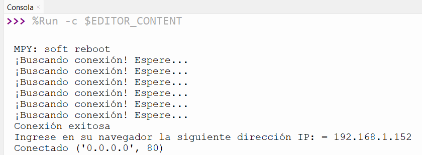
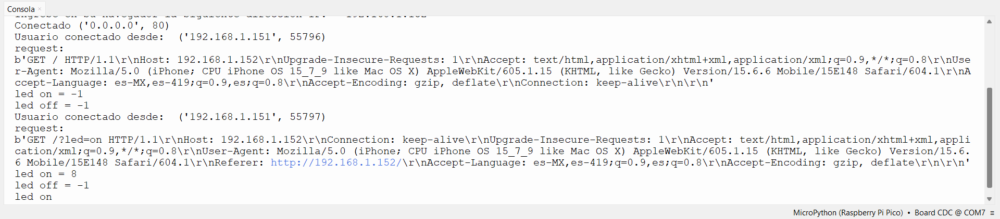
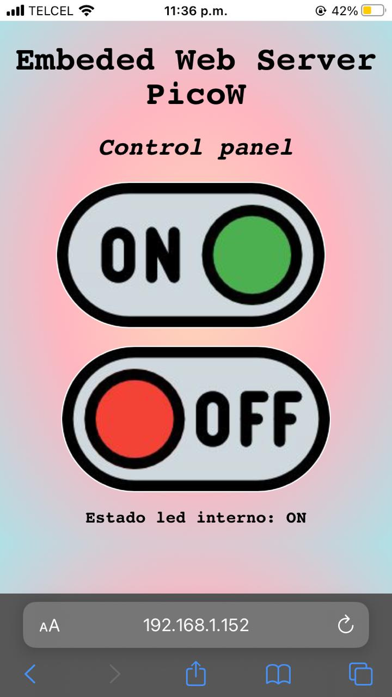
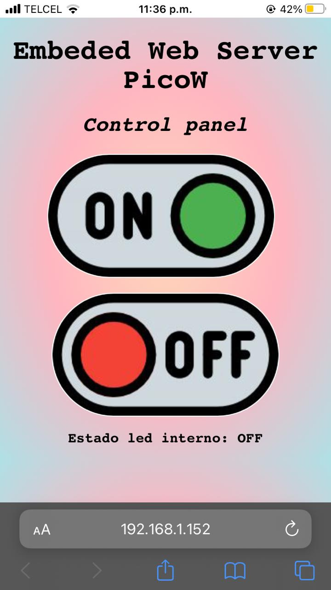

# 2.5 Embeded Web Server PicoW (prender / apagar BLINK Led Interno via WEB)

>Autor: Guipzot Garibay Denisse Abigail 20211788 SC7C
 
### Código Micropython
_En este apartado se presenta el código .py para desplegar un **menú de opciones**_
```python
#Guipzot Garibay Denisse Abigail 20211788
#Sistemas Programables SC7C
#2.5(prender / apagar BLINK Led Interno via WEB)

#librerías
import time
import network
import socket
from machine import Pin #importación de elementos de biblioteca

led = machine.Pin("LED", machine.Pin.OUT) #configuración de led interno
BlinkLed = 'Estado desconocido del LED' #declaración de objeto 

#datos de red wifi
red = 'INFINITUM11A4_2.4'
contraseña = 'GUIPZOT123'

#configuración de la red
wlan = network.WLAN(network.STA_IF)
wlan.active(True)
wlan.connect(red, contraseña)

#diseño de interfaz gráfica por medio de html
html = """<!DOCTYPE html>
<html>
<head>
    <meta name="viewport" content="width=device-width, initial-scale=1">
    <link rel="icon" href="data:,">
    <style>
        html {
            background: radial-gradient(rgb(255, 218, 185), rgb(255, 182, 193), rgb(176, 224, 230));
            font-family: "Consolas", monospace; 
            display: inline-block;
            margin: 0px auto;
            text-align: center;
            flex-direction: column;
            justify-content: center;
            align-items: center;
        }
        .cmdEncendido {
            padding: 15px 32px;
            display: inline-block;
            cursor: pointer;
            border-radius: 4.5rem;
            background-image:url(https://i.pinimg.com/564x/46/b8/bd/46b8bde62196bf58cc93cd803bf0e0e3.jpg);
            background-repeat:no-repeat;
            height:140px;
            width:258px;
            background-position:center;
        }
        .cmdApagado {
            padding: 15px 32px;
            display: inline-block;
            cursor: pointer;
            border-radius: 4.5rem;
            background-image:url(https://i.pinimg.com/564x/eb/5e/d2/eb5ed257070fd8e6c37ecb68cc3f4101.jpg);
            background-repeat:no-repeat;
            height:140px;
            width:258px;
            background-position:center;
        }
    </style>
</head>
<body>
    <h1>Embeded Web Server PicoW</h1>
    <h2><em>Control panel</em></h2>
    <form>
        <button class="cmdEncendido" name="led" value="on" type="submit"></button>
        <br><br>
        <button class="cmdApagado" name="led" value="off" type="submit"></button>
    </form>
    <p><strong>%s</strong><p>
</body>
</html>
"""

#condición y ciclo para obtener conexión de red wi-fi
espera = 10
while espera > 0:
    if wlan.status() < 0 or wlan.status() >= 3:
        break
    espera -= 1
    print('¡Buscando conexión! Espere...')
    time.sleep(1)

#lanzar excepción en caso de que no se haya establecido una conexión
if wlan.status() != 3:
    raise RuntimeError('¡Conexión fallida! Intente de nuevo')
else:
    print('Conexión exitosa')
    status = wlan.ifconfig()
    #proporcionar ip para ingresar al panel de control
    print( 'Ingrese en su navegador la siguiente dirección IP: = ' + status[0] )
direccion = socket.getaddrinfo('0.0.0.0', 80)[0][-1]
#datos del usuario
s = socket.socket()
s.bind(direccion)
s.listen(1)
print('Conectado', direccion)
while True:
    try:       
        usuario, direccion = s.accept()
        print('Usuario conectado desde: ', direccion)
        request = usuario.recv(1024)
        print("request:")
        print(request)
        request = str(request)
        
        #conocer el estado del led
        encendido = request.find('led=on')
        apagado = request.find('led=off')
        
        print( 'led on = ' + str(encendido))
        print( 'led off = ' + str(apagado))
        if encendido == 8:
            print("led on")
            led.value(1)
        if apagado == 8:
            print("led off")
            led.value(0)
        
        #despliegue de resultado en interfaz html
        BlinkLed = "Estado led interno: OFF" if led.value() == 0 else "Estado led interno: ON" 
        
        estadoLED = html % BlinkLed #mostrar en página
        usuario.send('HTTP/1.0 200 OK\r\nContent-type: text/html\r\n\r\n')
        usuario.send(estadoLED)
        usuario.close() #cerrar conexión
     
    #lanzar excepción tras cerrar conexión
    except OSError as e:
        usuario.close()
        print('El servidor a sido desconectado')
```
### Resultados en consola
_Despliegue de resultados que se muestran en la consola del software de Thonny_




### Interfaz gráfica 
_Capturas de pantalla del navegador_ 




**Vídeo de funcionalidad**
https://www.canva.com/design/DAFyD66j3LM/tKhPxuCDy2VlB4nkbc7sQ/editutm_content=DAFyD66j3LM&utm_campaign=designshare&utm_medium=link2&utm_source=sharebutton
