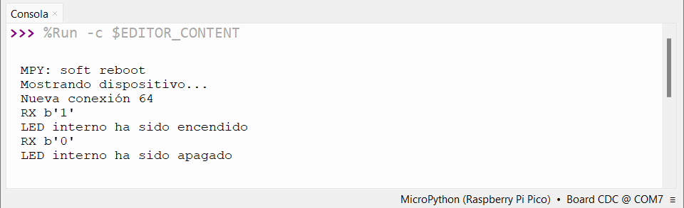
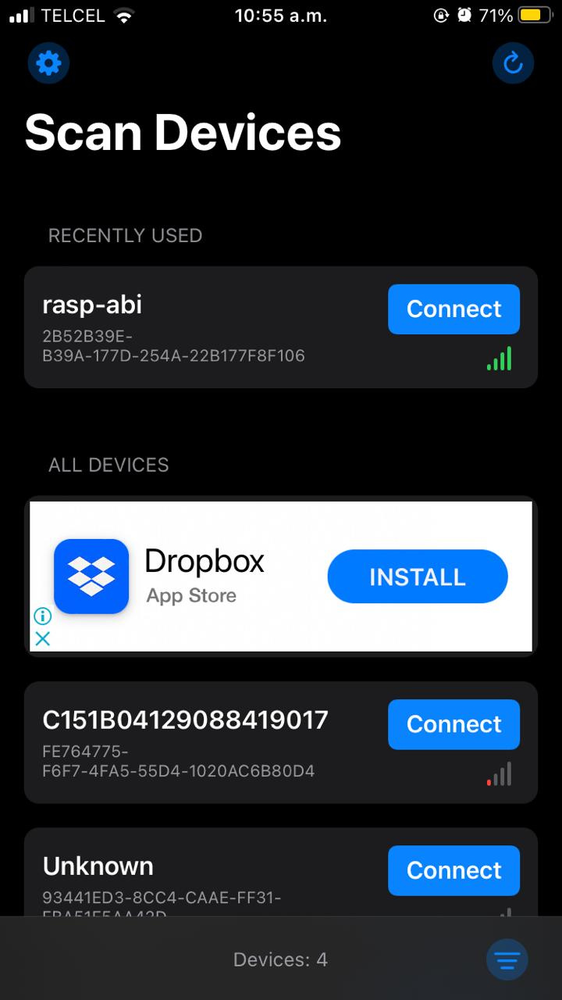
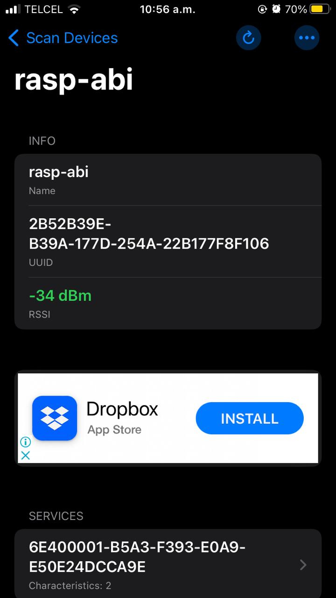
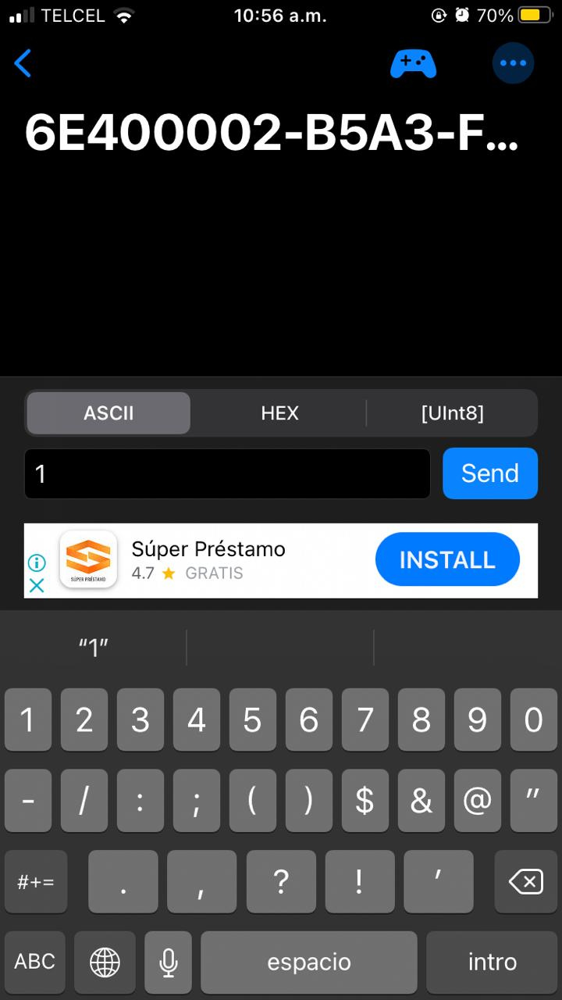

# 2.6 Bluetooth + LED (blink) via App (o Flask u otro medios)  móvil /laptop

>Autor: Guipzot Garibay Denisse Abigail 20211788 SC7C
 
### Código Micropython
_En este apartado se presenta el código .py para  **encender/apagar BLINK led interno vía APP**_
```python
#Guipzot Garibay Denisse Abigail 20211788
#Sistemas Programables SC7C
#2.6 Prender/apagar BLINK Led Interno via App

#librerías
import bluetooth
import random
import struct
import time
#importación de elementos de biblioteca
from machine import Pin
from ble_advertising import advertising_payload #uso de librería creada y guardada en raspberry
from micropython import const

#BLE = Bluetooth Low Energy
#definición e inicialización de variales para la comunicación tipo BLE
_IRQ_CENTRAL_CONNECT = const(1)
_IRQ_CENTRAL_DISCONNECT = const(2)
_IRQ_GATTS_WRITE = const(3)

_FLAG_READ = const(0x0002)
_FLAG_WRITE_NO_RESPONSE = const(0x0004)
_FLAG_WRITE = const(0x0008)
_FLAG_NOTIFY = const(0x0010)

#configuración de constantes para el uso de BLE
_UART_UUID = bluetooth.UUID("6E400001-B5A3-F393-E0A9-E50E24DCCA9E")
_UART_TX = (
    bluetooth.UUID("6E400003-B5A3-F393-E0A9-E50E24DCCA9E"),
    _FLAG_READ | _FLAG_NOTIFY,
)
_UART_RX = (
    bluetooth.UUID("6E400002-B5A3-F393-E0A9-E50E24DCCA9E"),
    _FLAG_WRITE | _FLAG_WRITE_NO_RESPONSE,
)
_UART_SERVICE = (
    _UART_UUID,
    (_UART_TX, _UART_RX),
)

#creación de clase para identificar el dispositivo
class BLESimplePeripheral:
    #definición de nombre
    #inicio de constructor
    def __init__(self, ble, name="rasp-abi"): 
        self._ble = ble
        self._ble.active(True)
        self._ble.irq(self._irq)
        ((self._handle_tx, self._handle_rx),) = self._ble.gatts_register_services((_UART_SERVICE,))
        self._connections = set()
        self._write_callback = None
        self._payload = advertising_payload(name=name, services=[_UART_UUID])
        self._advertise()

    #función para definir eventos de conexión/desconexión de dispositivos
    def _irq(self, event, data):
        if event == _IRQ_CENTRAL_CONNECT:
            conn_handle, _, _ = data
            print("Nueva conexión", conn_handle)
            self._connections.add(conn_handle)
        elif event == _IRQ_CENTRAL_DISCONNECT:
            conn_handle, _, _ = data
            print("Se ha desconectado el dispositivo", conn_handle)
            self._connections.remove(conn_handle)
            self._advertise()
        elif event == _IRQ_GATTS_WRITE:
            conn_handle, value_handle = data
            value = self._ble.gatts_read(value_handle)
            if value_handle == self._handle_rx and self._write_callback:
                self._write_callback(value)
    
    #función para el envío de datos para proceder con la conexión 
    def envio_datos(self, data):
        for conn_handle in self._connections:
            self._ble.gatts_notify(conn_handle, self._handle_tx, data)

    #función para saber si hay dispositivos conectados
    def conectar(self):
        return len(self._connections) > 0

    #función para saber si no hay dispositivos conectados
    def desconectar(self):
        return len(self._connections) < 0 

    #función para mostrar el dispositivo BLE (comenzar con la publicidad)
    def _advertise(self, interval_us=500000):
        print("Mostrando dispositivo...")
        self._ble.gap_advertise(interval_us, adv_data=self._payload)

    #función para manejar la llamada de datos
    def escribir(self, callback):
        self._write_callback = callback

#método principal para inicilizar el led interno
def principal():
    led_onboard = Pin("LED", machine.Pin.OUT) #configuración de led blink
    ble = bluetooth.BLE() #inicialización de variables
    var = BLESimplePeripheral(ble)

    #función para encender/apagar led por envío de comandos
    def on_rx(entrada):
        print("RX", entrada)
        if entrada == b'1':
            led_onboard.on()
            print("LED interno ha sido encendido")
        elif entrada == b'0':
            led_onboard.off()
            print("LED interno ha sido apagado")
        else:
            print("Caracter no permitido. 0 = OFF / 1 = ON")

    var.escribir(on_rx)
    
    while True:
        pass

#iniciar ejecución de programa
if __name__ == "__main__":
    principal()
```
### Resultados en consola
_Despliegue de resultados que se muestran en la consola del software de Thonny_


### Interfaz gráfica 
_Capturas de pantalla de la aplicación_ 




_**Prender LED**_



_**Apagar LED**_


[Vídeo de funcionalidad]()
