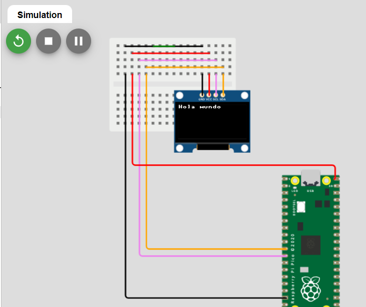
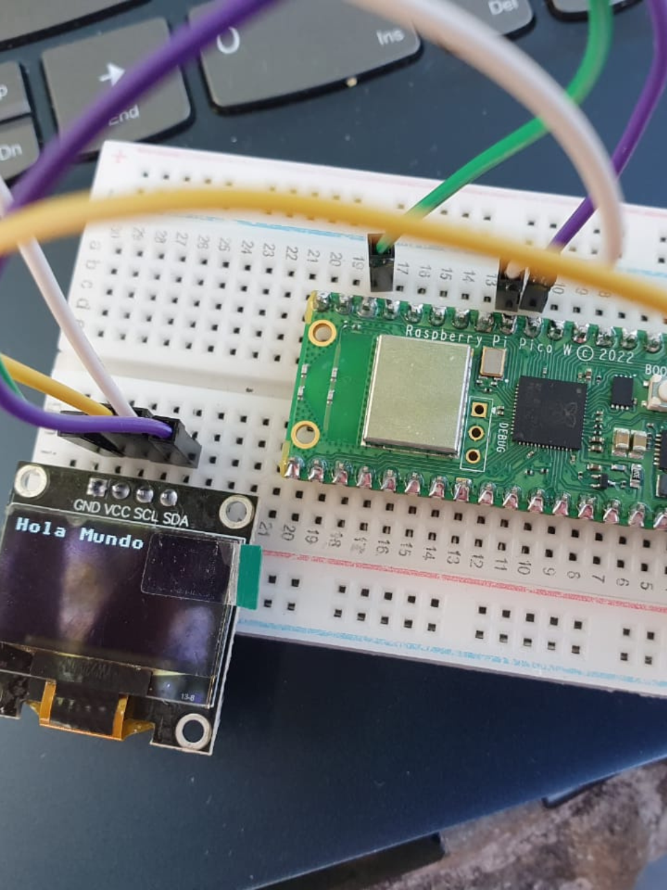
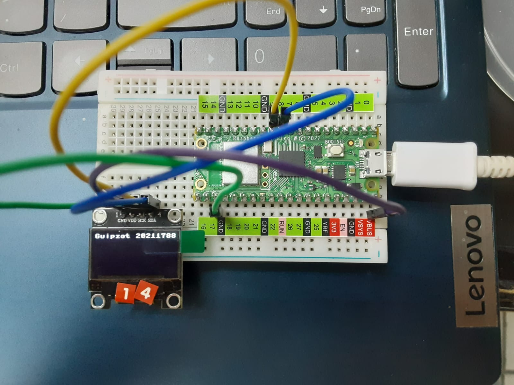
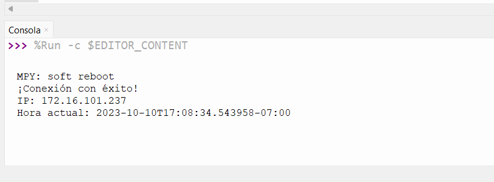
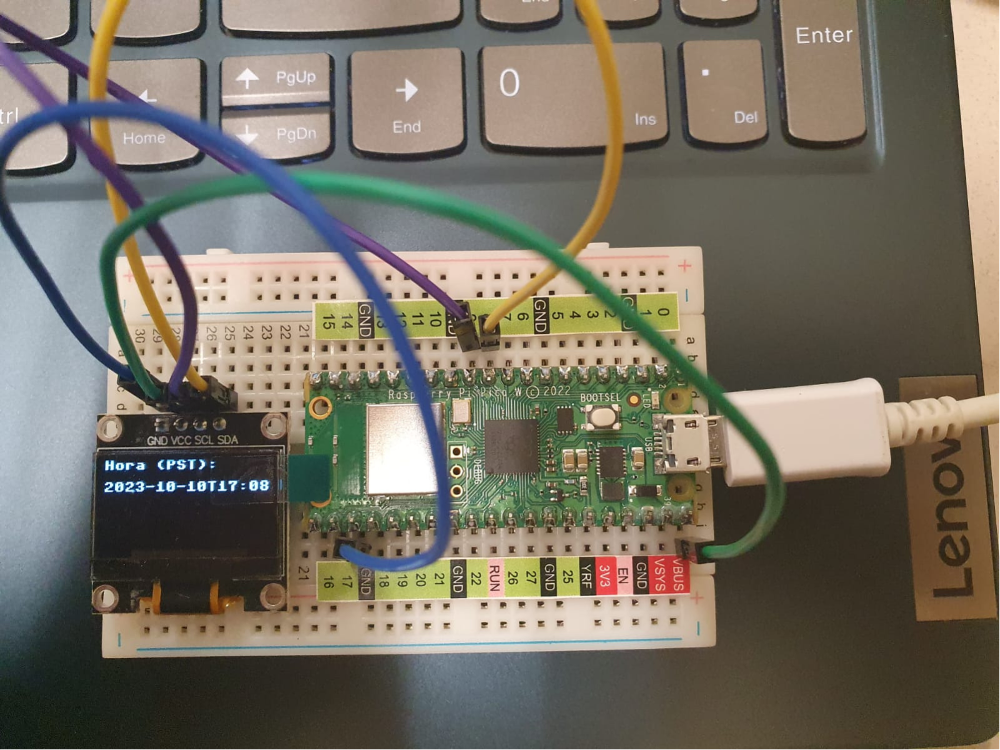

# Practica 2.1 Hola mundo y la Hora de internet

## 2.1.1 Práctica de inicio: Desplegar algo en pantalla, algunos quieren el logo de ISC, esta bien, otro texto simple en el OLED DIsplay
>Autor: Guipzot Garibay Denisse Abigail 20211788 SC7C
 
### Código Micropython
_En este apartado se presenta el código .py para desplegar **Hola mundo**_
```python
#librerías y módulos
import machine
import ssd1306

#comunicación y configuración de pines en la pantalla oled
i2c = machine.I2C(0, sda=machine.Pin(8), scl=machine.Pin(9))
displayOled = ssd1306.SSD1306_I2C(128, 64, i2c)

#Despliegue en pantalla oled
displayOled.fill(0) #propiedades para el despliegue
displayOled.show()
displayOled.text("Hola mundo", 0, 0) #escribir texto en la pantalla
displayOled.show() #mostrar texto
```

### Conexión simulada
_Utilizando el software de Wokwi se simulo la conexión en el Raspberry Pico W_


### Conexión física
_Usando como ejemplo la conexión simulada, se hizo el circuito de forma física_ 



_Se desplegó el texto **Guipzot 20211788** para modificación del mensaje básico_


## 2.1.2 Desplegar la hora de Internet usando Wi-Fi integrada para que interrogue un servidor NTP Time Server, en el OLED DIsplay
### Código Micropython
_En este apartado se presenta el código .py para desplegar **hora de internet**_
```python
#librerias y módulos
import network
import urequests
import utime
from machine import Pin, I2C
import ssd1306

#definición de funciones

#función para la conexión a Wi-Fi
def conexion(ssid, contra):
    #verificación de conexión
    sta_if = network.WLAN(network.STA_IF)
    #condición para reconocer la conexión
    if not sta_if.isconnected():
        print("¡Espere! Conectando a Wi-Fi ")
        sta_if.active(True)
        sta_if.connect(ssid, contra)
        while not sta_if.isconnected():
            pass
    print("¡Conexión con éxito!")
    print('IP:', sta_if.ifconfig()[0]) #despliegue de la dirección ip asignada

#función para la obtención de la hora actual
def hr_internet():
    #servicio web que brinda la hora actual
    url = "http://worldtimeapi.org/api/ip" 
    response = urequests.get(url)
    dat = response.json()
    return dat['datetime'] #devuelve el valor

#función de configuración de pines para la conexión y comunicación del oled
def config_pantalla():    
    i2c = I2C(0, sda=Pin(8), scl=Pin(9)) 
    oled = ssd1306.SSD1306_I2C(128, 64, i2c)
    return oled

#función para el despliegue de resultados en pantalla
def despliegue_oled(oled, hr):
    oled.fill(0) #propiedades de despliegue
    oled.text("Hora (PST):", 0, 0) #mensaje
    oled.text(hr, 0, 16)
    oled.show()

#definición de red a la que se hará la conexión
ssid = "TecNM-ITT-Docentes 2"
contra = "tecnm2022!"
#llamada a la función y envío de parametros
conexion(ssid, contra) 
oled = config_pantalla()

#blucle para imprimir en la pantalla y consola los resultados
while True:
    hr = hr_internet()
    print("Hora actual:", hr)
    despliegue_oled(oled, hr)
    utime.sleep(60)
```
### Resultados en consola
_Despliegue de resultados que se muestran en la consola del software de Thonny_


### Conexión física
_Realización del circuito de forma física_ 

