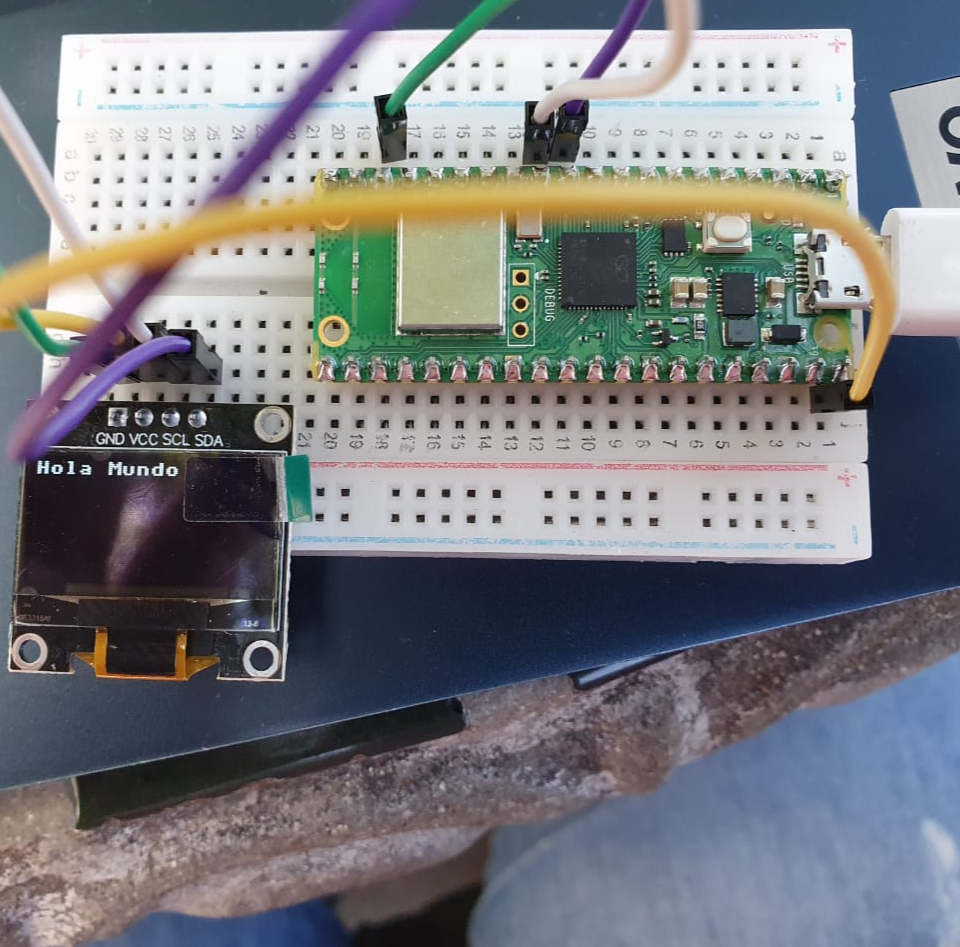

# Practica 2.1 Hola mundo y la Hora de internet

## 2.1.1 Práctica de inicio: Desplegar algo en pantalla, algunos quieren el logo de ISC, esta bien, otro texto simple en el OLED DIsplay
### Código Micropython
_En este apartado se presenta el código .py para desplegar **Hola mundo**__
```python
```

### Conexión simulada
_Utilizando el software de Wokwi se simulo la conexión en el Raspberry Pico W_


### Conexión física
_Usando como ejemplo la conexión simulada, se hizo el circuito de forma física_ 


